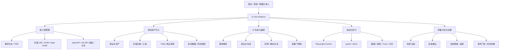
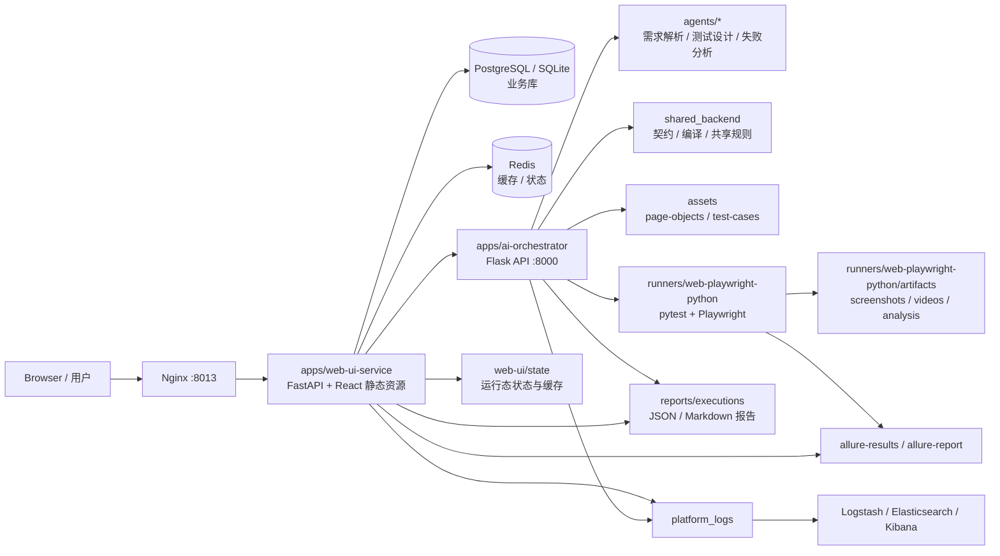
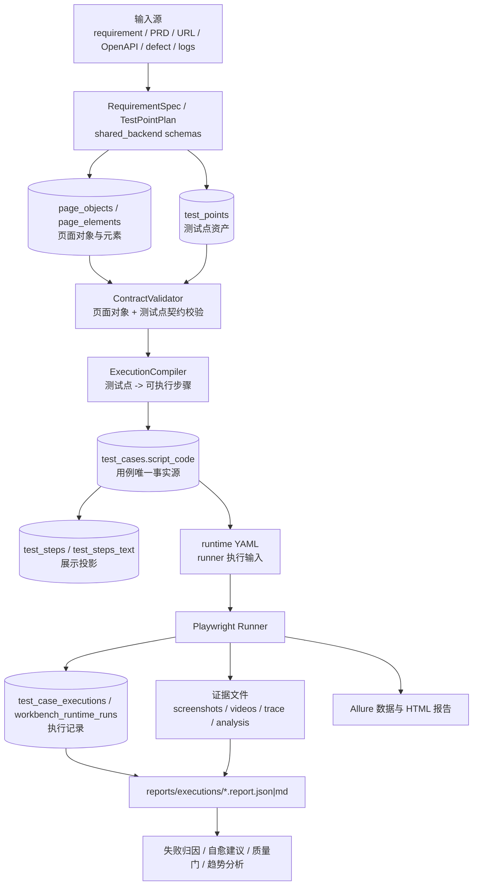

# AI Test Platform

企业级 AI 自动化测试平台。

这个项目不是单点脚本生成工具，而是一条面向测试研发场景的闭环链路：

```text
需求 / PRD / 页面 / OpenAPI / 缺陷
  -> 测试点与测试资产治理
  -> AI 编排生成用例
  -> 确定性 Runner 执行
  -> 证据采集与失败归因
  -> 质量分析与发布门禁
```

核心定位：

- **确定性底座**：Page Object、YAML 用例、pytest、Playwright runner、契约校验、报告与证据。
- **AI 增强**：需求解析、测试点生成、脚本生成、失败归因、风险评估、自愈建议。
- **资产闭环**：测试点、页面对象、用例、执行记录、证据、报告可追踪复用。
- **治理闭环**：审核、质量门、失败聚类、趋势分析、发布风险判断。

---

## 1. 平台解决什么问题

传统自动化测试常见痛点：

- 测试点设计依赖人工经验，需求到用例转化慢。
- 脚本生成与维护成本高，页面元素和用例步骤容易漂移。
- 测试资产分散，页面对象、用例、报告、失败证据之间缺少可追踪关系。
- 执行失败后定位慢，截图、日志、视频、trace、失败原因没有形成结构化闭环。
- 发布前质量判断依赖人工感觉，缺少稳定质量门和数据支撑。

AI Test Platform 的目标是把这些环节串成平台能力：让 AI 负责生成和分析，让确定性工程底座负责执行、校验和沉淀证据。

---

## 2. 主链路

当前主链路以 `apps/web-ui-service` 和 `apps/ai-orchestrator` 为核心：

```text
用户在 Web UI / Workbench 输入需求、页面、PRD、OpenAPI、缺陷等上下文
  -> Web UI 调用 Orchestrator
  -> Orchestrator 解析需求并生成测试点 / YAML 用例
  -> shared_backend 校验测试点、页面对象和执行步骤契约
  -> 用例保存到 assets/test-cases 或用例中心 DB
  -> runner 读取 YAML / runtime YAML 并执行 Playwright
  -> 输出 Allure、截图、视频、trace、analysis、report
  -> Web UI 展示报告、失败聚类、质量门、自愈建议
```

`POST /orchestrate` 是编排服务的关键入口：

- HTTP 入口：[`apps/ai-orchestrator/src/app.py`](apps/ai-orchestrator/src/app.py)
- 服务入口：[`apps/ai-orchestrator/src/orchestrator_service.py`](apps/ai-orchestrator/src/orchestrator_service.py)
- 主流程实现：[`apps/ai-orchestrator/src/services/orchestration_flow_support.py`](apps/ai-orchestrator/src/services/orchestration_flow_support.py)
- Web UI 调用位置：[`apps/web-ui-service/app/services/workbench_generation_api/orchestrator_client_factory.py`](apps/web-ui-service/app/services/workbench_generation_api/orchestrator_client_factory.py)

---

## 3. 业务架构图



业务上可以理解为四层：输入源、测试资产、执行证据、质量治理。

---

## 4. 系统架构图



当前 Docker 部署由 [`docker-compose.yml`](docker-compose.yml) 描述：

- `nginx` 对外暴露默认 `8013`，反向代理 Web UI。
- `web` 运行 `apps/web-ui-service`，容器内端口 `8013`。
- `orchestrator` 运行 `apps/ai-orchestrator`，默认端口 `8000`。
- `postgres` 存储业务数据。
- `redis` 存储缓存和运行状态。
- `elasticsearch / logstash / kibana` 用于日志采集与检索。

---

## 5. 数据架构图



关键数据原则：

- `shared_backend/schemas` 定义跨模块共享数据结构和契约。
- `TestCase.script_code` 是自动化用例执行和展示派生的唯一事实源。
- `test_steps`、`test_steps_text`、`precondition_state`、`expected_result` 是展示投影，只能从 `script_code` 派生，不能反向覆盖。
- `assets/` 保存可复用测试资产；`reports/`、`web-ui/state/`、`runners/**/artifacts` 保存运行态产物。

唯一事实源修复背景见：

- [`docs/bugfixes/2026-05-22_case_center_script_code_execution_chain_fix.md`](docs/bugfixes/2026-05-22_case_center_script_code_execution_chain_fix.md)
- [`docs/代码流程图/2026-05-22_DSL_V1.1_script_code唯一事实源流程图与代码评审.md`](docs/代码流程图/2026-05-22_DSL_V1.1_script_code唯一事实源流程图与代码评审.md)

---

## 6. 代码分层

### 6.1 当前分层架构（2026-05 重构后）

```text
┌─────────────────────────────────────────────────────────┐
│  Router 层  (app/routers/)                              │
│  接收 HTTP 请求，通过 Depends(get_db) 获取 Session       │
│  例: workbench_generation.py, page_objects.py           │
└────────────────────┬────────────────────────────────────┘
                     │ 调用 facade 方法，传入 db
┌────────────────────▼────────────────────────────────────┐
│  Facade 层  (app/api/workbench/facade.py)               │
│  编排业务流程：读 store → 调 service → 拼响应            │
│  依赖: store (文件+DB 双模读写), constants, 所有 service │
│  工具: _helpers.py (纯函数), _http.py (HTTP 请求)       │
└─────┬──────────────────────────────┬────────────────────┘
      │ 调用 service 函数             │ 调用 store 函数
┌─────▼──────────────┐  ┌────────────▼───────────────────┐
│  Service 层        │  │  Store 层                       │
│  (app/services/)   │  │  (app/api/workbench/store.py)   │
│  纯业务逻辑        │  │  → 委托 state_store             │
│  例: governance,   │  │  文件+DB 双模读写               │
│  reporting, asset  │  │  带 FILE_LOCK 线程安全          │
└─────┬──────────────┘  └────────────┬───────────────────┘
      │ 通过 Repository 访问 DB       │ 委托底层 store
┌─────▼──────────────────────────────────────────────────┐
│  Repository 层  (app/repositories/)                     │
│  封装所有 db.execute(select(...)) 为命名方法              │
│  6 个聚合根: TestCase, PageObject, Recorder,            │
│  TestProject, TestDataPool, WorkbenchState              │
└─────┬──────────────────────────────────────────────────┘
      │ SQLAlchemy Session
┌─────▼──────────────┐  ┌────────────────────────────────┐
│  PostgreSQL/SQLite │  │  shared_backend/               │
│  (app/core/        │  │  共享契约、类型工具、DB 连接    │
│   database.py)     │  │  type_utils.py (dict_value,    │
│  通过 DATABASE_URL │  │  normalize_project_code...)    │
│  配置              │  │  db.py (get_db_session)        │
└────────────────────┘  └────────────────────────────────┘
```

**数据流规则：**
- Router → Depends(get_db) 获取 Session → 传给 Facade
- Facade → 传给 Service/Repository/Store（不自己创建 Session）
- Service/Repository → 接收 db，绝不自己 `SessionLocal()`
- Store → 可选 `db=None`，有则复用，无则创建独立 Session
- 子进程/后台线程 → 必须 `SessionLocal()` 独立 Session（如 run_case 执行器）

### 6.2 两个 Store 的关系

项目中有两个名字相似的 store 模块，职责不同：

| 模块 | 导入路径 | 层级 | 职责 |
|------|---------|------|------|
| `store` | `app.api.workbench.store` | API 层 | 线程安全读写锁、run job 缓存、文件路径常量暴露 |
| `state_store` | `app.services.workbench_state_store` | Service 层 | DB/文件双模读写、WorkbenchState 模型 CRUD |

**调用链：**
```text
facade.py
  → from app.api.workbench import store         # API 层 store
  → store.append_history({...}, db=db)          # 带 FILE_LOCK + db 透传
      → from app.services import workbench_state_store as state_store
      → state_store.append_history({...}, db=db) # 底层 DB/文件写入
```

**简单记忆：** `store` 是 `state_store` 的线程安全包装。业务代码应该 import `store`，底层 CRUD 逻辑在 `state_store`。

### 6.3 目录说明

| 目录 | 责任 |
| --- | --- |
| [`apps/web-ui-service/`](apps/web-ui-service/) | Web UI 主服务，FastAPI 后端 + React 前端构建产物，负责 Workbench、用例中心、资产、报告、认证、Dashboard 等页面和 API。 |
| [`apps/ai-orchestrator/`](apps/ai-orchestrator/) | AI 编排服务，负责 `/orchestrate`、需求解析、测试生成、runner 调用、报告和失败分析聚合。当前 HTTP 层基于 Flask。 |
| [`shared_backend/`](shared_backend/) | 共享契约与规则层，包含 schema、契约校验、执行步骤编译、type_utils（dict_value 等共享工具）、db.py（统一 Session 获取）。 |
| [`app/repositories/`](apps/web-ui-service/app/repositories/) | **Repository 层（2026-05 新增）**：封装所有 `db.execute(select(...))` 为命名方法。6 个聚合根：TestCase、PageObject、Recorder、TestProject、TestDataPool、WorkbenchState。 |
| [`runners/web-playwright-python/`](runners/web-playwright-python/) | 当前成熟的 Web 自动化执行器，负责读取 YAML、执行 Playwright、产出 Allure 和证据。 |
| [`agents/`](agents/) | AI Agent 子项目，包括需求解析、测试设计、脚本生成、失败归因、风险评估、自愈建议等。 |
| [`assets/`](assets/) | 测试资产目录，当前主要包含 `page-objects/` 和 `test-cases/`。 |
| [`reports/`](reports/) | 编排和执行报告，主要是 `reports/executions/*.report.json|md`。 |
| [`web-ui/state/`](web-ui/state/) | 运行态状态与缓存，不应作为长期业务事实源手工维护。 |
| [`docs/`](docs/) | 架构、核心规则、bugfix、验收、pytest、页面对象治理等知识库。 |

更多目录说明见 [`docs/architecture/project-structure.md`](docs/architecture/project-structure.md)。

---

## 7. 当前运行入口

### 7.1 Python 开发环境

```bash
make install-dev
```

安装提交前资产校验：

```bash
make install-hooks
```

### 7.2 Web UI

FastAPI 后端本地启动：

```bash
./.venv/bin/python -m uvicorn app.main:app --app-dir apps/web-ui-service --host 127.0.0.1 --port 8013 --reload
```

React 前端开发：

```bash
make frontend-install
make frontend-dev
```

构建 React 到 FastAPI 静态目录：

```bash
make frontend-build
```

更多说明见 [`apps/web-ui-service/README.md`](apps/web-ui-service/README.md)。

### 7.3 AI Orchestrator

HTTP 服务：

```bash
cd apps/ai-orchestrator
PYTHONPATH=src flask --app src/wsgi:app run --host 127.0.0.1 --port 8000
```

CLI 编排：

```bash
cd apps/ai-orchestrator
python src/main.py orchestrate \
  --page product \
  --requirement "验证商品搜索功能" \
  --execute
```

更多说明见 [`apps/ai-orchestrator/README.md`](apps/ai-orchestrator/README.md)。

### 7.4 Docker

```bash
docker compose up -d --build
```

默认端口：

- Web UI / Nginx：`http://127.0.0.1:8013`
- Web 容器直连端口：`http://127.0.0.1:8015`
- Orchestrator：`http://127.0.0.1:8000`
- PostgreSQL：`127.0.0.1:5432`，来自 dev override
- Redis：`127.0.0.1:6379`，来自 dev override
- Kibana：`http://127.0.0.1:15601`，来自 dev override

---

## 8. 测试与质量门

统一测试入口：

```bash
make test
```

常用质量门：

```bash
make static-baseline-fast
make static-baseline
make test-orchestrator
make test-runner-assets
make test-openapi
```

E2E 与报告：

```bash
make test-e2e-login-demo
make test-e2e-smoke
make test-e2e-generated-allure
make allure-generate
make allure-open
```

`pytest.ini` 当前 marker：

| Marker | 含义 |
| --- | --- |
| `contract` | 稳定契约、schema、不变量检查，不需要 live app。 |
| `integration` | 跨模块集成检查，不需要真实业务环境。 |
| `e2e` | 端到端浏览器测试，需要可运行目标系统。 |
| `smoke` | 人工维护的冒烟测试。 |
| `generated` | AI 生成 YAML 驱动测试。 |

`make test-orchestrator` 当前执行：

```bash
.venv/bin/python -m pytest -m integration apps/ai-orchestrator/tests/integration
```

完整 pytest 说明见 [`docs/pytest/README.md`](docs/pytest/README.md)。

---

## 9. API 与关键入口

### Orchestrator

OpenAPI 契约：

- [`apps/ai-orchestrator/openapi/orchestrator-openapi.yaml`](apps/ai-orchestrator/openapi/orchestrator-openapi.yaml)

关键接口：

- `GET /health`
- `POST /orchestrate`
- `POST /requirements/parse`
- `POST /risk/evaluate`
- `POST /failures/triage`
- `POST /healing/preview`
- `GET /reports/latest`
- `GET /reports/{case_id}`

`POST /orchestrate` 示例：

```json
{
  "page": "product",
  "requirement": "验证商品搜索功能",
  "execute": false,
  "mode": "generate_only",
  "source": "manual",
  "runner": "playwright"
}
```

说明：

- `mode` 支持 `generate_only` / `generate_and_run`。
- 同时传 `mode` 和 `execute` 时，以 `mode` 为准。
- `source` 当前支持 `manual` / `ai` / `regression`。
- `runner` 默认 `playwright`。

### Web UI Service

关键 API 分布在：

- [`apps/web-ui-service/app/routers/`](apps/web-ui-service/app/routers/)
- [`apps/web-ui-service/app/api/workbench/`](apps/web-ui-service/app/api/workbench/)
- [`apps/web-ui-service/app/services/workbench_generation_api/`](apps/web-ui-service/app/services/workbench_generation_api/)

健康检查：

- `GET /health`
- `GET /health/ready`
- `GET /health/llm?probe=true`

---

## 10. 当前工程约束

- 新功能优先进入 `apps/web-ui-service`、`apps/ai-orchestrator`、`shared_backend`、`runners/web-playwright-python` 这些主链目录。
- `web-ui/` 当前主要是运行态状态和历史兼容目录，不是新功能主入口。
- `apps/web-console/` 是历史 scaffold 控制台资源，不是当前 Workbench 主事实入口。
- 运行态产物可以进入 `reports/`、`web-ui/state/`、`runners/**/artifacts`，但业务真相应回到 DB、`assets/` 或 `shared_backend` 契约。
- 自动修复当前以建议和预览为主，不应静默改写 YAML 或 page object。
- 对用例中心链路，继续坚持 `TestCase.script_code` 是唯一事实源。
- **Session 管理**：Router 层通过 `Depends(get_db)` 获取 Session；Service/Repository/Store 层只接收 `db` 参数，不自己 `SessionLocal()`；子进程/后台线程可例外。
- **DB 访问**：必须通过 Repository 层（`app/repositories/`），禁止在 Service/Facade 中直接写 `db.execute(select(Model)...)`。
- **共享工具**：`_dict_value`、`_list_value`、`normalize_project_code` 等通用函数统一在 `shared_backend/type_utils.py`，不再在各 service 中重复定义。
- **Store 用法**：业务代码 import `app.api.workbench.store`（线程安全包装），底层 CRUD 在 `app.services.workbench_state_store`。
- **异常处理**：`json.loads` 捕获 `json.JSONDecodeError`，`yaml.safe_load` 捕获 `yaml.YAMLError`，仅在编排弹性/DB 回滚/子进程重试场景使用 `except Exception`。

---

## 11. 重要文档

- [`docs/architecture/project-structure.md`](docs/architecture/project-structure.md)
- [`docs/core/platform_rules.md`](docs/core/platform_rules.md)
- [`docs/core/test_asset_rules.md`](docs/core/test_asset_rules.md)
- [`docs/core/quality_gate_rules.md`](docs/core/quality_gate_rules.md)
- [`docs/core/page_object_rules.md`](docs/core/page_object_rules.md)
- [`docs/core/prompt_versioning_rules.md`](docs/core/prompt_versioning_rules.md)
- [`docs/core/2026-5-23DSL V1.1实施方案.md`](docs/core/2026-5-23DSL%20V1.1实施方案.md)
- [`docs/core/2026-05-25_dsl_v1_1_assertion_timing_rules.md`](docs/core/2026-05-25_dsl_v1_1_assertion_timing_rules.md)
- [`docs/bugfixes/2026-05-22_case_center_script_code_execution_chain_fix.md`](docs/bugfixes/2026-05-22_case_center_script_code_execution_chain_fix.md)
- [`docs/bugfixes/2026-05-25_dsl_v1_1_data_source_boundary_risk_fix.md`](docs/bugfixes/2026-05-25_dsl_v1_1_data_source_boundary_risk_fix.md)
- [`docs/pytest/README.md`](docs/pytest/README.md)
