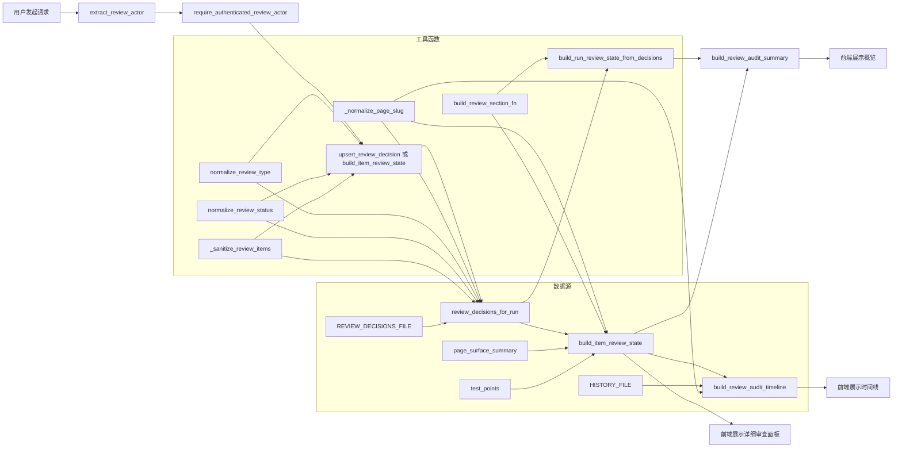

# 📘 代码说明书
## 一句话概括  
这是一个「自动化测试审查工作台」的后端服务模块，专门负责**整理、清洗、归档和展示测试过程中需要人工确认的各类问题（比如页面元素识别不准、测试点逻辑存疑、潜在风险等）**，让测试工程师能清晰看到哪些地方卡住了、谁确认过、为什么确认、还剩哪些没审。

---

## 📂 文件总览
| 文件 | 作用 |
|------|------|
| `workbench_review_service.py` | 整个审查工作台的“大脑”：不直接处理网页或AI模型，而是专注做「数据管家」——把杂乱的原始审查数据（来自不同模块、不同格式）统一清洗、标准化、归类、存档，并组装成前端友好的结构化状态（比如“元素确认区”“测试点确认区”“风险决策区”）。 |

---

## 🔍 核心函数/类说明
- **`_sanitize_review_items()` / `sanitize_review_items()`**：作用——把用户或系统提交的“待审查条目”（比如 `{ "intent_id": "btn-login", "confidence": 0.3, "warnings": ["位置偏移"] }`）变成干净、安全、格式统一的标准条目。  
  - 输入：原始条目列表（可能含空值、错类型、超范围数字、拼写错误字段等）+ 当前审查类型（如 `"element"`）  
  - 输出：清洗后的标准条目列表（每个条目必有 `key`, `label`, `decision`, `confidence`, `warnings` 等字段，且 `confidence` 被强制限制在 0~1 之间）  
  - 大白话解释：就像快递分拣站——不管包裹是用纸箱、塑料袋还是麻袋装的，也不管上面写的字歪不歪、有没有涂改，它都会拆开、检查内容、贴上统一标签（“收件人：张三”，“重量：2.3kg”，“易碎：是”），再整齐码好。  

- **`review_decisions_for_run()`**：作用——根据一次测试运行的 ID（`run_id`），从所有历史审查记录里，精准捞出**属于这次运行、且匹配项目名/页面名**的所有审查结果，并按「页面+审查类型」分组（例如 `("product", "element") → {...}`）。  
  - 输入：`run_id`、可选的 `project`/`page` 过滤条件，以及一堆“工具函数”（用于标准化页面名、审查类型等）  
  - 输出：一个字典，键是 `(页面名, 审查类型)` 元组，值是该组合下的完整审查状态（含 items、确认人、时间等）  
  - 大白话解释：就像图书馆管理员——你告诉 TA “我要查《Python入门》这本书在2024年3月借阅记录”，TA 就去所有借阅登记本里翻，只挑出“书名=Python入门”且“日期=2024-03”的条目，再按“哪个阅览室”“哪类读者”分类放好。  

- **`build_run_review_state_from_decisions()`**：作用——把上一步捞出的分散审查结果，组装成前端工作台首页所需的**三大板块状态**（元素确认、测试点确认、风险决策），并计算汇总指标（如“共需确认3项，当前待审2项”）。  
  - 输入：`run_id`, `project`, `page`，以及几个构建函数（如 `build_review_section_fn`）  
  - 输出：一个结构化字典，包含 `element`/`test_point`/`risk` 三个 section 字段，以及 `requires_review`（是否还有未审项）、`pending_sections`（待审数量）等统计字段  
  - 大白话解释：就像装修监理的日报——TA 把水电工、木工、油漆工各自交来的验收单汇总起来，生成一页报告：“水电已签收✅，木工2处待补漆⚠️，油漆1面色差需重做❌；总计待处理2项”。  

- **`build_item_review_state()`**：作用——为**某个具体页面**生成更详细的审查状态，不仅包含历史决策，还会融合当前页面的最新分析结果（比如 AI 检测到的新低置信度元素、新生成的测试点），形成“动态审查视图”。  
  - 输入：页面名、运行 ID、当前页面分析数据（`page_surface_summary`, `test_points` 等）、以及各种构建函数  
  - 输出：和上一个函数类似，但 `items` 字段会包含**最新发现的问题**（不只是历史存档），且多了一个 `model_versions` 字段记录所用 AI 模型版本  
  - 大白话解释：就像医生的门诊记录——不仅看上次体检报告（历史决策），还结合本次听诊、B超新结果（实时分析），告诉你：“上次血压高已控制✅，本次发现血糖略高⚠️，建议复查；用的是第3版健康评估模型”。  

- **`upsert_review_decision()`**：作用——接收用户提交的一条审查决定（比如“这个按钮确认无误”），**智能更新或新增**到审查记录文件中（自动去重、保留创建时间、限制最多存1000条）。  
  - 输入：审查 payload（JSON 数据）、可选的用户身份信息（`actor`）  
  - 输出：最终存入的那条完整记录（含自动生成的时间戳、用户信息等）  
  - 大白话解释：就像微信收藏夹——你点“收藏”一篇新文章，如果之前已收藏过同一链接，就只更新“最后查看时间”；如果是新文章，就加到最顶上；而且收藏夹最多只显示最近1000篇，老的自动滚走。  

- **`extract_review_actor()` & `require_authenticated_review_actor()`**：作用——从 HTTP 请求里**千方百计找用户是谁**（Bearer Token、反向代理头、Nginx 头等），并确保不是“匿名用户”才允许提交审查决定。  
  - 输入：FastAPI 的 `Request` 对象  
  - 输出：`{"confirmed_by": "张三", "confirmed_by_role": "QA", "confirmed_by_source": "bearer_token"}` 或抛出 401 错误  
  - 大白话解释：就像银行柜台——你递身份证（Token）或单位介绍信（X-Forwarded-User 头），柜员（代码）必须确认你是真员工才能给你办业务；只说“我是张三”不行，必须有官方凭证。  

- **`build_review_audit_summary()`**：作用——生成一个**简洁的审查概览卡片**，供前端放在顶部导航栏或仪表盘，快速掌握全局状态（如“最新操作：李四在10:23确认了风险项”）。  
  - 输入：完整的审查状态字典（如 `build_item_review_state` 的输出）  
  - 输出：精简摘要（含各板块状态、待审数、最新操作人/时间）  
  - 大白话解释：就像手机天气 App 首页——不显示全部数据，只告诉你：“📍北京｜☁️多云｜22℃｜⚠️空气质量轻度污染｜最新更新：10:25”。  

- **`build_review_audit_timeline()`**：作用——拉取某次运行的所有**审查相关操作时间线**（谁在什么时候确认了什么、执行门禁触发了什么规则），按时间排序返回。  
  - 输入：`run_id`, 可选 `page`，以及读取历史的函数  
  - 输出：按时间升序排列的操作事件列表（每条含时间、动作、详情、证据等）  
  - 大白话解释：就像微信聊天记录——把所有和“测试运行 #12345”有关的消息（张三确认、系统告警、李四驳回）按时间顺序排好，方便回溯“到底发生了什么”。  

---

## 🧩 调用关系与数据流转  

> ✅ **关键流转说明**：  
> - 所有对外暴露的功能（如保存审查、获取状态）都**先验身份**（`extract` → `require`）；  
> - `review_decisions_for_run` 是核心枢纽：它从文件读取原始数据，经清洗、过滤、分组，喂给 `build_*_review_state`；  
> - `build_item_review_state` 是“最全视图”：它既查历史（`review_decisions_for_run`），又融实时（`page_surface_summary`），还调用 `build_review_section_fn` 组装每个板块；  
> - `upsert_review_decision` 是“唯一写入口”：它用 `_review_entry_identity` 做唯一键（project+run_id+page+review_type），确保同一件事不会重复存；  
> - 时间线（`timeline`）和概览（`summary`）都是“只读聚合”，不修改数据，只从文件或已有状态里提取、重组。

---

## 💡 值得学习的写法  
- **`_dedup_keep_order()`**：用 `set` 记录已见项 + `list` 保持顺序，比 `dict.fromkeys()` 更直观，且兼容 Python 3.6 以下；  
- **`_clamp_confidence()`**：用 `max(0.0, min(1.0, float(x)))` 一行安全截断浮点数，比 if-else 更简洁鲁棒；  
- **`_safe_case_id()`**：当 case_id 为空时，自动生成带时间戳的默认 ID（`case-general-102345`），避免空值引发后续崩溃；  
- **`_review_entry_identity()`**：把多字段组合成元组作为唯一标识，天然支持 `==` 比较，比拼接字符串更安全（无歧义分隔符问题）；  
- **`state_store.FILE_LOCK`**：对文件读写加锁，防止多请求并发写同一个 JSON 文件导致损坏（虽简单但关键）；  
- **`items[:1000]` 截断写入**：主动限制文件大小，避免日志爆炸，是生产环境实用主义典范。

---

## ⚠️ 需要注意的地方  
- **`read_json_list_fn` 和 `write_json_list` 是传入的函数参数**：实际调用时若传错（比如传了同步函数却在异步上下文中用），会阻塞整个 FastAPI 应用；务必确认它们是线程安全/非阻塞的；  
- **`_payload_value()` 对非 dict 类型用 `getattr`**：如果 payload 是 Pydantic 模型但字段是 `Optional[str]`，`.get("xxx")` 会报错，此时 `getattr` 是救命稻草，但依赖模型实现细节，稍脆弱；  
- **`PAGE_ALIAS_MAP` 映射是静态的**：`"addprouct"` → `"addproduct"` 这种 typo 修复很贴心，但如果未来新增别名（如 `"new-product"`），必须手动维护此字典，容易遗漏；  
- **`upsert_review_decision` 中 `items.insert(0, record)`**：每次都在列表开头插入，大数据量时性能为 O(n)，若记录超 1000 条，频繁插入会变慢（建议改为 append + reverse 或用 deque）；  
- **`build_review_audit_timeline` 默认读 `HISTORY_FILE`**：当传入 `read_history_items=None` 时才 fallback，但若外部传了 `read_history_items=lambda: []`（空列表），会导致 timeline 永远为空，调试困难；  
- **`_normalize_history_text_list(..., limit=10)`**：对 `evidence`/`review_items` 等列表硬性截断，若业务要求“必须看到全部证据”，此处会丢数据，需提前沟通需求。