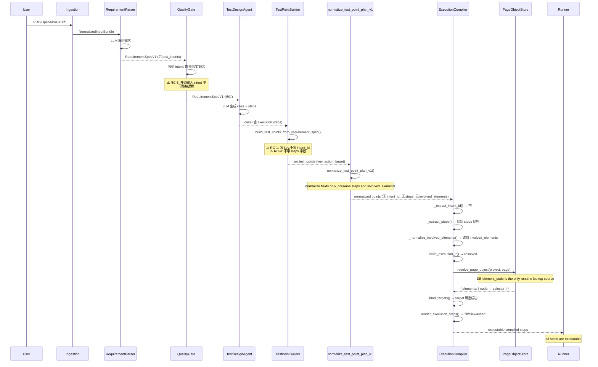
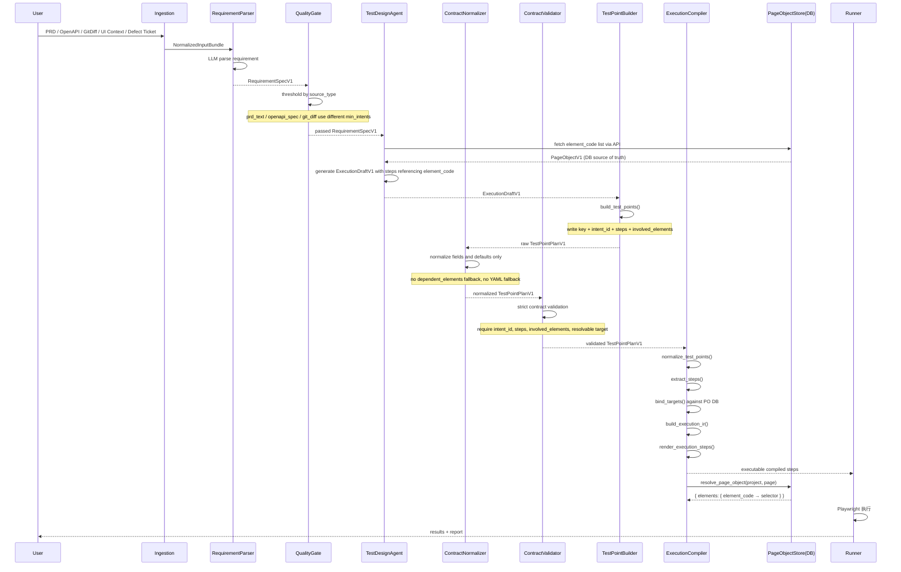
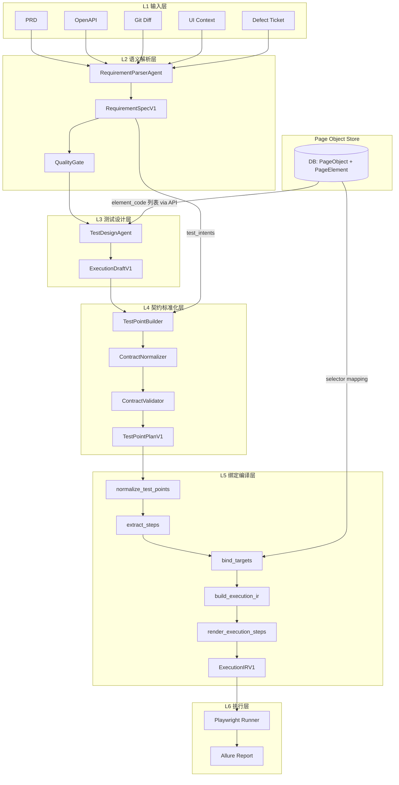

# AI Test Platform — 测试用例生成管线整改方案

> 版本：v1.0 ｜ 日期：2026-04-15

---

## 目录

1. [问题全景](#1-问题全景)
2. [目标架构（6 层）](#2-目标架构6-层)
3. [UML 时序图](#3-uml-时序图)
4. [代码调用链与文件映射](#4-代码调用链与文件映射)
5. [全层级字段契约矩阵](#5-全层级字段契约矩阵)
6. [层间校验机制](#6-层间校验机制)
7. [5 大根因与修复映射](#7-5-大根因与修复映射)
8. [分阶段实施计划](#8-分阶段实施计划)
9. [验收标准](#9-验收标准)
10. [工程原则](#10-工程原则)

---

## 1. 问题全景

### 1.1 症状

管线"多源需求输入 → 测试点提取 → 页面对象映射 → 测试用例"中，仅"测试点提取"正常，
其余环节产出 degraded / unknown 步骤。

### 1.2 根因总览


| #    | 根因                                                  | 断裂层                   | 影响范围                      |
| ---- | --------------------------------------------------- | --------------------- | ------------------------- |
| RC-1 | `key` vs `intent_id` 字段名不匹配                         | TestPoint → Compiler  | 主路径 + 降级路径全部产出空 intent_id |
| RC-2 | `involved_elements` / `steps` 契约未完全统一            | Normalizer → Compiler | 目标输入缺失，编译无法稳定解析       |
| RC-3 | Page Object 运行时事实源未完全收口为 DB                    | Builder → Binding     | selector 绑定不稳定             |
| RC-4 | 标准化层 (`normalize_test_point_plan_v1`) 未严格保留 `steps` | Normalizer → Compiler | 多步骤点被压成单步                |
| RC-5 | Quality Gate 阈值未区分输入源类型                             | Gate → 全链路            | 多源输入场景被误拦截                |


### 1.3 根因因果链

```
多源输入 → RequirementParser → test_intents ✅
                                      │
                                      ▼
                          RequirementTestPointSupport
                          .build_test_points_from_requirement_spec()
                                      │
                        ┌─────────────┼──────────────────┐
                        │             │                  │
                   写 intent_id    写 steps        写 involved_elements
                        │             │                  │
                        ▼             ▼                  ▼
              normalize_test_point_plan_v1()
                        │             │                  │
                   保留 intent_id   保留 steps         保留 involved_elements
                        │             │                  │
                        ▼             ▼                  ▼
              ┌─── execution_compiler ───┐
              │                          │
        _extract_intent_id()      _extract_steps()      _normalize_involved_elements()
        只读 intent_id           读 steps                只读 involved_elements
              │                   结构保留               │
              ▼                   进入 IR                ▼
        build_execution_ir → resolved
              │                                          │
              ▼                                          ▼
        bind_targets → target 绑定 page object element
              │
              ▼
        render_execution_steps → 输出 fill/click/assert
```

---

## 2. 目标架构（6 层）

### 2.1 分层总览

```
┌──────────────────────────────────────────────────────┐
│                  L1  输入层 (Ingestion)               │
│  PRD / OpenAPI / GitDiff / UI Context / 缺陷单        │
└──────────────────────┬───────────────────────────────┘
                       │ NormalizedInputBundle
                       ▼
┌──────────────────────────────────────────────────────┐
│               L2  语义解析层 (Parser)                 │
│  RequirementParserAgent → RequirementSpecV1          │
│  产出: test_intents / business_rules / ambiguities   │
└──────────────────────┬───────────────────────────────┘
                       │ RequirementSpecV1
                       ▼
┌──────────────────────────────────────────────────────┐
│              L3  测试设计层 (Design)                   │
│  TestDesignAgent → ExecutionDraftV1                   │
│  产出: case.execution.steps (语义级, 不含 selector)    │
└──────────────────────┬───────────────────────────────┘
                       │ ExecutionDraftV1 + RequirementSpecV1
                       ▼
┌──────────────────────────────────────────────────────┐
│       L4  契约标准化层 (Contract Normalization)        │  ← 当前缺失
│  统一字段名 / 补齐默认值 / 版本适配                       │
│  产出: TestPointPlanV1 (含 intent_id + steps)         │
└──────────────────────┬───────────────────────────────┘
                       │ TestPointPlanV1
                       ▼
┌──────────────────────────────────────────────────────┐
│           L5  绑定编译层 (Binding / Compiler)          │
│  intent_id 校验 → target 解析 → PO 绑定 → IR 生成      │
│  产出: ExecutionIRV1 → compiled steps                 │
└──────────────────────┬───────────────────────────────┘
                       │ Compiled TestCase
                       ▼
┌──────────────────────────────────────────────────────┐
│              L6  执行层 (Runner)                       │
│  Playwright / Selenium → 执行 + 报告                  │
└──────────────────────────────────────────────────────┘
```

### 2.2 每层职责边界


| 层级            | 输入                                  | 输出                               | 核心原则                                        |
| ------------- | ----------------------------------- | -------------------------------- | ------------------------------------------- |
| L1 Ingestion  | 用户原始输入                              | `NormalizedInputBundle`          | 多源归一                                        |
| L2 Parser     | `NormalizedInputBundle`             | `RequirementSpecV1`              | LLM 产出必须强 schema 校验                         |
| L3 Design     | `RequirementSpecV1` + page elements | `ExecutionDraftV1`               | 语义级步骤, 不含 selector                          |
| L4 Normalizer | Draft + RequirementSpec             | `TestPointPlanV1`                | 字段标准化, 是"通过层"不是"过滤层"                        |
| L5 Compiler   | `TestPointPlanV1` + `PageObjectV1`  | `ExecutionIRV1` → compiled steps | 唯一真相裁判, Preview 可降级 / Generate 必须 fail-fast |
| L6 Runner     | compiled steps                      | 执行结果 + 报告                        | 不理解业务语义, 只执行 IR                             |


### 2.3 关键设计决策


| 决策                | 选择                                | 理由                        |
| ----------------- | --------------------------------- | ------------------------- |
| `intent_id` 全链路主键 | `intent_id`                       | 不能漂移, 不能有别名, 从 L2 一直传到 L6 |
| `test_point` 定位   | 中间契约, 不是临时结构                      | 上下游都必须以它为边界               |
| Page Object 权威源   | DB                                | 运行时仅走 DB                   |
| Compiler 降级策略     | Preview 允许降级 / Generate fail-fast | 不允许 degraded 步骤混入正式用例     |
| 标准化层定位            | "通过层", 不是"过滤层"                    | 可以补默认值、做类型转换, 但不能丢弃上游结构   |


---

## 3. UML 时序图

### 3.1 历史附录（旧链参考，不作为当前目标）




### 3.2 整改后目标数据流（new-chain only）




### 3.3 层间数据流向图（new-chain only）




---

## 4. 代码调用链与文件映射

### 4.1 历史附录（旧调用链参考，不作为当前目标）

#### 路径 A：单用例生成 (`POST /api/workbench/generate`)

```
[Router] workbench_generation.py::generate_case()
    │
    ├── build_generate_case_usecase(db)         # usecase_factory.py
    │
    └── GenerateCaseService.execute()           # generate_case_service.py
        │
        ├── has_multisource_inputs()            # workbench_generation_service.py
        ├── resolve_effective_requirement()      # workbench_generation_service.py
        ├── CandidateNormalizer.normalize()      # candidate_normalizer.py
        │
        └── run_generate_pipeline()             # runtime/generate_pipeline.py
            │
            ├── run_orchestrator_generate()      # → POST orchestrator:8000/orchestrate
            │   │
            │   └── [Orchestrator] OrchestratorService.orchestrate()
            │       │
            │       ├── RequirementParseSupport.parse_requirement_spec()     # L2
            │       │   └── subprocess: requirement-parser-agent/src/index.py
            │       │       └── RequirementParserAgent.parse()              # L2
            │       │
            │       ├── RequirementTestPointSupport.enforce_requirement_quality_gate()  # Gate
            │       │
            │       ├── AgentExecutionSupport.generate_case()               # L3
            │       │   └── TestDesignAgent.generate()
            │       │       └── page_object_loader.list_page_elements()     # ← 读 YAML ⚠️
            │       │
            │       ├── RequirementTestPointSupport.build_test_points_preview()  # L4 前半
            │       │   ├── build_test_points_from_requirement_spec()
            │       │   │   └── map_intent_to_step()                        # ← 硬编码 target ⚠️
            │       │   └── normalize_test_point_plan_v1()                   # ← 丢 steps ⚠️
            │       │
            │       └── serialize_result() → OrchestrationResult
            │
            ├── resolve_page_object(project, page)          # L5: 读 DB
            │   └── SELECT PageObject + PageElement
            │
            └── compile_execution_steps(test_points, page_object)  # L5
                ├── normalize_test_points()
                │   ├── _extract_intent_id()    # ← 只读 intent_id ⚠️
                │   ├── _extract_steps()        # ← steps 为空时 fallback
                │   └── _normalize_involved_elements()  # ← 只读 involved_elements ⚠️
                ├── normalize_test_points_to_actions()
                │   └── _resolve_explicit_target()
                ├── build_execution_ir()
                ├── bind_targets()
                └── render_execution_steps()
```

#### 路径 B：完整链路 (`POST /api/workbench/full-chain/run`)

```
[Router] workbench_generation.py::run_full_chain()
    │
    └── FullChainPipeline.run()                 # full_chain_service.py
        │
        ├── stage_prepare_request()
        ├── stage_preview_test_points()
        │   └── run_preview_pipeline()          # runtime/preview_pipeline.py
        │       └── orchestrator_client.parse()  # → POST /requirements/parse
        │
        ├── stage_build_candidate_matrix()
        │   └── ScenarioEngine.build_candidate_matrix()
        │
        ├── stage_coverage_gate()
        │
        ├── stage_sync_test_points()
        │   └── test_point_service.sync_requirement_test_points()
        │       └── 使用 requirement_spec.test_intents ← 注意: 不是 test_points.points
        │
        ├── stage_generate_cases()
        │   └── GenerateCaseService.execute()    # → 同路径 A
        │
        ├── stage_execute_cases()
        │   └── bind_case_page_object_refs()     # DB 关联
        │
        └── stage_build_response()
```

### 4.2 文件索引表


| 层级     | 文件路径                                                                                          | 核心函数/类                                                                    |
| ------ | --------------------------------------------------------------------------------------------- | ------------------------------------------------------------------------- |
| L1     | `apps/web-ui-service/app/services/workbench_generation_api/payloads.py`                       | `GenerateCasePayload`, `FullChainRunPayload`                              |
| L2     | `agents/requirement-parser-agent/src/agent.py`                                                | `RequirementParserAgent.parse()`                                          |
| L2     | `apps/ai-orchestrator/src/services/requirement_parse_support.py`                              | `parse_requirement_spec()`                                                |
| Gate   | `apps/ai-orchestrator/src/services/requirement_testpoint_support.py`                          | `build_requirement_quality_gate()`                                        |
| L3     | `agents/test-design-agent/src/agent.py`                                                       | `TestDesignAgent.generate()`                                              |
| L3     | `agents/test-design-agent/src/tools/page_object_loader.py`                                    | `list_page_elements()`                                                    |
| L4     | `apps/ai-orchestrator/src/services/requirement_testpoint_support.py`                          | `build_test_points_from_requirement_spec()`, `map_intent_to_step()`       |
| L4     | `shared_backend/schemas/contracts.py`                                                         | `normalize_test_point_plan_v1()`                                          |
| L5     | `shared_backend/execution_compiler.py`                                                        | `compile_execution_steps()`, `bind_targets()`, `render_execution_steps()` |
| L5     | `apps/web-ui-service/app/services/workbench_generation_compiler/runtime/generate_pipeline.py` | `run_generate_pipeline()`, `resolve_page_object()`                        |
| L5     | `shared_backend/mapping_engine.py`                                                            | `MappingEngine`, `map_ir_to_selectors()`                                  |
| PO     | `apps/web-ui-service/app/models/page_object.py`                                               | `PageObject`, `PageElement`                                               |
| PO     | `assets/page-objects/web/*.page-object.yaml`                                                  | 静态 YAML (仅供 seed)                                                         |
| L6     | `runners/web-playwright-python/conftest.py`                                                   | pytest fixtures + Playwright                                              |
| Router | `apps/web-ui-service/app/routers/workbench_generation.py`                                     | `generate_case()`, `run_full_chain()`                                     |
| Facade | `apps/web-ui-service/app/services/workbench_generation_api/orchestrator_client.py`            | `OrchestratorClient.parse()`, `.generate()`                               |


---

## 5. 全层级字段契约矩阵

### 5.1 L2 输出：RequirementSpecV1


| 字段                            | 类型                   | 用途           | 约束                                 | 消费者                   |
| ----------------------------- | -------------------- | ------------ | ---------------------------------- | --------------------- |
| `page`                        | `str`                | 目标页面标识       | 必填, 非空                             | L3, L4, L5            |
| `priority`                    | `str`                | 需求优先级        | P0/P1/P2/P3                        | L4                    |
| `test_intents`                | `list[TestIntentV1]` | 测试意图列表       | 至少 1 项（阈值按输入源区分）                   | L4 (TestPointBuilder) |
| `test_intents[].intent_id`    | `str`                | **全链路主键**    | 必填, 唯一, 格式 `intent-{nn}`           | L4, L5, L6 追溯         |
| `test_intents[].title`        | `str`                | 意图简述         | 必填                                 | L4 description        |
| `test_intents[].intent_type`  | `str`                | 意图分类         | functional/boundary/negative/...   | L4 point_type 映射      |
| `test_intents[].priority`     | `str`                | 意图优先级        | P0/P1/P2/P3                        | L4                    |
| `test_intents[].steps_hint`   | `list[str]`          | 步骤提示         | 可选                                 | L4 map_intent_to_step |
| `test_intents[].dependencies` | `list[str]`          | 依赖的其他 intent | 可选                                 | L4                    |
| `test_intents[].source_ids`   | `list[str]`          | 来源追溯         | 可选                                 | L4 traceability       |
| `parse_confidence`            | `float`              | 解析置信度        | 0.0-1.0                            | Gate                  |
| `ambiguities`                 | `list[dict]`         | 歧义列表         | 可选                                 | Gate                  |
| `source_type`                 | `str`                | 输入源类型        | prd_text/openapi_spec/git_diff/... | Gate 阈值选择             |
| `source_inputs`               | `list[dict]`         | 多源输入摘要       | 可选                                 | 追溯                    |
| `design_input`                | `str`                | 设计输入摘要       | 可选                                 | L3 requirement        |
| `business_rules`              | `list[dict]`         | 业务规则         | 可选                                 | L3                    |
| `coverage_matrix`             | `list[dict]`         | 覆盖矩阵         | 可选                                 | Gate                  |


### 5.2 L3 输出：ExecutionDraftV1


| 字段                      | 类型                | 用途        | 约束                                 | 消费者          |
| ----------------------- | ----------------- | --------- | ---------------------------------- | ------------ |
| `case.id`               | `str`             | 用例 ID     | 后续由 allocate_case_id 覆盖            | L5           |
| `case.title`            | `str`             | 用例标题      | 必填                                 | 最终用例         |
| `case.requirement`      | `list[str]`       | 需求列表      | 至少 1 项                             | 最终用例         |
| `case.execution.page`   | `str`             | 执行页面      | 必填, 与 L2 page 一致                   | L5           |
| `case.execution.runner` | `str`             | 运行器       | `web-playwright-python`            | L6           |
| `case.execution.steps`  | `list[StepDraft]` | 步骤草稿      | 语义级, 不含 selector                   | L4           |
| `steps[].action`        | `str`             | 动作类型      | fill/click/goto/assert_visible/... | L4           |
| `steps[].target`        | `str`             | **语义级目标** | element_code 或描述文本                 | L4, L5       |
| `steps[].value`         | `any`             | 输入值       | 可选                                 | L5           |
| `steps[].expected`      | `str`             | 预期结果      | 可选                                 | L5 assertion |


### 5.3 L4 输出：TestPointPlanV1（整改后标准）


| 字段                               | 类型                  | 用途             | 约束                      | 当前状态     | 整改要求            |
| -------------------------------- | ------------------- | -------------- | ----------------------- | -------- | --------------- |
| `version`                        | `str`               | schema 版本      | `TestPointPlanV1`       | ✅ 正常     | —               |
| `points`                         | `list[TestPointV1]` | 测试点列表          | 至少 1 项                  | ✅ 正常     | —               |
| `points[].intent_id`             | `str`               | **全链路主键**      | 必填, 唯一                  | ✅ 正常     | —               |
| `points[].action`                | `str`               | 动作类型           | fill/click/wait_for/... | ✅ 正常     | —               |
| `points[].target`                | `str`               | 目标元素           | element_code            | ✅ 正常     | —               |
| `points[].value`                 | `any`               | 输入值            | 可选                      | ✅ 正常     | —               |
| `points[].description`           | `str`               | 测试点描述          | 必填                      | ✅ 正常     | —               |
| `points[].steps`                 | `list[StepV1]`      | **步骤列表**       | 至少 1 项                  | ❌ **缺失** | **必须保留**        |
| `points[].involved_elements`     | `list[str]`         | **关联元素(编译器用)** | element_code 列表         | ✅ 正常     | —               |
| `points[].priority`              | `str`               | 优先级            | P0/P1/P2/P3             | ✅ 正常     | —               |
| `points[].metadata.traceability` | `dict`              | 追溯信息           | 含 intent_ids            | ✅ 正常     | —               |


### 5.4 L5 内部：ExecutionIRV1


| 字段                             | 类型             | 用途            | 约束                                                   |
| ------------------------------ | -------------- | ------------- | ---------------------------------------------------- |
| `version`                      | `str`          | IR 版本         | `execution-ir/v1`                                    |
| `steps`                        | `list[IRStep]` | IR 步骤         | 非空                                                   |
| `steps[].type`                 | `str`          | DSL 动作        | `input`/`click`/`wait`/`navigate`/`assert`/`unknown` |
| `steps[].target`               | `str`          | element_code  | 绑定前可为空                                               |
| `steps[].selector`             | `str`          | CSS/XPath 选择器 | 绑定后必填(resolved)                                      |
| `steps[].locator_type`         | `str`          | 选择器类型         | css/xpath/role/...                                   |
| `steps[].value`                | `any`          | 输入值/断言值       | input 必填                                             |
| `steps[].assertion`            | `str`          | 断言类型          | url/visible/text                                     |
| `steps[].intent_id`            | `str`          | 追溯回 L2        | 必填                                                   |
| `steps[].meta.compiler_status` | `str`          | 编译状态          | resolved/degraded                                    |
| `steps[].meta.compiler_reason` | `str`          | 降级原因          | degraded 时必填                                         |
| `steps[].meta.confidence`      | `float`        | 置信度           | 0.0-1.0                                              |


### 5.5 L5 输出：Compiled Steps（最终用例步骤）


| 字段                    | 类型      | 用途                | 约束                                                                                     |
| --------------------- | ------- | ----------------- | -------------------------------------------------------------------------------------- |
| `action`              | `str`   | Runner 动作         | `fill`/`click`/`wait_for`/`goto`/`assert_visible`/`assert_text`/`assert_url`/`unknown` |
| `target`              | `str`   | element_code      | resolved 时必填                                                                           |
| `selector`            | `str`   | 选择器               | resolved 时必填                                                                           |
| `locator_type`        | `str`   | 选择器类型             | resolved 时必填                                                                           |
| `intent_id`           | `str`   | 追溯主键              | 必填                                                                                     |
| `confidence`          | `float` | 置信度               | 0.0-1.0                                                                                |
| `traceability.status` | `str`   | resolved/degraded | 必填                                                                                     |
| `traceability.reason` | `str`   | 降级原因              | degraded 时必填                                                                           |


### 5.6 Page Object 三层标识模型


| 标识层 | 名称                | 示例                                       | 归属层              | 规则                          |
| --- | ----------------- | ---------------------------------------- | ---------------- | --------------------------- |
| 语义层 | `semantic_target` | "用户名输入框"                                 | L2, L3           | LLM 产出, 自然语言                |
| 标识层 | `element_code`    | `login_username`                         | L4, L5, PO Store | 系统内唯一标识, snake_case         |
| 执行层 | `selector`        | `#username` / `[data-testid="username"]` | L5, L6           | CSS/XPath/role, 直接用于 DOM 定位 |


**跨层引用规则**：

- L3 Design 只能输出 `semantic_target` 或 `element_code`
- L4 Normalizer 负责 `semantic_target → element_code` (若需要)
- L5 Compiler 负责 `element_code → selector`（通过 PO Store）
- **任何层不能跳级**：L3 不能直接写 selector, L6 不能理解 semantic_target

### 5.7 Action 映射表

**输入层 → IR 层** (`_RUNNER_ACTION_MAP`):


| 输入 action        | IR type    | 说明     |
| ---------------- | ---------- | ------ |
| `fill`           | `input`    | 填写输入框  |
| `input`          | `input`    | 同上     |
| `click`          | `click`    | 点击元素   |
| `wait_for`       | `wait`     | 等待元素   |
| `wait`           | `wait`     | 同上     |
| `goto`           | `navigate` | 页面跳转   |
| `navigate`       | `navigate` | 同上     |
| `assert_visible` | `assert`   | 断言可见   |
| `assert_text`    | `assert`   | 断言文本   |
| `assert_url`     | `assert`   | 断言 URL |


**IR 层 → Runner 层** (`_DSL_TO_RUNNER_ACTION`):


| IR type            | Runner action    |
| ------------------ | ---------------- |
| `input`            | `fill`           |
| `click`            | `click`          |
| `wait`             | `wait_for`       |
| `navigate`         | `goto`           |
| `assert` (url)     | `assert_url`     |
| `assert` (text)    | `assert_text`    |
| `assert` (visible) | `assert_visible` |


---

## 6. 层间校验机制

### 6.1 校验点总览

```
L2 Parser ──┐
            │  校验点 V1: RequirementSpec 结构校验
            ▼
     Quality Gate ──┐
                    │  校验点 V2: 阈值分级校验
                    ▼
L3 Design ──┐
            │  校验点 V3: Draft 结构 + element_code 可解析校验
            ▼
L4 Normalizer ──┐
                │  校验点 V4: 字段完备性校验
                ▼
L4 Validator ──┐
               │  校验点 V5: 契约一致性校验
               ▼
L5 Compiler ──┐
              │  校验点 V6: 编译结果质量门
              ▼
L6 Runner
```

### 6.2 各校验点详细规则

#### V1: RequirementSpec 结构校验（L2 出口）


| 规则                      | 条件                   | 动作                    |
| ----------------------- | -------------------- | --------------------- |
| `page` 非空               | `page` is empty      | raise ValidationError |
| `test_intents` 是 list   | type check           | raise ValidationError |
| 每个 intent 有 `intent_id` | `intent_id` is empty | raise ValidationError |
| 每个 intent 有 `title`     | `title` is empty     | raise ValidationError |
| `parse_confidence` 范围   | not in [0.0, 1.0]    | clamp to [0.0, 1.0]   |
| `source_type` 有效        | not in allowed set   | default to `manual`   |


**实现位置**：`RequirementParserAgent.parse()` 返回后, orchestrator 端做 schema validation

#### V2: Quality Gate 阈值分级校验（Gate）


| 输入源类型           | `min_test_intents` | `min_parse_confidence` | `max_coverage_gap_ratio` |
| --------------- | ------------------ | ---------------------- | ------------------------ |
| `prd_text`      | 3                  | 0.6                    | 0.5                      |
| `openapi_spec`  | 1                  | 0.4                    | 0.8                      |
| `git_diff`      | 1                  | 0.3                    | 0.8                      |
| `user_story`    | 2                  | 0.5                    | 0.6                      |
| `defect_ticket` | 1                  | 0.4                    | 0.8                      |
| `mixed` (多源)    | 2                  | 0.5                    | 0.6                      |
| `manual` (默认)   | 1                  | 0.3                    | 1.0                      |


**实现位置**：`RequirementTestPointSupport.build_requirement_quality_gate()` 根据 `requirement_spec.source_type` 选择阈值集

#### V3: Draft 结构 + element_code 校验（L3 出口）


| 规则                      | 条件                          | 动作                  |
| ----------------------- | --------------------------- | ------------------- |
| `execution.steps` 非空    | empty                       | raise               |
| 每步有 `action`            | action is empty             | raise               |
| `action` 在允许集合内         | not in allowed              | warning + 标记 review |
| `target` 在 PO Store 可解析 | target not in element_codes | raise               |


**实现位置**：新增 `validate_execution_draft()` in `shared_backend/execution_compiler.py`

#### V4: 字段完备性校验（L4 Normalizer 出口）


| 规则                              | 条件     | 动作                        |
| ------------------------------- | ------ | ------------------------- |
| 每个 point 有 `intent_id`          | 缺失     | raise                     |
| 每个 point 有 `steps`              | 缺失     | raise                     |
| `involved_elements` 有值          | 缺失     | raise                     |
| `target` 非空(需要 target 的 action) | 空      | warning                   |
| `action` 在允许集合内                 | `noop` | warning                   |


**实现位置**：新增 `validate_normalized_test_points()` in `shared_backend/schemas/contracts.py`

#### V5: 契约一致性校验（L4 Validator）


| 规则                                    | 条件               | 动作                                |
| ------------------------------------- | ---------------- | --------------------------------- |
| 所有 `intent_id` 在 RequirementSpec 中有对应 | orphan intent_id | warning                           |
| 所有 `test_intents` 在 points 中有对应       | uncovered intent | warning                           |
| `target` 在 PO Store element_code 列表中  | miss             | raise                             |
| steps 中无重复 intent_id + step_index     | duplicate        | raise                             |
| version 匹配                            | mismatch         | warning + coerce                  |


**实现位置**：新增 `ContractValidator` class in `shared_backend/schemas/validator.py`

#### V6: 编译结果质量门（L5 出口）


| 场景                                      | degraded 步骤占比阈值 | 超过阈值的动作                         |
| --------------------------------------- | --------------- | ------------------------------- |
| Preview (`/preview-test-points`)        | 100% (允许全部降级)   | 返回 warning                      |
| Generate (`/generate`)                  | 50%             | raise ExecutionCompilerError    |
| Full-chain Generate (`/full-chain/run`) | 30%             | raise ExecutionCompilerError    |
| Execute (提交给 Runner)                    | 0%              | raise, 不允许 degraded 步骤进入 Runner |


**实现位置**：`compile_execution_steps()` 增加 `mode` 参数: `preview` / `generate` / `execute`

---

## 7. 历史附录（旧链修复记录，不作为当前目标）

### RC-1: `key` vs `intent_id` 字段名不匹配

**当前代码**：

```python
# apps/ai-orchestrator/src/services/requirement_testpoint_support.py:347-348
point = {
    "key": str(intent.get("intent_id", ...)),  # 只写 key
    # 没有 intent_id 字段
}
```

```python
# shared_backend/execution_compiler.py:58-60
def _extract_intent_id(point, point_index):
    return _normalized_text(point.get("intent_id"))  # 只读 intent_id → 空
```

**修复 — 双端对齐**：

改动 1：生产端同时写入 `key` 和 `intent_id`

文件：`apps/ai-orchestrator/src/services/requirement_testpoint_support.py`

```python
# 第 347-349 行
intent_id_value = str(intent.get("intent_id", f"intent-{index:02d}")).strip() or f"intent-{index:02d}"
point = {
    "key": intent_id_value,
    "intent_id": intent_id_value,  # ← 新增
    ...
}
```

改动 2：消费端增加 `key` 回退

文件：`shared_backend/execution_compiler.py`

```python
# 第 58-60 行
def _extract_intent_id(point: dict[str, Any], point_index: int) -> str:
    _ = point_index
    return _normalized_text(point.get("intent_id") or point.get("key"))
```

改动 3：降级路径同步修复

文件：`shared_backend/execution_compiler.py`

```python
# 第 961 行 (_degraded_steps_from_points)
intent_id = _normalized_text(point.get("intent_id") or point.get("key")) or f"intent-unknown-{point_index + 1:04d}"
```

改动 4：标准化层补写 `intent_id`

文件：`shared_backend/schemas/contracts.py`

```python
# normalize_test_point_plan_v1 第 683-684 行
point = {
    "key": _string(item.get("key"), default=f"point-{index:02d}"),
    "intent_id": _string(item.get("intent_id") or item.get("key"), default=f"point-{index:02d}"),  # ← 新增
    ...
}
```

---

### RC-2: `dependent_elements` vs `involved_elements`

**当前代码**：

```python
# shared_backend/schemas/contracts.py:697
"dependent_elements": _dedup_strings(dependent_elements),
# 没有 involved_elements
```

```python
# shared_backend/execution_compiler.py:63-66
def _normalize_involved_elements(point):
    raw_involved = point.get("involved_elements")  # 只读 involved_elements → None
    if not isinstance(raw_involved, list):
        return []
```

**修复 — 编译器以契约名为主，兼容双字段**：

改动 1：标准化层同步写入

文件：`shared_backend/schemas/contracts.py`

```python
# normalize_test_point_plan_v1, point 字典中新增
"involved_elements": _dedup_strings(dependent_elements),  # ← 新增, 与 dependent_elements 同值
```

改动 2：编译器增加回退

文件：`shared_backend/execution_compiler.py`

```python
# 第 63-66 行
def _normalize_involved_elements(point: dict[str, Any]) -> list[str]:
    raw_involved = point.get("involved_elements") or point.get("dependent_elements")
    if not isinstance(raw_involved, list):
        return []
    ...
```

---

### RC-3: YAML vs DB 双源 + 硬编码 target

**当前代码**：

```python
# agents/test-design-agent/src/tools/page_object_loader.py
# 从 assets/page-objects/web/*.page-object.yaml 加载 → LLM 用这些元素名

# apps/web-ui-service/.../generate_pipeline.py:resolve_page_object()
# 从 DB PageObject + PageElement 加载 → compiler 用 DB 的 element_code
```

```python
# requirement_testpoint_support.py:541-562
# map_intent_to_step() 硬编码: return "fill", "search_input", "3"
# 这些 target 名字与 DB element_code 无校验关系
```

**修复 — 分两步**：

Step 1（止血）：编译时双源 fallback + target 校验

文件：`apps/web-ui-service/.../runtime/generate_pipeline.py`

```python
def resolve_page_object(project: str, page: str) -> dict[str, Any]:
    # 先查 DB
    try:
        db_result = _resolve_from_db(project, page)
        if db_result["elements"]:
            return db_result
    except ExecutionCompilerError:
        pass
    # DB 无结果时 fallback 到 YAML
    return _resolve_from_yaml(page)
```

新增文件：`shared_backend/page_object_resolver.py` — 统一解析逻辑

Step 2（收敛）：DB 为唯一权威源

- YAML 导入工具：`scripts/tools/seed_page_objects.py` — YAML → DB
- Agent 元素查询 API：orchestrator 新增 `GET /page-objects/{page}/elements` → 查 DB
- TestDesignAgent 改为通过 API 获取 element_code 列表，不再读 YAML
- `map_intent_to_step()` 改为查询 PO Store 动态匹配，不再硬编码

---

### RC-4: 标准化层丢失 `steps` 结构

**当前代码**：

`normalize_test_point_plan_v1` 输出的 point 只有 `action`/`target`/`value`，没有 `steps`。
compiler 的 `_extract_steps()` 读 `steps` 为空，fallback 到用 `action` 构造单步。

**修复**：

改动 1：`build_test_points_from_requirement_spec` 构建 steps

文件：`apps/ai-orchestrator/src/services/requirement_testpoint_support.py`

```python
# 第 347-367 行, 为每个 point 构建 steps 字段
point = {
    "key": intent_id_value,
    "intent_id": intent_id_value,
    "action": action,
    "target": target,
    "value": value,
    "steps": [                    # ← 新增
        {
            "action": action,
            "target": target,
            "value": value,
            "raw_text": title[:200],
        }
    ],
    ...
}
```

改动 2：标准化层保留 steps

文件：`shared_backend/schemas/contracts.py`

```python
# normalize_test_point_plan_v1, point 字典中新增
raw_steps = item.get("steps")
normalized_steps = []
if isinstance(raw_steps, list):
    for step in raw_steps:
        if isinstance(step, dict):
            normalized_steps.append({
                "action": _string(step.get("action")),
                "target": _string(step.get("target")),
                "value": step.get("value"),
                "raw_text": _string(step.get("raw_text") or step.get("description")),
            })
# 写入 point
point = {
    ...
    "steps": normalized_steps if normalized_steps else None,  # ← 新增
    ...
}
```

---

### RC-5: Quality Gate 阈值未区分输入源类型

**当前代码**：

```python
# requirement_testpoint_support.py
# build_requirement_quality_gate() 使用全局 self._requirement_min_test_intents
# 不区分 source_type
```

**修复**：

文件：`apps/ai-orchestrator/src/services/requirement_testpoint_support.py`

```python
_SOURCE_TYPE_THRESHOLDS = {
    "prd_text": {"min_test_intents": 3, "min_parse_confidence": 0.6},
    "openapi_spec": {"min_test_intents": 1, "min_parse_confidence": 0.4},
    "git_diff": {"min_test_intents": 1, "min_parse_confidence": 0.3},
    "user_story": {"min_test_intents": 2, "min_parse_confidence": 0.5},
    "defect_ticket": {"min_test_intents": 1, "min_parse_confidence": 0.4},
    "mixed": {"min_test_intents": 2, "min_parse_confidence": 0.5},
}

def build_requirement_quality_gate(self, requirement_spec, *, stage):
    source_type = str(requirement_spec.get("source_type", "manual")).strip().lower()
    thresholds = _SOURCE_TYPE_THRESHOLDS.get(source_type, {})
    min_test_intents = thresholds.get("min_test_intents", self._requirement_min_test_intents)
    min_parse_confidence = thresholds.get("min_parse_confidence", self._requirement_min_parse_confidence)
    ...
```

---

## 8. 历史附录（旧链实施计划，不作为当前目标）

### Phase 0: 止血（1-2 天）

目标：让管线恢复可用，全部 degraded 步骤变为 resolved。


| 编号   | 任务                                                        | 文件                                     | 改动量    | 风险  |
| ---- | --------------------------------------------------------- | -------------------------------------- | ------ | --- |
| P0.1 | `_extract_intent_id` 增加 `key` 回退                          | `shared_backend/execution_compiler.py` | 1 行    | 极低  |
| P0.2 | `_degraded_steps_from_points` 同步修复                        | `shared_backend/execution_compiler.py` | 1 行    | 极低  |
| P0.3 | `_normalize_involved_elements` 增加 `dependent_elements` 回退 | `shared_backend/execution_compiler.py` | 1 行    | 极低  |
| P0.4 | `resolve_page_object` 增加 YAML fallback                    | `runtime/generate_pipeline.py`         | ~20 行  | 低   |
| P0.5 | 补 3-5 个关键回归测试                                             | 新建测试文件                                 | ~100 行 | 无   |


验收：`compile_execution_steps` 对真实 orchestrator 输出产出 resolved 步骤。

### Phase 1: 生产端对齐（2-3 天）

目标：从源头消除字段分裂。


| 编号   | 任务                                                                        | 文件                                 | 改动量    |
| ---- | ------------------------------------------------------------------------- | ---------------------------------- | ------ |
| P1.1 | `build_test_points_from_requirement_spec` 同时写入 `intent_id` 和 `steps`      | `requirement_testpoint_support.py` | ~15 行  |
| P1.2 | `normalize_test_point_plan_v1` 补写 `intent_id`、`involved_elements`、`steps` | `contracts.py`                     | ~30 行  |
| P1.3 | Quality Gate 增加 source_type 分级阈值                                          | `requirement_testpoint_support.py` | ~30 行  |
| P1.4 | 契约测试：orchestrator 输出 → compiler 输入完整链路                                    | 新建测试                               | ~150 行 |


验收：去掉 Phase 0 的 fallback 后，链路仍然正常工作。

### Phase 2: 收敛（5-8 天）

目标：建立不可漂移的架构。


| 编号   | 任务                                                              | 文件                                       | 改动量    |
| ---- | --------------------------------------------------------------- | ---------------------------------------- | ------ |
| P2.1 | 定义共享 Pydantic model: `TestPointV1`, `TestPointPlanV1`           | 新建 `shared_backend/schemas/models.py`    | ~200 行 |
| P2.2 | orchestrator 和 compiler 都使用共享 model                             | 多文件                                      | ~100 行 |
| P2.3 | Page Object DB 唯一权威源 + YAML seed 工具                             | 新建 seed 脚本 + 改 agent                     | ~200 行 |
| P2.4 | `map_intent_to_step` 改为动态查询 PO Store                            | `requirement_testpoint_support.py`       | ~50 行  |
| P2.5 | `compile_execution_steps` 增加 mode 参数 (preview/generate/execute) | `execution_compiler.py`                  | ~40 行  |
| P2.6 | 新建 `ContractValidator` 层间校验                                     | 新建 `shared_backend/schemas/validator.py` | ~150 行 |
| P2.7 | CI 守卫：契约一致性检查 + 字段命名 lint                                       | `scripts/ci/`                            | ~100 行 |


验收：去掉所有 fallback/兼容代码后，链路正常；CI 能拦截字段漂移。

### Phase 3: 治理（可选，2-4 周）


| 编号   | 任务                                                   |
| ---- | ---------------------------------------------------- |
| P3.1 | Schema versioning + breaking change detection        |
| P3.2 | 自定义 lint 规则禁止裸 dict 传递                               |
| P3.3 | 可观测性：每层记录 trace_id + schema version + dropped fields |
| P3.4 | 领域词汇表 + 术语守卫                                         |
| P3.5 | `map_intent_to_step` 完全由 PO Store 元数据驱动，不再有硬编码规则     |


---

## 9. 验收标准

### 9.1 功能验收


| 场景          | 输入                        | 期望输出                     | 当前结果                  |
| ----------- | ------------------------- | ------------------------ | --------------------- |
| 单源 PRD 生成   | PRD 文本 + page=product     | resolved 步骤, 含 selector  | ❌ 全部 degraded         |
| OpenAPI 生成  | OpenAPI spec + page=order | resolved 步骤              | ❌ 被 Gate 拦截或 degraded |
| Git Diff 生成 | diff + page=product       | resolved 步骤              | ❌ 被 Gate 拦截           |
| 混合多源        | PRD + OpenAPI + page      | resolved 步骤              | ❌ degraded            |
| Preview     | 任意输入                      | test_points (可含 warning) | ✅ 正常 (但 steps 为空)     |


### 9.2 契约验收


| 检查项                                     | 方法   | 通过标准                      |
| --------------------------------------- | ---- | ------------------------- |
| orchestrator 输出包含 `intent_id`           | 契约测试 | 每个 point 都有非空 `intent_id` |
| normalized point 包含 `steps`             | 单测   | `steps` 列表非空              |
| normalized point 包含 `involved_elements` | 单测   | 与 `dependent_elements` 同值 |
| compiler 无 degraded (generate 模式)       | 集成测试 | degraded 占比 < 50%         |
| compiler 无 degraded (execute 模式)        | 集成测试 | degraded 占比 = 0%          |
| target 全部绑定 selector                    | 集成测试 | unresolved target = 0     |


### 9.3 回归验收


| 检查项                           | 方法                    |
| ----------------------------- | --------------------- |
| 现有 `make test-contracts` 全通过  | CI                    |
| 现有 `make static-baseline` 全通过 | CI                    |
| `py_compile` 覆盖所有改动文件         | CI                    |
| Preview 接口行为不变                | 回归测试                  |
| 现有 E2E 冒烟测试通过                 | `make test-e2e-smoke` |


---

## 10. 工程原则

### 10.1 全链路主键原则

> `intent_id` 是全链路唯一追溯主键。从 L2 Parser 产出开始，到 L6 Runner 报告结束，
> 同一个 intent 的所有衍生产物必须携带相同的 `intent_id`。任何层不得重命名、丢弃或
> 替换此字段。

### 10.2 契约层是"保真层"原则

> 标准化层（L4）可以补默认值、做类型转换、增加字段，但**不能丢弃**上游已有的结构化字段。
> 如果上游传了 `steps` 和 `involved_elements`，标准化后必须保留。`intent_id` 必须保持唯一且不可回退。

### 10.3 单一真值源原则

> 每个概念只有一个权威存储。Page Object 的权威源是 DB。
> 测试点的权威格式是 `TestPointPlanV1`，其他格式（`test_intents`、`execution.steps`）都只是它的输入或派生视图。

### 10.4 Compiler 是唯一裁判原则

> Compiler 是全链路中唯一决定"步骤能不能执行"的角色。Router 不做编译判断，
> Agent 不做 selector 绑定，Runner 不做 target 解析。

### 10.5 分场景执行原则

> Preview 只负责展示草稿，不进入 legacy fallback。Generate 和 Execute 都必须沿新链编译。

### 10.6 不允许跨层直连原则

> `semantic_target`（语义）、`element_code`（标识）、`selector`（执行）三者必须
> 分层。L3 不能直接写 selector，L6 不能理解语义 target。每一层只能通过相邻层的契约
> 进行数据交换。

### 10.7 硬编码映射必须有校验闭环原则

> `map_intent_to_step` 产出的 target 必须能在 Page Object Store 中找到对应的
> `element_code`。如果找不到，必须在构建阶段就报 warning，而不是等到 compiler
> 阶段才发现绑不上。

### 10.8 单一主实现路径原则

> 每个阶段只能有一个主实现。Preview、Generate、Execute 都必须走同一条新链。

### 10.9 版本化契约原则

> 所有中间数据结构必须版本化（`TestPointPlanV1`、`ExecutionIRV1`）。
> 禁止无版本 dict 在链路中裸传。版本变更必须通过 CI 检测是否向后兼容。

### 10.10 Quality Gate 按源分级原则

> 单一 OpenAPI spec 或 git diff 产出的 intent 数量天然少于完整 PRD，
> 不能用同一套阈值拦截。Gate 必须根据 `source_type` 选择对应的阈值集。
