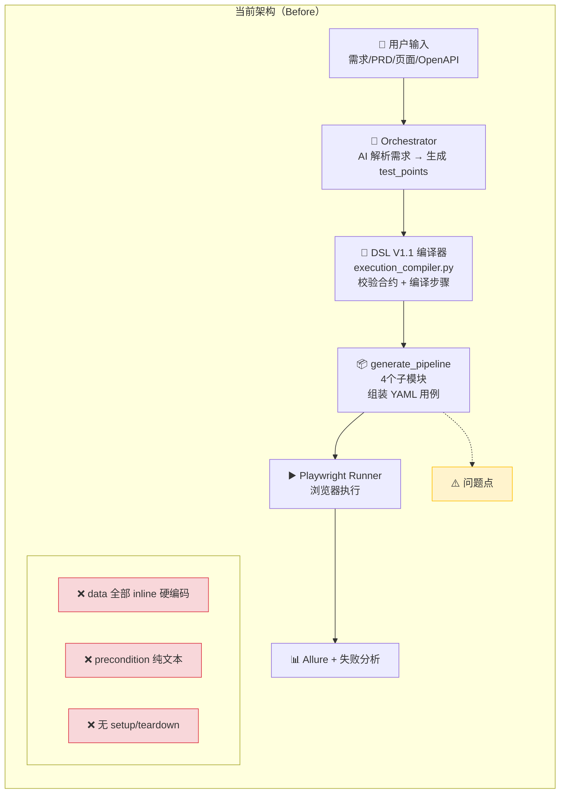
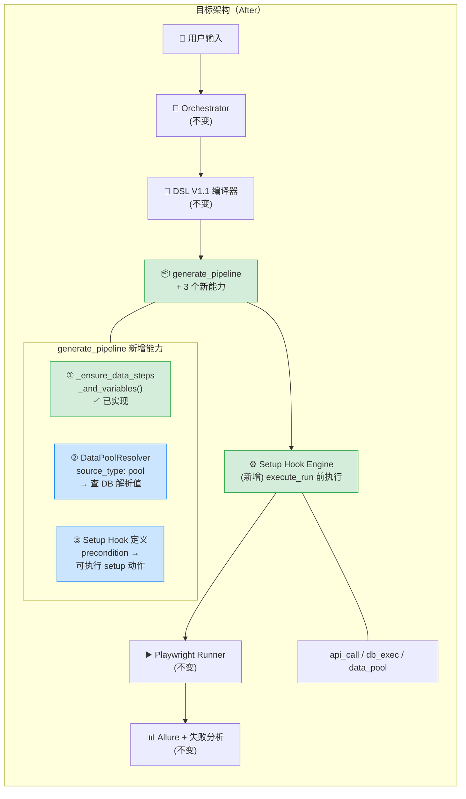
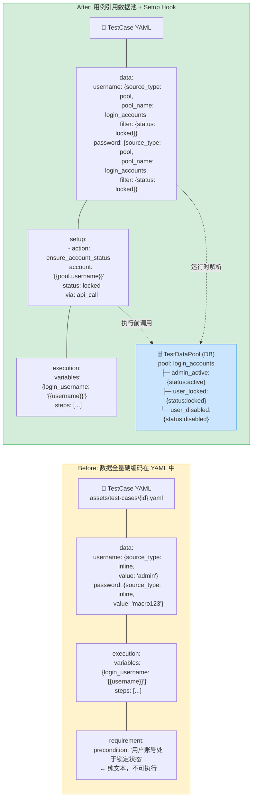
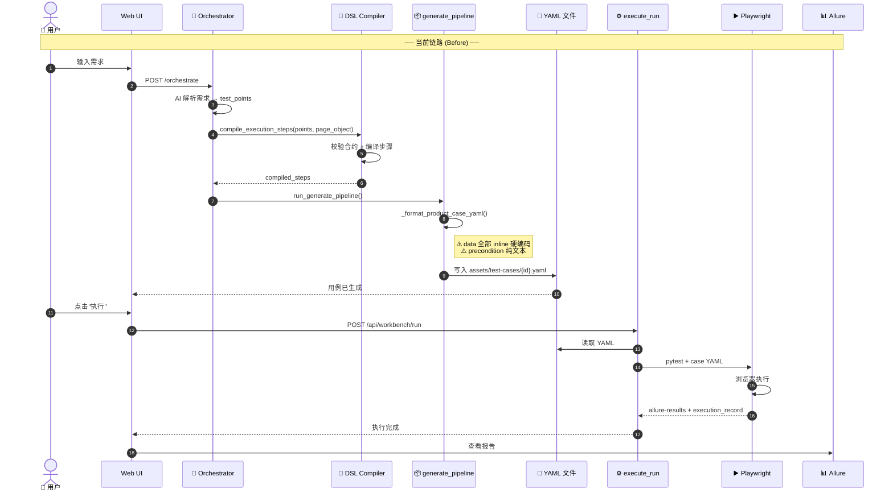
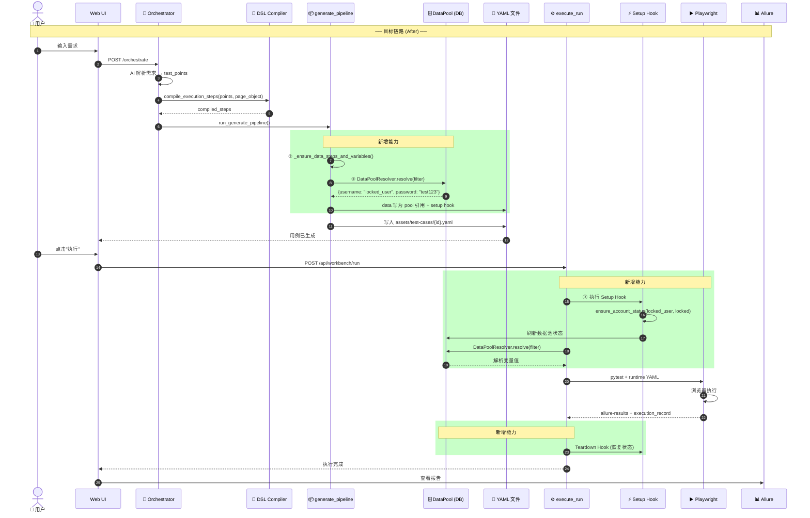
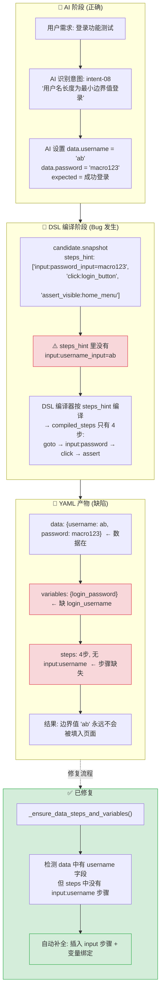

# 测试数据池与前置脚本方案

> 日期：2026-06-15
> 版本：v1.0
> 状态：方案阶段

---

## 一、当前遇到的问题

### 1.1 问题总览

在 2026-06-12 的用例质量审查中，发现 23 个登录测试用例中有以下问题：

| 类别 | 数量 | 典型用例 | 表现 |
|------|------|---------|------|
| 硬编码测试数据 | 23/23 | 全部 | username/password 直接写在 YAML 里 |
| 外部状态依赖 | 3 | 0002、0020、0021 | precondition 说"账号已锁定"，但平台无法确保目标系统上账号真的被锁 |
| 数据字段缺 input 步骤 | 6 | 0008~0017 | data 里有 username 字段，但 steps 里没有 input:username 步骤 |
| 生成管线漏 steps | 系统性 | 整个管线 | AI 识别了测试意图但编译器没把数据字段映射成执行步骤 |

### 1.2 最典型的问题用例

**用例 0020 — "账号锁定时登录提示错误"**

```
当前 YAML：
  data:
    password: macro123      ← 没有 username！不知道用哪个账号登录
  precondition: 用户账号处于锁定状态    ← 纯文本，不可执行
  steps:
    goto → input:password → click → assert_url:#/login

问题：
  1. 平台不知道"哪个账号是锁定的"
  2. 平台无法在执行前把账号设为锁定状态
  3. 如果目标系统上没有锁定账号 → 测试永远失败（假阴性）
  4. 即使碰巧有个锁定账号 → 也不是平台能力保证的，不可复现
```

---

## 二、为什么会出现这些问题

### 2.1 当前架构：生成→执行直通，无数据层

```
┌─────────────┐     ┌──────────────┐     ┌─────────────┐
│  AI 生成     │ ──▶ │  YAML 用例    │ ──▶ │  Playwright  │
│  (orchestrator)│     │  (静态文件)    │     │  执行        │
└─────────────┘     └──────────────┘     └─────────────┘
                           │
                    数据直接写死在 YAML 里
                    没有数据池、没有 setup、没有 teardown
```

**数据流：**

```
当前：
  AI 输出 → candidate.snapshot → YAML data.username = "admin"
                                            data.password = "macro123"
                                                  │
                                                  ▼
                                          执行时直接取 YAML 里的值
                                          填到页面 input 框
```

**问题链：**

```
AI 识别意图"账号锁定"
     │
     ▼
AI 输出 candidate: {intent: "locked", precondition: "账号锁定"}
     │
     ▼
DSL 编译器: 把 intent 转成 steps
     │ 但 precondition 被转成纯文本，没有可执行的动作
     │ data 里只有 password，没有 username（哪个账号？）
     ▼
YAML: {data: {password: "macro123"}, precondition: "用户账号处于锁定状态"}
     │
     ▼
Playwright 执行:
  1. 打开登录页                     ← ✅ 能做到
  2. 输入密码 macro123              ← ✅ 能做到
  3. 点击登录                       ← ✅ 能做到
  4. 断言还在登录页                  ← ❓ 账号真的被锁了吗？不知道
```

---

## 三、业界参照

| 能力 | Google | Amazon | Netflix | Stripe | **我们** |
|------|--------|--------|---------|--------|---------|
| 数据工厂（按需创建） | ✅ | ✅ | ✅ | ✅ | ❌ |
| 数据池 + 标签过滤 | ❌ | ✅ | ❌ | ❌ | 有模型但没用 |
| 故障注入 | ❌ | ❌ | ✅ | ❌ | ❌ |
| 隔离环境 | ✅ | ❌ | ❌ | ✅ | ❌ |
| 前置脚本 | ✅ | ✅ | ✅ | ✅ | ❌ |
| 硬编码数据 | ❌ | ❌ | ❌ | ❌ | ✅ |

**我们的路径：不学 Netflix（太重），不学 Stripe（太贵）。走 Amazon 的数据池路线 + Google 的 setup hook 路线——两个都在我们现有架构上增量叠加即可。**

---

## 四、处理方案

### 4.1 方案概述

分两阶段，在现有架构上渐进式叠加：

| 阶段 | 做什么 | 解决的问题 | 工期 |
|------|--------|-----------|------|
| **一：数据池绑定** | 用例从硬编码值改为引用 `data_pool` | 0020/0021 的"不知道哪个账号" | 1 周 |
| **二：Setup Hook** | 定义可执行的前置脚本 | "账号确实处于锁定状态" | 1 周 |

### 4.2 阶段一：数据池绑定

**核心思路**：用例不再写死 `username: "locked_user"`，改为引用数据池：

```yaml
# Before（现在）
data:
  username:
    source_type: inline
    value: locked_user          ← 硬编码

# After（目标）
data:
  username:
    source_type: pool            ← 从数据池取
    pool_name: login_accounts
    filter:
      status: locked
```

**数据池结构**：

```
Pool: login_accounts
├── item: admin_active
│   ├── username: admin
│   ├── password: macro123
│   └── status: active
├── item: user_locked
│   ├── username: locked_user
│   ├── password: test123
│   └── status: locked
└── item: user_disabled
    ├── username: disabled_user
    ├── password: test123
    └── status: disabled
```

**数据流变化——执行时**：

```
生成时：
  AI 识别 intent "locked" 
    → candidate.source_type = "pool"
    → candidate.pool_name = "login_accounts"
    → candidate.pool_filter = {"status": "locked"}

执行时：
  YAML {source_type: pool, pool_name: login_accounts, filter: {status: locked}}
    → DataPoolResolver.resolve()
      → 查 DB: SELECT * FROM test_data_pool_items WHERE pool_name=login_accounts AND tags->>'status'='locked'
      → 返回 {username: "locked_user", password: "test123"}
    → 填入 {{login_username}} 和 {{login_password}}
    → Playwright 执行
```

### 4.3 阶段二：Setup Hook

**核心思路**：precondition 不再是纯文本，变成可选的 setup 动作：

```yaml
# Before（现在）
requirement:
  precondition: 用户账号处于锁定状态  ← 纯文本

# After（目标）
requirement:
  precondition: 用户账号处于锁定状态  ← 仍是文本描述，给人看的
setup:
  - action: ensure_account_status
    account: "{{pool.login_accounts.locked.username}}"
    status: locked
    via: api_call    # 调目标系统的 API 把账号锁了
```

**Setup Hook 类型**：

| 类型 | 做什么 | 例子 |
|------|--------|------|
| `api_call` | 调目标系统 API | POST /admin/lock-account |
| `db_exec` | 直接改 DB | UPDATE users SET status='locked' |
| `data_pool` | 确保数据池状态 | 刷新数据池中的账号状态 |
| `wait_for` | 等待条件满足 | 等 Redis 缓存失效 |

---

## 五、架构对比图

### 5.1 技术架构：Before vs After（Mermaid 可渲染版）





### 5.1b 文本版（ASCII 备用）

**Before（当前平台实际架构）：**

```
┌─────────────────────────────────────────────────────────────────────────┐
│                     AI Quality Assurance Platform                        │
│                                                                         │
│  用户输入（需求/PRD/页面/OpenAPI）                                        │
│    │                                                                    │
│    ▼                                                                    │
│  ┌──────────────────────┐                                               │
│  │   Orchestrator       │  AI 解析需求 → 生成测试点 (test_points)         │
│  │   (ai-orchestrator)  │  产出: test_points + page_object              │
│  └────────┬─────────────┘                                               │
│           │                                                             │
│           ▼                                                             │
│  ┌──────────────────────┐                                               │
│  │   DSL V1.1 编译器     │  校验测试点合约、绑定页面元素、编译执行步骤       │
│  │   (execution_        │  产出: compiled_steps (action/target/locator) │
│  │    compiler.py)      │                                               │
│  └────────┬─────────────┘                                               │
│           │                                                             │
│           ▼                                                             │
│  ┌──────────────────────┐                                               │
│  │   generate_pipeline  │  将 compiled_steps 组装为 YAML 用例            │
│  │   (4个子模块)         │  产出: assets/test-cases/{case_id}.yaml       │
│  │                      │                                               │
│  │   ⚠️ data 全部 inline │  username: {source_type: inline, value: "admin"}│
│  │   ⚠️ precondition    │  "用户账号处于锁定状态" ← 纯文本，不执行        │
│  │   ⚠️ 无 setup/       │                                               │
│  │      teardown        │                                               │
│  └────────┬─────────────┘                                               │
│           │                                                             │
│           ▼                                                             │
│  ┌──────────────────────┐                                               │
│  │   Playwright Runner  │  读取 YAML → 浏览器执行 → 截图/视频/日志       │
│  │   (web-playwright-   │  产出: allure-results, execution_record      │
│  │    python)           │                                               │
│  └────────┬─────────────┘                                               │
│           │                                                             │
│           ▼                                                             │
│  ┌──────────────────────┐                                               │
│  │   Allure + 失败分析   │  报告、失败聚类、质量门、自愈建议                │
│  └──────────────────────┘                                               │
└─────────────────────────────────────────────────────────────────────────┘
```

**After（目标架构）：**

```
┌─────────────────────────────────────────────────────────────────────────┐
│                     AI Quality Assurance Platform                        │
│                                                                         │
│  用户输入                                                               │
│    │                                                                    │
│    ▼                                                                    │
│  ┌──────────────────────┐                                               │
│  │   Orchestrator       │  (不变)                                        │
│  └────────┬─────────────┘                                               │
│           │                                                             │
│           ▼                                                             │
│  ┌──────────────────────┐                                               │
│  │   DSL V1.1 编译器     │  (不变)                                        │
│  └────────┬─────────────┘                                               │
│           │                                                             │
│           ▼                                                             │
│  ┌──────────────────────────────────────────────┐                       │
│  │   generate_pipeline  (新增 3 个能力)           │                       │
│  │                                              │                       │
│  │   ① _ensure_data_steps_and_variables()       │  ← 已实现              │
│  │      data 里每个字段 → 必有对应 input 步骤    │                       │
│  │                                              │                       │
│  │   ② DataPoolResolver (新增)                  │                       │
│  │      source_type: pool                       │                       │
│  │        → 查询 TestDataPool (DB)              │                       │
│  │        → 按 filter 匹配 item                 │                       │
│  │        → 解析变量值                          │                       │
│  │                                              │                       │
│  │   ③ Setup Hook 定义 (新增)                   │                       │
│  │      precondition → 可选的 setup 动作        │                       │
│  │      setup: [{action: ensure_account_status}]│                       │
│  └────────┬─────────────────────────────────────┘                       │
│           │                                                             │
│           ▼                                                             │
│  ┌──────────────────────┐                                               │
│  │   Setup Hook Engine   │  执行前置脚本 (新增)                          │
│  │   (execute_run 前)    │  api_call / db_exec / data_pool              │
│  └────────┬─────────────┘                                               │
│           │                                                             │
│           ▼                                                             │
│  ┌──────────────────────┐                                               │
│  │   Playwright Runner  │  (不变)                                        │
│  └────────┬─────────────┘                                               │
│           │                                                             │
│           ▼                                                             │
│  ┌──────────────────────┐                                               │
│  │   Allure + 失败分析   │  (不变)                                        │
│  └──────────────────────┘                                               │
└─────────────────────────────────────────────────────────────────────────┘
```

### 5.2 数据架构：Before vs After（Mermaid 版）



### 5.2b 文本版

**Before：**

```
TestCase YAML
  ├── data:
  │     username: {source_type: inline, value: "admin"}   ← 写死
  │     password: {source_type: inline, value: "macro123"} ← 写死
  ├── execution:
  │     variables: {login_username: "{{username}}"}       ← 从 data 取
  │     steps: [...]
  └── requirement:
        precondition: "用户账号处于锁定状态"               ← 纯文本
```

**After：**

```
TestCase YAML                          TestDataPool (DB)
  ├── data:                              ├── pool: login_accounts
  │     username:                            ├── item: admin_active
  │       source_type: pool                      ├── tags: {status: active}
  │       pool_name: login_accounts              ├── username: admin
  │       filter: {status: "locked"}             └── password: macro123
  │     password:                            ├── item: user_locked
  │       source_type: pool                      ├── tags: {status: locked}
  │       pool_name: login_accounts              ├── username: locked_user
  │       filter: {status: "locked"}             └── password: test123
  ├── setup:                                └── item: user_disabled
  │     - action: ensure_account_status          ├── tags: {status: disabled}
  │       account: "{{pool.username}}"           ├── username: disabled_user
  │       status: locked                         └── password: test123
  │       via: api_call
  └── execution:
        variables: {login_username: "{{username}}"}   ← 从 Pool 解析
        steps: [...]
```

### 5.3 业务架构：用例生成→执行全链路（Mermaid 序列图）





### 5.3b 文本版

**Before（当前实际链路）：**

```
用户输入需求 (Web UI)
  │
  ▼
Orchestrator: AI 解析需求 → 生成 requirement_spec + test_points
  │  产出: {test_points: [{intent_id, steps_hint, involved_elements, expected_result}]}
  │
  ▼
DSL V1.1 编译器 (shared_backend/execution_compiler.py)
  │  compile_execution_steps(test_points, page_object)
  │  → 校验: 每个 step 的 action 是否合法? target 是否在 page_object 中?
  │  → 编译: steps_hint → compiled_steps (action + target + locator + value)
  │  产出: compiled_steps = [{action: "input", target: "element:username_input", ...}]
  │
  ▼
generate_pipeline (4 个子模块)
  │  _format_product_case_yaml → 组装 YAML
  │    ├── data 字段: 从 candidate snapshot 取, 写死 inline 值 → ⚠️ 硬编码
  │    ├── variables: data 的 key 映射为 {{key}} 模板变量
  │    ├── steps: _format_product_execution_steps(compiled_steps)
  │    └── precondition: 纯文本 → ⚠️ 不可执行
  │  产出: assets/test-cases/{case_id}.yaml
  │
  ▼
用户点击"执行"
  │
  ▼
execute_run() (workbench_runtime_service.py)
  │  → 读取 YAML → 写入 runtime YAML → 调 Playwright runner
  │
  ▼
Playwright Runner (pytest + conftest.py)
  │  → 读取 YAML steps → 浏览器执行 → allure-results + execution_record
  │
  ▼
Allure 报告 + 失败分析 + 质量门
```

**After（目标链路）：**

```
用户输入需求 (Web UI)
  │
  ▼
Orchestrator (不变)
  │
  ▼
DSL V1.1 编译器 (不变)
  │
  ▼
generate_pipeline (3 处改动)
  │
  ├── ① _ensure_data_steps_and_variables()           ← 已实现
  │      data 中每个有 value 的字段 → 确保 steps 中有对应 input 步骤
  │
  ├── ② DataPoolResolver                             ← 新增
  │      遇到 source_type: pool 时:
  │        → 查 TestDataPool (DB)
  │        → 按 filter 匹配 item
  │        → 解析出 username/password
  │      data 不再写死 inline 值, 改为引用 pool
  │
  └── ③ Setup Hook 写入 YAML                          ← 新增
        有 precondition 且非纯描述时:
          → 生成 setup: [{action, params}] 块
          → 写入 YAML
  │
  ▼
用户点击"执行"
  │
  ▼
execute_run() (改动)
  │
  ├── Setup Hook Engine (新增)
  │     → 读取 YAML setup 块
  │     → 执行 setup 动作 (api_call / db_exec / data_pool)
  │     → 确保前置条件满足 (如: 账号确实被锁定)
  │
  ├── DataPoolResolver (新增)
  │     → 执行时解析 pool 变量
  │     → 将解析后的值填入 runtime YAML
  │
  └── Playwright Runner (不变)
  │
  ▼
Teardown Hook (新增, 可选)
  │  → 恢复被 setup 改变的状态
  │
  ▼
Allure 报告 + 失败分析 + 质量门
```

---

### 5.4 问题根因：0008 用例缺陷产生流程（Mermaid）



---

## 六、实施计划

### 阶段一：数据池绑定（1 周）

| 文件 | 改动 |
|------|------|
| `models/test_data_pool.py` | `TestDataPoolItem` 加 `tags` JSON 字段 |
| `services/test_data_pool_service.py` | 新增 `resolve_pool_value(pool_name, filter)` |
| `services/workbench_generation_compiler/runtime/generate_pipeline_format.py` | `_enrich_dsl_v1_1_data_bindings` 支持 `source_type: pool` |
| `tests/unit/` | 新增 pool 解析测试 |

**交付物**：用例 0020/0021 可以引用 `pool:login_accounts?status=locked` 而不是硬编码 `locked_user`

### 阶段二：Setup Hook（1 周）

| 文件 | 改动 |
|------|------|
| `models/test_case.py` | `TestCase` 加 `setup_hooks` JSON 字段 |
| `services/workbench_runtime_service.py` | `execute_run` 前执行 setup hooks |
| `services/test_data_pool_service.py` | 新增 `ensure_item_tags(pool_name, item_key, tags)` |
| `assets/test-cases/*.yaml` | 0020/0021 加 setup hook |

**交付物**：执行 0020 前自动调 API 把账号锁了，执行后恢复

---

## 七、预期结果

| 指标 | Before | After |
|------|--------|-------|
| 硬编码数据 | 23/23 用例 | 0（全部引用 pool） |
| precondition 可执行率 | 0% | 100%（有 setup hook 的用例） |
| 假阴性率（环境不匹配） | 3/23 (13%) | 0/23 (0%) |
| 新增同类用例 | 每次都要手工修正 YAML | 生成管线自动处理 |
| 同一用例多环境执行 | 需要改 YAML | 换 pool 即可 |

---

## 八、风险评估

| 风险 | 概率 | 应对 |
|------|------|------|
| Pool 数据泄露（含真实密码） | 低 | pool 标记 `env=test` 的项密码脱敏 |
| Setup hook 执行失败导致环境污染 | 中 | hook 执行失败 → 标记用例为 blocked，不继续执行 |
| Pool 查询性能（大池子） | 低 | 每个用例最多查 5 个 pool 项，DB 索引覆盖 |

---

*文档结束。*
