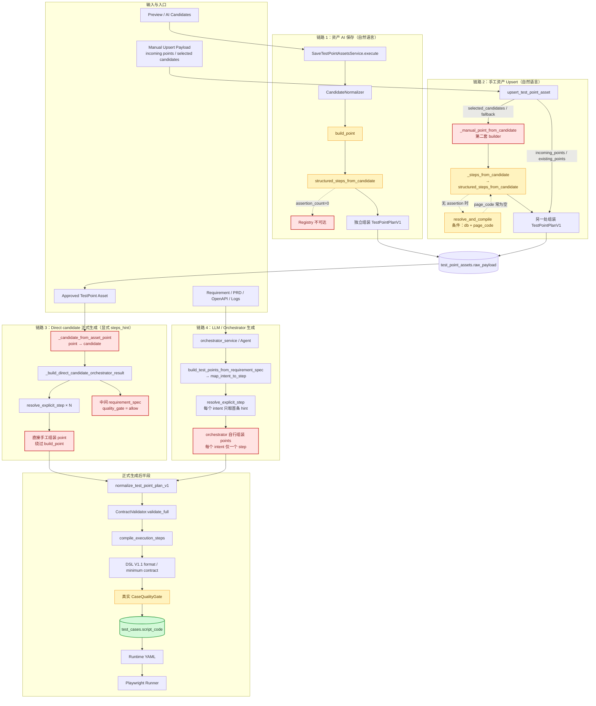
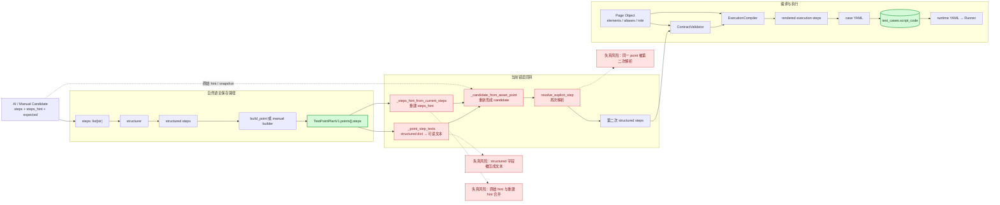
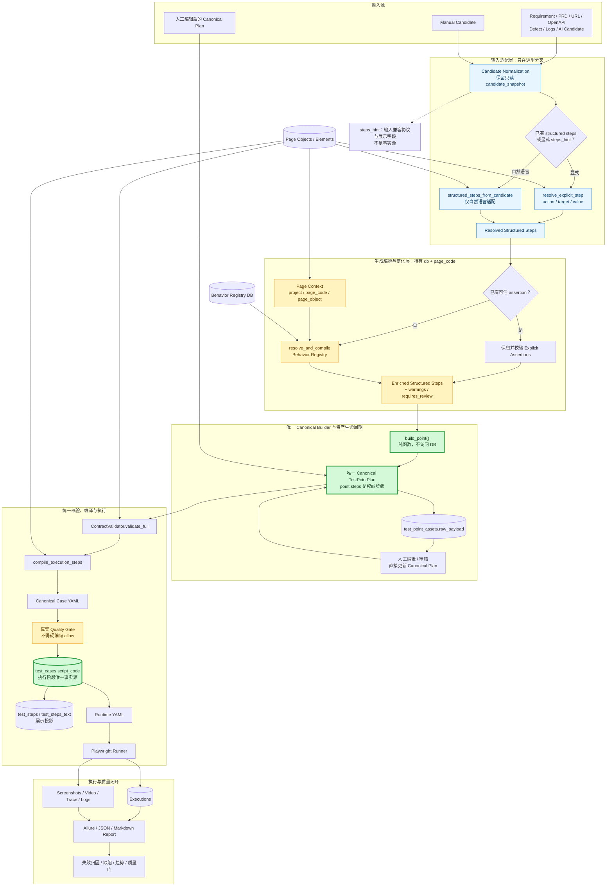

# ATP 测试点生成与执行架构：现状、错误链路与目标单链路

> 日期：2026-07-12
>
> 审阅基线：`dev@e08f39d`，并单独标注当前工作区尚未提交的 `db` 透传修改
>
> 范围：从需求/候选测试点生成，到 Canonical TestPointPlan、执行编译、`test_cases.script_code` 和 Runner
>
> 方法：基于实际入口、调用方、参数和持久化代码逐层核对；不把注释或设计意图当作已实现事实

---

## 1. 结论

当前系统的核心问题不是某一个解析函数，而是**生成生命周期存在四条并行链路**：

1. 资产 AI 保存：自然语言 candidate 经过 `build_point()`。
2. 手工资产 Upsert：`incoming_points/existing_points` 可直接保存；只有 `selected_candidates/fallback` 分支经过 `_manual_point_from_candidate()`。
3. Direct candidate 正式生成：显式 `steps_hint` 经过 `resolve_explicit_step()`，但绕过 `build_point()`。
4. LLM/orchestrator 生成：orchestrator 自行生成 point，再由 web-ui pipeline 再次规范化、校验和编译，也不经过 web-ui 的 `build_point()`。

因此，当前事实是：

- `build_point()` 存在，但不是唯一 canonical builder。
- `steps_hint` 在 direct 路径是输入协议；在资产回转路径又被重建并参与再次解析，尚未完全降级为兼容/展示字段。
- Behavior Registry 只在手工 `_steps_from_candidate()` 路径中有条件调用，其他生成路径不可达。
- `build_point()` 当前不访问数据库，这一点符合目标约束，后续也应保持。
- 人工审核状态会直接更新已保存的 plan；但生成用例时，canonical point 又会被转换回 candidate，形成数据回转。
- Direct candidate 中间产物固定写入 `quality_gate.decision="allow"`；最终持久化前仍有真实 `CaseQualityGate`，所以问题是**中间质量状态不真实**，并非最终质量门完全缺失。
- `ContractValidator → compile_execution_steps()` 已在正式 web-ui 生成链中串联，但资产生成前仍存在 point → candidate → point 的回转。
- `test_cases.script_code` 已是执行阶段事实源；runtime YAML 是由它物化出的运行时输入。

---

## 2. 事实源与中间数据定义

| 数据 | 当前用途 | 目标定位 | 是否应成为事实源 |
|---|---|---|---|
| 原始 requirement / PRD / OpenAPI / defect / logs | 生成输入 | 只读来源 | 否 |
| Candidate | AI/手工生成的过渡模型 | 进入 canonical builder 前的输入 | 否 |
| `candidate_snapshot` | 追踪 AI 原始输出 | 只读审计快照 | 否 |
| `steps_hint` | 显式步骤协议、兼容输入、展示 | 只读兼容协议和展示字段 | 否 |
| Natural-language `steps` | structurer 输入 | 只在首次结构化时使用 | 否 |
| Structured `point.steps` | 当前编译输入 | canonical 测试点步骤 | 是，生成阶段内部事实 |
| `TestPointPlanV1` | 测试点资产 | 唯一 Canonical TestPointPlan | 是，测试点阶段事实源 |
| Compiled execution steps | compiler 输出 | 派生中间表示 | 否 |
| `test_cases.script_code` | DB 中的可执行 YAML/脚本 | 执行阶段唯一事实源 | 是 |
| Runtime YAML | Runner 临时输入 | 从 `script_code` 物化 | 否 |

---

## 3. 当前系统架构图：错误的多链路实现

图中红色节点表示已确认的架构差距；黄色节点表示能力存在但覆盖不完整。



### 当前架构中已经确认的错误

| 编号 | 错误 | 直接后果 |
|---|---|---|
| C1 | 三套 point 组装：`build_point()`、`_manual_point_from_candidate()`、direct builder | 同一输入在不同入口得到不同字段、warning、review 状态和 metadata |
| C2 | Structured point 在生成用例前回转成 candidate | canonical 数据可能被降级成文本，再重新解析 |
| C3 | Registry 只挂在 `_steps_from_candidate()` | AI Save、Direct、orchestrator 路径没有统一 assertion enrichment |
| C4 | Registry 的 `page_code` 从 candidate 读取 | 即使 `db` 已透传，也可能以空 page 查询而无法命中模板 |
| C5 | `_build_expected_assertions()` 固定返回 `0` | expected 不再自动猜测 assertion，这是正确方向；但 `assertion_count` 也无法反映 PageHook 已追加的断言 |
| C6 | Direct candidate 中间质量门固定 `allow` | 中间 requirement/test-intent 质量状态不真实，可能影响诊断与追踪 |
| C7 | 质量门存在多套语义 | preview requirement gate、asset structural gate、final CaseQualityGate 没有统一生命周期表达 |
| C8 | LLM/orchestrator 与 web-ui 都可能规范化、校验、编译 | 生成责任重复，出现两边规则漂移的风险 |
| C9 | orchestrator 对每个 intent 只解析 `steps_hint` 首条 | 同一 intent 的后续操作或 assertion 可能在 orchestrator point 中丢失；direct 路径却会遍历全部 hints |

---

## 4. 当前数据链路图：错误的数据回转

这张图只关注字段如何变化，以及在哪些位置可能失真。



### 字段级失真点

| 位置 | 输入 | 输出 | 风险 |
|---|---|---|---|
| `structured_steps_from_candidate()` | 自然语言 `steps`、`steps_hint`、`expected` | structured steps、重新生成的 hints、data、warnings | 自然语言无法解析时产生 candidate step；expected 不生成 assertion |
| `_steps_from_candidate()` | candidate | structured steps | Registry 只在这里条件执行；默认 resolver 不含完整页面专属 Hook/Config |
| `_candidate_from_asset_point()` | canonical `point.steps` | candidate `steps + steps_hint` | structured step 被转换成可读文本，随后再次解析 |
| `_steps_hint_from_current_steps()` | structured steps | 新 hints | 与 snapshot hints 合并，存在来源和语义冲突 |
| direct builder | candidate hints | 新 point | 绕过唯一 builder，字段组装规则不同 |

---

## 5. 当前四条调用链的准确状态

### 5.1 链路 1：资产 AI 保存

```text
POST /api/workbench/test-point-assets/save
→ SaveTestPointAssetsService.execute()
→ CandidateNormalizer.normalize_candidates()
→ build_point(candidate, resolver, page_hook, page_config)
→ structured_steps_from_candidate()
→ 独立组装 TestPointPlanV1
→ test_point_assets.raw_payload + test_points
```

状态：

- 使用 `build_point()`。
- 有 DB 加载出的 `PageConfig`、alias map 和 `PageHook`。
- 不调用 Behavior Registry。
- `_build_expected_assertions()` 返回 `0`，缺 assertion 时 `build_point()` 添加 warning / requires_review。
- 保存 Service 本身不运行最终 `CaseQualityGate`。

### 5.2 链路 2：手工资产 Upsert

```text
POST/PUT /api/workbench/test-point-assets[/{id}]
→ upsert_test_point_asset()
├─ incoming_points 存在 → 直接使用 canonical points
├─ existing_points 存在 → 直接沿用 canonical points
└─ selected_candidates / fallback
   → _manual_point_from_candidate()
   → _steps_from_candidate()
   → structured_steps_from_candidate()
   → 条件调用 resolve_and_compile()
   → 第二套 point 组装
→ normalize_test_point_plan_v1()
→ test_point_assets.raw_payload
```

状态：

- incoming/existing points 分支不会重新结构化；selected candidate/fallback 分支不调用 `build_point()`。
- `dev@e08f39d` 中 `_manual_point_from_candidate()` 没有把 `db` 传给 `_steps_from_candidate()`，Registry 分支不可达。
- 当前工作区存在尚未提交的 `db` 透传修改，使分支变为可达。
- 但 `_steps_from_candidate()` 仍从 `candidate.page_code` 读取页面；Upsert 上下文虽然已有顶层 `page`，却没有显式传入，因此 Registry 仍可能无法命中。
- 没有完整的 page-specific `resolver/page_hook/page_config` 注入。

### 5.3 链路 3：Direct candidate 正式生成

```text
GenerateCaseService
→ run_generate_pipeline()
→ _call_orchestrator_and_parse()
→ _build_direct_candidate_orchestrator_result()
→ resolve_explicit_step() × 每条 steps_hint
→ 手工组装 point
→ normalize_test_point_plan_v1()
→ ContractValidator.validate_full(strict=True)
→ compile_execution_steps()
→ DSL V1.1 格式化
→ CaseQualityGate
→ test_cases.script_code
```

状态：

- 已是 web-ui 正式生产生成链的一部分。
- 显式 `steps_hint` 解析正确进入 `resolve_explicit_step()`。
- 绕过 `build_point()`。
- 中间 requirement spec 和 intent 固定写入 `quality_gate=allow`。
- 最终写入前真实 `CaseQualityGate` 会重新计算并覆盖对外 quality gate；因此不是最终门禁完全绕过。

### 5.4 链路 4：LLM/orchestrator 生成

```text
run_generate_pipeline()
→ run_orchestrator_generate()
→ RequirementTestPointSupport.build_test_points_from_requirement_spec()
→ map_intent_to_step()
→ resolve_explicit_step()
→ orchestrator ContractValidator + compile_execution_steps()
→ 返回 web-ui
→ web-ui normalize + ContractValidator + compile_execution_steps()
→ DSL V1.1 格式化
→ CaseQualityGate
→ test_cases.script_code
```

状态：

- 不经过 web-ui 的 `build_point()`。
- 使用显式 `steps_hint` 映射 action/target/value，但 `resolve_explicit_step()` 每次只读取首条 hint，最终每个 intent 只构造一个 step。
- orchestrator 和 web-ui 都承担规范化/校验/编译职责，存在重复链路。
- 最终仍经过 web-ui `CaseQualityGate`。

---

## 6. 正确的目标系统架构图：唯一 canonical 生命周期

目标架构只允许输入适配分叉，不允许 canonical 生命周期分叉。



### 目标架构必须保持的边界

1. `steps_hint` 只在首次输入适配时读取。
2. 显式输入由 `resolve_explicit_step()` 解析；自然语言输入才进入 structurer。
3. structurer 不根据 expected 猜测 assertion。
4. Registry 由持有 `db + page_code` 的编排层调用。
5. `build_point()` 接收已经解析、已经富化的数据，本身不访问 DB。
6. 所有输入最终只经过一个 `build_point()`，产出唯一 Canonical TestPointPlan。
7. 人工修改直接更新 Canonical TestPointPlan，后续不回转成 candidate。
8. 编译只读取 canonical `point.steps`。
9. `ContractValidator` 通过后才能调用 `compile_execution_steps()`。
10. 质量门必须真实计算，任何路径不得构造固定 `allow`。
11. `test_cases.script_code` 是执行阶段唯一事实源。

---

## 7. 正确的目标数据链路图：单向、无回转

```mermaid
flowchart LR
  INPUT["Raw Input"]
  SNAP["candidate_snapshot<br/>只读审计"]
  HINT["steps_hint<br/>兼容输入"]
  NL["natural steps<br/>自然语言输入"]
  EXPLICIT["resolve_explicit_step"]
  STRUCT["structurer"]
  STEPS["Resolved Structured Steps<br/>action / target / value / raw_text"]
  ENRICH["Registry / Page Context Enrichment<br/>由编排层完成"]
  BUILDER["build_point<br/>纯函数"]
  PLAN["Canonical TestPointPlan<br/>points[].steps"]
  REVIEW["人工编辑 Canonical Plan"]
  VALID["ContractValidator"]
  IR["ExecutionCompiler IR"]
  RENDER["Rendered Execution Steps"]
  CASE["Canonical Case YAML"]
  SCRIPT["test_cases.script_code"]
  RUNTIME["Runtime YAML"]
  RUNNER["Runner"]

  INPUT --> SNAP
  INPUT --> HINT --> EXPLICIT --> STEPS
  INPUT --> NL --> STRUCT --> STEPS
  STEPS --> ENRICH --> BUILDER --> PLAN
  PLAN --> REVIEW --> PLAN
  PLAN --> VALID --> IR --> RENDER --> CASE --> SCRIPT --> RUNTIME --> RUNNER

  SNAP -. "trace only" .-> PLAN
  HINT -. "display only after parsing" .-> PLAN

  STOP1["禁止：PLAN → candidate"]
  STOP2["禁止：PLAN → steps_hint → parser"]
  STOP3["禁止：builder 查询 DB"]
  PLAN -. "禁止" .-> STOP1
  PLAN -. "禁止" .-> STOP2
  BUILDER -. "禁止" .-> STOP3

  classDef truth fill:#d3f9d8,stroke:#2f9e44,color:#173d20,stroke-width:2px;
  classDef stop fill:#ffe3e3,stroke:#c92a2a,color:#7f1d1d;
  class STEPS,PLAN,SCRIPT truth;
  class STOP1,STOP2,STOP3 stop;
```



### 目标数据契约

#### Builder 输入

```text
candidate metadata
+ resolved_structured_steps
+ registry/page-context enrichment result
+ warnings/requires_review
+ read-only candidate_snapshot
```

#### Canonical TestPointPlan

```text
TestPointPlanV1
├── project / page / case_id
├── points[]
│   ├── intent_id / point_type / priority
│   ├── steps[]                 ← 编译权威输入
│   ├── expected_result         ← 文档语义，不直接转 assertion
│   ├── involved_elements
│   ├── warnings / requires_review
│   └── metadata.candidate_snapshot
└── review / coverage / traceability metadata
```

#### 执行事实源

```text
Canonical TestPointPlan.points[].steps
→ ContractValidator
→ compile_execution_steps
→ Canonical Case YAML
→ test_cases.script_code
→ Runtime YAML
→ Playwright Runner
```

---

## 8. 当前实现与目标约束逐项对照

| # | 目标约束 | 当前状态 | 结论 |
|---|---|---|---|
| 1 | `steps_hint` 仅兼容/展示 | 资产生成时仍重建并重新解析 | 部分满足 |
| 2 | 显式 hints 经 `resolve_explicit_step` | Direct 与 orchestrator 已做到 | 部分满足 |
| 3 | 自然语言 steps 经 structurer | AI Save 与手工 Upsert 已做到 | 已满足 |
| 4 | 两种输入汇聚到唯一 `build_point()` | direct、orchestrator、manual 均有旁路 | 未满足 |
| 5 | 唯一 Canonical TestPointPlan | 多处组装 plan/point | 未满足 |
| 6 | Registry 在编排层，builder 无 DB | builder 无 DB；Registry 仍嵌在 helper 且 page_code 不稳定 | 部分满足 |
| 7 | 编辑后直接更新 canonical plan | 审核直接更新；生成时又回转 candidate | 部分满足 |
| 8 | Validator 后统一 compiler | 正式 web pipeline 已串联；前面仍有重复生成/编译职责 | 部分满足 |
| 9 | `script_code` 为执行事实源 | Runner 从 DB script_code 物化 runtime YAML | 已满足 |
| 10 | direct 不得固定 allow | 中间 requirement spec 仍固定 allow；最终 CaseQualityGate 会重算 | 未满足 |

---

## 9. 单链路迁移顺序

### Phase 1：统一解析结果与 builder

只做：

- 让显式 `steps_hint` 和自然语言 structurer 都输出同一种 resolved structured steps。
- 让 direct、AI Save、manual Upsert 都调用唯一 `build_point()`。
- `build_point()` 保持纯函数，不增加 `db` 参数。

验收标准：

- 三类输入产生同结构 point。
- direct 路径不再手工组装 point。
- `_manual_point_from_candidate()` 不再作为第二套 builder。

### Phase 2：统一 Registry 与页面上下文富化

只做：

- 由持有 `db + project + page_code` 的生成编排层调用 `resolve_and_compile()`。
- 将 Registry assertions、warnings 和 requires_review 作为 builder 输入。
- 不恢复 `_build_expected_assertions()` 的文本猜测逻辑。

验收标准：

- 所有路径使用相同 Registry 规则。
- Registry 查询始终拿到明确 `page_code`。
- 未配置 Registry 且没有显式可信 assertion 时，进入 review/block，而非自动猜测。

### Phase 3：消除资产回转并统一质量/编译出口

只做：

- 资产生成直接读取 Canonical TestPointPlan 的 `point.steps`。
- 删除正式生成对 `_candidate_from_asset_point()` 和重建 hints 的依赖。
- 所有路径统一走 `ContractValidator → compile_execution_steps → CaseQualityGate → script_code`。
- 移除 direct candidate 的固定 `quality_gate=allow`。

验收标准：

- 保存后的 structured steps 在生成脚本时不再转回文本或 hints。
- 同一 Canonical TestPointPlan 在所有入口得到一致 compiled steps。
- 任何可持久化用例都有真实质量门结果。
- Runner 仅消费由 `test_cases.script_code` 物化的 runtime YAML。

---

## 10. 代码证据索引

| 事实 | 文件 / 函数 |
|---|---|
| 资产 AI Save 入口 | `apps/web-ui-service/app/routers/workbench_generation.py::save_test_point_assets` |
| AI Save builder | `apps/web-ui-service/app/services/workbench_generation_api/save_test_point_assets_service.py::SaveTestPointAssetsService.execute` |
| 当前 canonical point builder | `apps/web-ui-service/app/services/workbench_generation_api/compilation/point_builder.py::build_point` |
| 自然语言 structurer | `apps/web-ui-service/app/services/workbench_generation_api/steps/structurer.py::structured_steps_from_candidate` |
| expected assertion 已停用 | `apps/web-ui-service/app/services/workbench_generation_api/steps/structurer.py::_build_expected_assertions` |
| 手工 Upsert 第二套 builder | `apps/web-ui-service/app/api/workbench/facade_helpers.py::_manual_point_from_candidate` |
| 当前 Registry fallback | `apps/web-ui-service/app/api/workbench/facade_helpers.py::_steps_from_candidate` |
| Registry 入口 | `apps/web-ui-service/app/services/assertion_resolver.py::resolve_and_compile` |
| 资产 point 回转 candidate | `apps/web-ui-service/app/api/workbench/facade_helpers.py::_candidate_from_asset_point` |
| hints 反向重建 | `apps/web-ui-service/app/api/workbench/facade_helpers.py::_steps_hint_from_current_steps` |
| Direct candidate builder | `apps/web-ui-service/app/services/workbench_generation_compiler/runtime/generate_pipeline_orchestrate.py::_build_direct_candidate_orchestrator_result` |
| web-ui 正式生成入口 | `apps/web-ui-service/app/services/workbench_generation_compiler/runtime/generate_pipeline_steps.py::run_generate_pipeline` |
| web-ui 校验/编译 | `apps/web-ui-service/app/services/workbench_generation_compiler/runtime/generate_pipeline_steps.py::_validate_and_compile_steps` |
| 最终 CaseQualityGate | `apps/web-ui-service/app/services/workbench_generation_compiler/runtime/generate_pipeline_steps.py::_persist_and_build_response` |
| Orchestrator point 生成 | `apps/ai-orchestrator/src/services/requirement_testpoint_support.py::build_test_points_from_requirement_spec` |
| Orchestrator 显式解析 | `apps/ai-orchestrator/src/services/requirement_testpoint_support.py::map_intent_to_step` |
| Orchestrator 校验/编译 | `apps/ai-orchestrator/src/services/orchestration_flow_support.py::_validate_compile_and_persist_case` |
| 统一 compiler | `shared_backend/execution_compiler.py::compile_execution_steps` |
| 合约规范化 | `shared_backend/schemas/contracts.py::normalize_test_point_plan_v1` |
| 合约校验 | `shared_backend/schemas/validator.py::ContractValidator` |
| 执行事实源读取 | `apps/web-ui-service/app/api/workbench/facade_test_point_assets.py::run_case` |
| Runtime YAML 物化 | `apps/web-ui-service/app/services/workbench_runtime_service.py::materialize_runtime_case_yaml` |

---

## 11. 最终架构判定

当前架构不是“显式路径和自然语言路径在 canonical builder 前短暂分叉”，而是“入口、解析、富化、builder、质量门和持久化责任多处并行”。

正确迁移方向是：

```text
输入适配允许分叉
→ resolved structured steps 必须汇聚
→ 编排层统一 Registry/Page Context 富化
→ 唯一纯函数 build_point
→ 唯一 Canonical TestPointPlan
→ 人工只编辑 canonical plan
→ ContractValidator
→ compile_execution_steps
→ 真实 Quality Gate
→ test_cases.script_code
→ Runner
```

这条链路中，`steps_hint`、自然语言 steps、candidate 和 runtime YAML 都是阶段性数据；只有 Canonical TestPointPlan 与 `test_cases.script_code` 分别承担测试点阶段和执行阶段的事实源职责。
