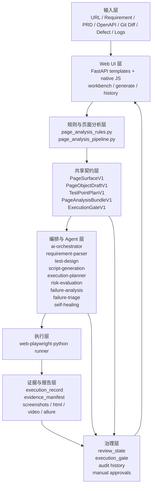
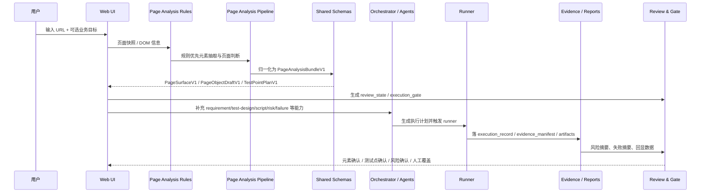

# 当前架构与调用链

本文档只描述当前仓库已经落地的主链能力，不把目标设计、路线图和未来愿景写成既成事实。

## 当前口径

- 当前平台的准确定位是：**确定性底座 + AI 辅助 + 人工门禁**。
- 当前最可信的主链不是“纯 Agent 自治”，而是 `Web UI URL-first 入口 -> 页面分析规则/契约 -> orchestrator/agents -> Playwright runner -> review_state / execution_gate / audit`。
- URL 解析、DOM 提取、schema 归一化、runner 执行、断言裁决、审计落盘都应视为**确定性能力**，不是 AI 推理能力。
- AI 当前主要承担：需求语义解析、测试点设计补充、失败归因解释、风险解释与建议。
- 人工当前主要承担：低置信度元素确认、测试点确认、风险决策、门禁覆盖、自愈审批。

## 1. 当前分层图

## 2. 当前真实主链

当前仓库已经能稳定表达的 URL-first 主链更接近下面这个顺序：

## 3. 当前核心模块与职责

| 模块 | 当前位置 | 当前职责 | 当前判断 |
|---|---|---|---|
| Web UI | `apps/web-ui-service/` | URL-first 入口、确认点面板、历史审计、run 回显 | 已落地，业务最集中 |
| 页面分析规则 | `apps/web-ui-service/app/core/page_analysis_rules.py` | 规则优先元素抽取、页面候选、置信度计算 | 已落地，确定性优先 |
| 页面分析编排 | `apps/web-ui-service/app/core/page_analysis_pipeline.py` | 三模型组装、bundle 消费、兼容归一化 | 已落地 |
| 共享契约 | `apps/shared_backend/schemas/contracts.py` | 中间模型 V1、归一化、兼容别名 | 已落地，是收口点 |
| Workbench API | `apps/web-ui-service/app/api/workbench/facade.py` | 运行编排、回显、review、gate、审计统一入口 | 已落地，仍需继续按域收敛 |
| Orchestrator | `apps/ai-orchestrator/src/orchestrator_service.py` | 多源输入、质量门禁、Agent 调用、报告拼装 | 已落地，仍偏大编排器 |
| Agents | `agents/*` | 解析、设计、脚本、规划、风险、归因、triage、自愈 | 大部分可用，能力成熟度不一 |
| Runner | `runners/web-playwright-python/` | 执行、断言、证据采集、报告产出 | 已落地，确定性最高 |

## 4. 当前统一术语

为避免不同文档对同一对象反复换名，当前建议统一用下面这组词：

| 术语 | 含义 | 当前来源 |
|---|---|---|
| `PageSurfaceV1` | 页面表层结构与元素候选 | shared contracts |
| `PageObjectDraftV1` | 页面对象草稿与质量摘要 | shared contracts |
| `TestPointPlanV1` | 测试点计划、依赖元素、review 信息 | shared contracts |
| `PageAnalysisBundleV1` | 三模型 bundle 与版本摘要 | shared contracts |
| `review_state` | 三个确认点的当前状态：元素 / 测试点 / 风险 | workbench runtime |
| `execution_gate` | 系统门禁决策与人工覆盖结果 | workbench runtime |
| `execution_record` | 运行记录的标准化主体 | shared contracts / runner |
| `evidence_manifest` | 证据索引和证据来源声明 | shared contracts / runner |

## 5. 确定性、AI、人工的当前边界

| 环节 | 当前主责任 | 为什么这样划分 |
|---|---|---|
| URL 解析 / 路由归一化 | 确定性逻辑 | 这是工程事实，不需要 AI |
| DOM 提取 / 页面快照 | 确定性逻辑 | Playwright 与 DOM API 可重复 |
| 元素候选抽取 | 规则优先，AI 补充 | 稳定元素应先靠 role/placeholder/text/selector 规则 |
| 页面语义判断 | 规则初判 + AI 补充 | 同页多语义时才需要推断 |
| 测试点设计 | AI 辅助 + 人工确认 | 业务覆盖边界不能完全自动决定 |
| 脚本生成 | 模板约束 + AI 填充 | 需要可执行格式，但仍依赖上游质量 |
| 执行与断言 | 确定性 runner | pass/fail 不应交给 AI 裁决 |
| 失败归因 | AI 辅助 + 规则兜底 + 人工复核 | 最容易误判应用 bug / 脚本 bug |
| 风险评估 | 规则评分/AI 解释 + 人工最终决策 | 高风险节点必须保留人工边界 |
| 自愈 | AI 建议 + 人工审批 | 只允许 locator/timeout/selector 级修复 |

## 6. 当前真正落地的治理链

当前不是“做完生成就算完成”，而是已经有可落盘、可回显、可审计的治理对象：

1. `review_state`
   元素确认、测试点确认、风险确认都可保存、刷新后回显。
2. `execution_gate`
   支持系统决策、人工放行、人工阻断、二次审批、撤销。
3. 审计历史
   review/gate 行为会写入历史事件，用于追溯“谁在何时确认了什么”。
4. 风险与失败摘要
   风险评估和失败分析已能回显到生成页、工作台和历史视图。

## 7. 当前最重要的现实判断

### 7.1 已经比较稳的部分

- Web UI 的 URL-first 入口和确认点闭环。
- 规则优先的页面分析与三模型契约收口。
- Playwright runner 的执行、断言、证据产出。
- `review_state`、`execution_gate`、审计历史的持久化与回显。

### 7.2 仍然明显不稳的部分

- 测试点仍偏 requirement 驱动，页面语义驱动还可继续增强。
- `app/api/workbench/facade.py` 仍承载较多编排，后续需要继续按域拆层。
- `failure-analysis-agent` 的应用 bug / 测试 bug 区分仍有误判空间。
- `risk-evaluation-agent` 当前更接近规则启发式，不是预测模型。
- `data-generation-agent` 已补成最小可用确定性服务，当前的主要缺口是企业级数据治理闭环，而不是空壳状态。

## 8. 当前建议的阅读顺序

如果只想快速理解当前真实系统，建议按下面顺序看：

1. [project-inventory-and-risk-audit-2026-03-21.md](./project-inventory-and-risk-audit-2026-03-21.md)
2. [overview.md](./overview.md)
3. [agents/README.md](./agents/README.md)
4. [../product/url-driven-oneclick-automation-status-and-priority-plan-2026-03-20.md](../product/url-driven-oneclick-automation-status-and-priority-plan-2026-03-20.md)

## 9. 当前结论

当前仓库已经不是早期“只有测试设计 + runner”的单点系统，也还不是“完全自治的 AI 测试平台”。

更准确的定义是：

**一个以回归测试为核心、以确定性执行为底座、以 AI 生成和解释为增强、以 review/gate 为治理边界的混合自动化测试平台。**
