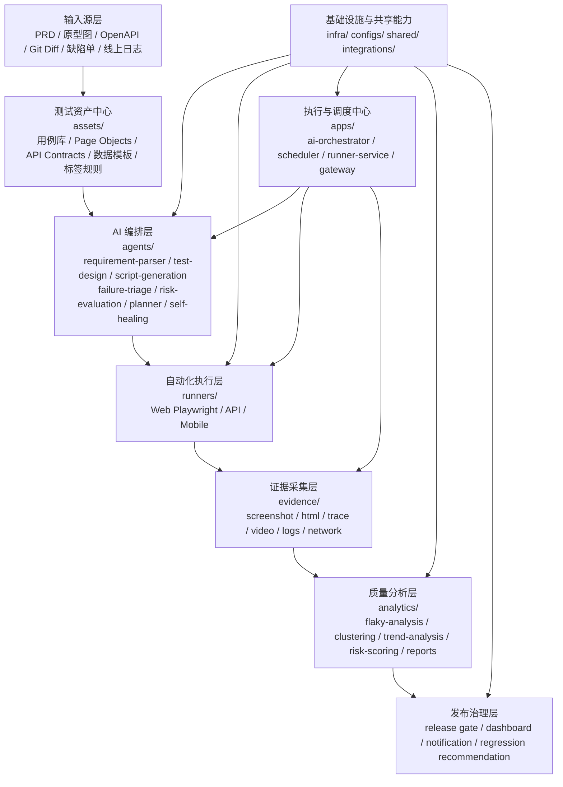
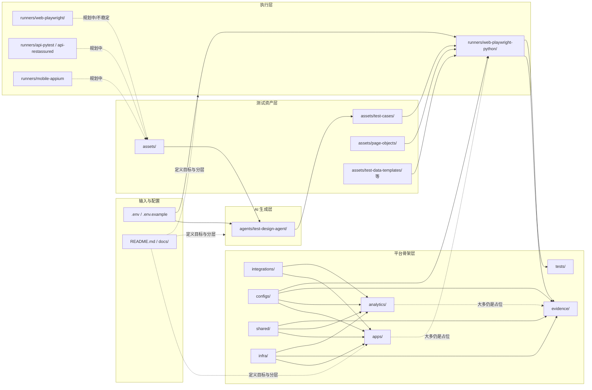
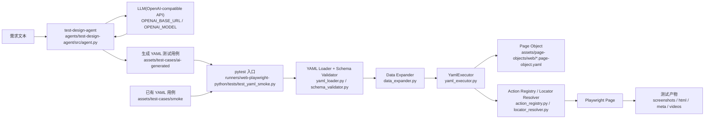
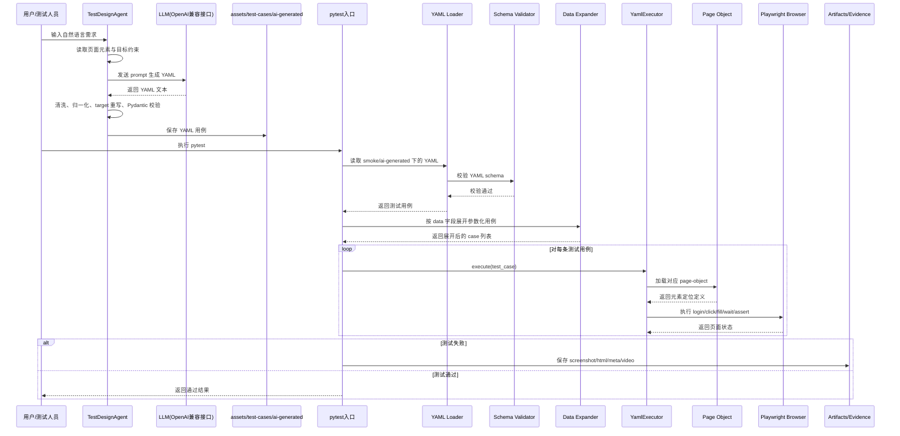

# 当前架构与调用链

本文档描述仓库当前阶段已经落地的架构分层、目录依赖关系，以及“从需求到测试执行”的真实调用链。

说明：

- 重点基于当前已有实现，不按 README 的理想蓝图虚构未落地能力。
- 当前最可信的主链路是 `agents/test-design-agent` 与 `runners/web-playwright-python`。

## 1. 架构分层图

## 2. 当前项目的模块依赖图（按目录）

说明：

- 当前真正有强依赖关系的主链路是 `agents/test-design-agent -> assets/test-cases -> runners/web-playwright-python`。
- `assets/` 是当前最核心的共享层，AI 生成结果和执行输入都在这里汇聚。
- `apps/`、`analytics/`、`evidence/`、`integrations/`、`infra/` 主要还是平台化预留目录。

## 3. 当前实际调用关系图

## 4. 从需求到测试执行落地的时序图

## 5. 当前主链路对应目录

- AI 测试设计：`agents/test-design-agent/`
- 测试资产：`assets/test-cases/`、`assets/page-objects/`
- Python Web Runner：`runners/web-playwright-python/`
- 平台骨架：`apps/`、`analytics/`、`evidence/`、`integrations/`、`infra/`

## 6. 当前结论

- 已形成的核心闭环：`需求 -> AI 生成 YAML -> YAML 进入资产层 -> Python Playwright Runner 执行 -> 输出测试证据`
- 目前“平台骨架”层次完整，但实际代码主要集中在 Python runner 和单个 Python agent。
- 后续如果要让平台真正跑起来，需要优先补齐 orchestrator、统一工程构建、证据流转与分析链路。
