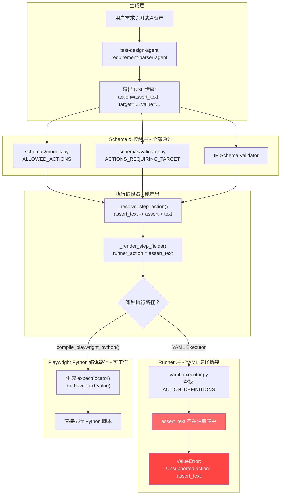
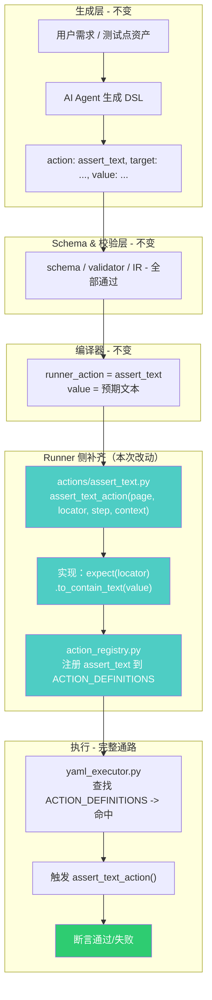
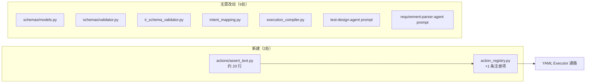

# DSL V1.1 `assert_text` 方案：补齐 Runner 端执行能力

> 状态：方案定稿  
> 日期：2026-05-25  
> 作者：Codex Agent  
> 关联议题：DSL V1.1 升级 — 第3点 `assert_text`

---

## 1. 问题陈述

编译器 (`execution_compiler`) 已支持生成 `runner_action = "assert_text"`，
schema 层已将 `assert_text` 列入 `ALLOWED_ACTIONS`，AI prompt 已教模型使用该动作。
但 **Runner 端缺失对应的 action handler**，导致 YAML Executor 路径在运行时报错：

    ValueError: Unsupported action at step N: assert_text

该断裂发生在 `runners/web-playwright-python/runner/yaml_executor.py:154`，
因为 `action_registry.py` 的 `ACTION_DEFINITIONS` 中未注册 `assert_text`。

### 各层状态一览

| 层级 | 文件 | 状态 |
|------|------|------|
| Schema 允许列表 | `shared_backend/schemas/models.py:119` | `assert_text` 在 `ALLOWED_ACTIONS` ✅ |
| Schema 校验器 | `shared_backend/schemas/validator.py:22` | 在 `ACTIONS_REQUIRING_TARGET` ✅ |
| IR 校验器 | `shared_backend/ir_schema_validator.py:24` | 在默认允许动作集 ✅ |
| Intent 映射 | `shared_backend/intent_mapping.py:29,106,132` | 正确映射 ✅ |
| 编译器中段 | `shared_backend/execution_compiler.py:354-359` | 映射为 `assert` + `text` ✅ |
| 编译器渲染(YAML) | `shared_backend/execution_compiler.py:791-792` | 输出 `runner_action = "assert_text"` ✅ |
| 编译器渲染(Python) | `shared_backend/execution_compiler.py:1195-1197` | `expect().to_have_text()` ✅ |
| AI Prompt | `test-design-agent` / `requirement-parser-agent` | 均教学使用 ✅ |
| **Runner 注册表** | `runner/action_registry.py` | **未注册** ❌ |
| **Runner 处理器** | `actions/` | **无 assert_text.py** ❌ |

## 2. 当前流程（含断裂点）

## 3. 目标流程（补齐后）

## 4. 改动范围

| 文件 | 操作 | 内容 |
|------|------|------|
| `runners/web-playwright-python/actions/assert_text.py` | **新建** | 实现 `assert_text_action(page, locator, step, context)` |
| `runners/web-playwright-python/runner/action_registry.py` | **修改** | `ACTION_DEFINITIONS` 新增 `"assert_text"` 条目 |

其余文件均无需改动。

---
## 5. 实施计划（含日期）

### 阶段 0：方案评审（2026-05-25 ~ 2026-05-26）

| 日期 | 事项 | 负责人 | 产出 |
|------|------|--------|------|
| 2026-05-25 | 方案文档完成，提交评审 | Codex Agent | 本文档 |
| 2026-05-26 | 团队评审确认方案 | - | 评审结论 |

### 阶段 1：实现 assert_text Action Handler（2026-05-27）

| 日期 | 事项 | 产出 | 估时 |
|------|------|------|------|
| 2026-05-27 | 新建 actions/assert_text.py | assert_text_action() 函数 | 0.5h |
| 2026-05-27 | 修改 action_registry.py | 注册 assert_text | 5min |

**assert_text.py 实现细节：**
- 使用 Playwright 的 expect(locator).to_contain_text(value, timeout=10000)
- to_contain_text 是部分匹配语义，比 to_have_text（精确匹配）更适合动态 UI
- 支持 {{variable}} 模板变量解析
- 参考现有 assert_visible.py 的 locator 处理模式（first 降级）

**action_registry.py 修改：**
- 新增 `from actions.assert_text import assert_text_action`
- 在 ACTION_DEFINITIONS 中新增 `"assert_text": {"handler": assert_text_action, "requires_target": True}`

### 阶段 2：验证（2026-05-27 ~ 2026-05-28）

| 日期 | 事项 | 产出 | 估时 |
|------|------|------|------|
| 2026-05-27 | 单元测试 test_assert_text_action.py | 覆盖正常/不匹配/空值/变量解析 | 1h |
| 2026-05-28 | 集成测试：编译器->YAML Executor 端到端 | 验证 runner_action 通路 | 0.5h |
| 2026-05-28 | 登录页真实场景跑通 | test-design-agent 生成的用例 | 0.5h |

### 阶段 3：发布（2026-05-29）

| 日期 | 事项 | 产出 |
|------|------|------|
| 2026-05-29 | Code Review + 合并 | PR 合并到主分支 |
| 2026-05-29 | 更新 DSL V1.1 能力矩阵 | assert_text 全链路支持 |

---
## 6. 风险评估

| 风险 | 等级 | 缓解措施 |
|------|------|----------|
| `to_contain_text` 子串匹配过宽，误判通过 | 低 | 可后续支持 `match_mode` 参数（精确/包含/正则） |
| 变量模板注入安全风险 | 低 | 沿用现有 `variable_resolver`，不引入新注入面 |
| `value` 为 None 时语义不清 | 低 | 默认转空字符串，`to_contain_text("")` 始终通过 |
| 与 `assert_visible` 职责重叠 | 无 | `assert_visible` 校验存在性，`assert_text` 校验内容，互补 |

## 7. 测试计划

### 7.1 单元测试 (`test_assert_text_action.py`)

| 用例 | 输入 | 预期 |
|------|------|------|
| 正常匹配 | value="登录超时" | 断言通过 |
| 文本不匹配 | value="不存在的文字" | AssertionError |
| value=None | value=None | 断言通过（空字符串始终匹配） |
| 模板变量 | value="{{error_msg}}" + context | 解析后匹配 |
| 多行文本 | value 含换行 | 正常工作 |

### 7.2 集成测试

| 用例 | 验证目标 |
|------|----------|
| 编译器输出 assert_text → yaml_executor 执行 | 全链路通路 |
| test-design-agent 生成 assert_text → 编译 → 执行 | AI 产物的可执行性 |

## 8. 决策记录

- **方案选择**：补齐 Runner（选项 A），而非禁止生成（选项 B）
- **依据**：
  1. Schema / Compiler / Prompt 四层已就位，禁止需回退 4 个文件
  2. 补齐仅需新建 1 个文件 + 修改 1 行注册，改动最小
  3. `assert_text` 是基础断言语义，DSL V1.1 不应缺失
- **匹配策略**：使用 `to_contain_text`（部分匹配），不要求精确匹配
- **后续扩展**：保留 `match_mode` 参数空间（exact / contains / regex）

## 9. 与 DSL V1.1 其他议题的关系

本方案仅解决第 3 点 `assert_text`。对第 4 点"顶层 assertions 与步骤内关系"：
- 当前 `yaml_executor.py` 已支持顶层 `test_case.assertions` 列表
- 顶层断言与步骤内断言共用同一分发逻辑（`_execute_step`）
- `assert_text` 补齐后，顶层断言区也可使用 `assert_text`
- 执行时序：步骤内断言按原顺序，顶层断言在所有步骤之后
