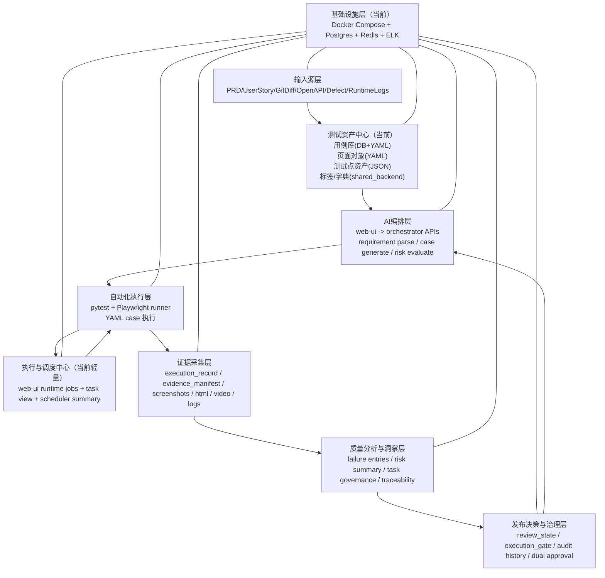
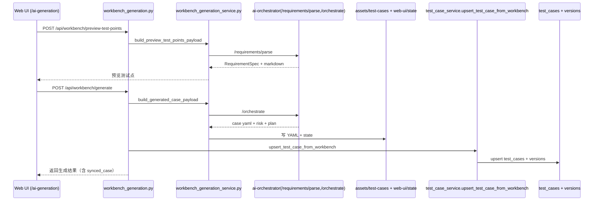
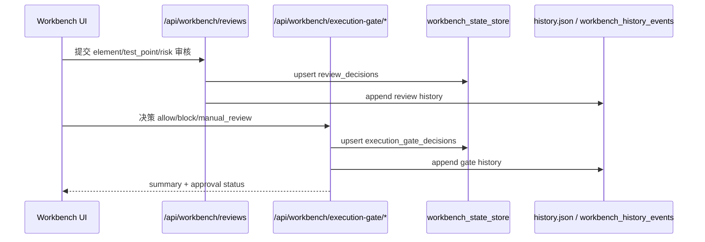
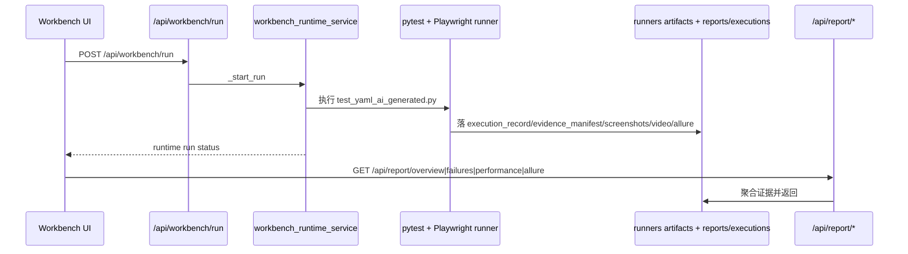

# 企业级 AI 自动化测试平台全景架构与缺口补齐说明（2026-04-06）

文档版本：v1.0  
文档类型：现状架构留存 + 缺口闭环方案（As-Is + To-Be）  
适用范围：平台研发、测试架构、治理落地、后续实施验收  
更新日期：2026-04-06

---

## 0. 执行摘要

当前项目已形成可运行主链，但仍处于“确定性底座 + AI 增强 + 人工门禁”的混合阶段，尚未完全达到你定义的企业级九层闭环目标。  
最大缺口集中在 **测试资产中心**，尤其是 **页面对象中心化（录制化、版本化、健康巡检、引用反查）** 仍未真正落地，导致上层 AI 设计、执行和分析虽然可跑，但在资产治理与长期稳定性上仍有隐患。

本文件完成了三件事：

1. 逐层还原当前真实实现（不是目标图想象）。
2. 给出层间调用关系、依赖关系、契约关系。
3. 输出“资产中心缺失项全量清单 + 全层补齐清单 + 分阶段闭环计划”。

---

## 1. 范围与方法

### 1.1 覆盖范围

本次覆盖你定义的 9 层：

1. 输入源层
2. 测试资产中心
3. AI 编排层
4. 自动化执行层
5. 执行与调度中心
6. 证据采集层
7. 质量分析与洞察层
8. 发布决策与治理层
9. 基础设施层

### 1.2 证据来源（代码实证）

本结论基于仓库现状代码与文档，不做主观假设。关键证据路径：

- `apps/web-ui-service/app/main.py`
- `apps/web-ui-service/app/routers/*.py`
- `apps/web-ui-service/app/services/*.py`
- `apps/web-ui-service/app/models/*.py`
- `apps/ai-orchestrator/src/app.py`
- `apps/ai-orchestrator/src/orchestrator_service.py`
- `apps/ai-orchestrator/src/tools/*.tool.py`
- `runners/web-playwright-python/runner/*.py`
- `shared_backend/*.py`
- `docker-compose.yml`
- `docs/architecture/current-architecture-and-flows.md`

---

## 2. 当前全景分层图（As-Is）

---

## 3. 端到端调用链（当前真实主链）

## 3.1 生成链（需求 -> 用例）

关键入口：

- `apps/web-ui-service/app/routers/workbench_generation.py`
- `apps/web-ui-service/app/services/workbench_generation_service.py`
- `apps/ai-orchestrator/src/app.py`
- `apps/web-ui-service/app/services/test_case_service.py`

## 3.2 审核与门禁链（review/gate）

关键入口：

- `apps/web-ui-service/app/routers/workbench_reviews.py`
- `apps/web-ui-service/app/routers/workbench_gate.py`
- `apps/web-ui-service/app/services/workbench_review_service.py`
- `apps/web-ui-service/app/services/workbench_gate_service.py`
- `apps/web-ui-service/app/services/workbench_state_store.py`

## 3.3 执行与证据链（run -> evidence -> report）

关键入口：

- `apps/web-ui-service/app/routers/workbench_runs.py`
- `apps/web-ui-service/app/services/workbench_runtime_service.py`
- `runners/web-playwright-python/runner/yaml_executor.py`
- `apps/web-ui-service/app/routers/workbench_reporting.py`
- `apps/web-ui-service/app/services/workbench_reporting_service.py`

---

## 4. 分层职责、依赖、契约矩阵（逐层）

| 层级 | 当前入口/实现 | 输入契约 | 输出契约 | 依赖 | 被依赖 | 当前状态 |
|---|---|---|---|---|---|---|
| 输入源层 | `GenerateCasePayload` + orchestrator tools (`openapi-parser.tool.py`,`git-diff.tool.py`,`jira-reader.tool.py`) | PRD/UserStory/OpenAPI/GitDiff/Defect/RuntimeLogs（文本或对象） | `requirement_spec`、source summary、risk signals | Web UI 请求、orchestrator 工具 | 测试资产中心、AI编排层 | 已有基础，多源接入主要是“解析聚合”，缺少持久化治理 |
| 测试资产中心 | `test_case_service.py`、`workbench_asset_service.py`、`assets/page-objects/web/*.yaml` | case yaml/state/db data | case list/detail、test-point assets、yaml assets | DB + 文件系统 + shared_backend | AI编排、执行、分析、门禁 | 部分完成，页面对象中心化缺口最大 |
| AI编排层 | `ai-orchestrator/src/app.py` + `orchestrator_service.py` | requirement/context/case/execution/failure payload | requirement parse、生成用例、脚本、执行计划、风险评估 | Agent/Support 模块 | 执行层、质量分析、Web UI | 主链可跑，但部分 adapter/tool 仍空壳 |
| 自动化执行层 | `workbench_runtime_service.py` + pytest runner | case yaml + env + run config | execution record + evidence artifacts | Playwright/pytest、page object yaml | 证据采集、调度中心 | 可运行，主要是 Web/API，Mobile 未落地 |
| 执行与调度中心 | `workbench_tasks.py`、`workbench_scheduler.py` | execution records/runtime runs | task view、dispatch plan、queue summary | runtime records | 治理层、运维视图 | 目前是“调度视图层”，非真实队列调度内核 |
| 证据采集层 | runner artifacts + `workbench_reporting_service.py` | runner 执行结果、manifest、analysis | failure entries、meta health、allure snapshots | 文件系统 + 兼容扫描 | 质量分析、发布决策 | 能采集，但 manifest-first 仍在过渡 |
| 质量分析与洞察层 | `workbench_analysis_service.py`、`workbench_task_service.py` | execution/failure/review/gate data | risk summary、task governance、traceability | 证据层 + review/gate | 发布治理层 | 可输出摘要，趋势/聚类/评分需继续产品化 |
| 发布决策与治理层 | review + gate routers/services | review decisions、risk report、coverage、policy | allow/block/manual_review、audit history | 质量分析、执行状态 | 主流程放行拦截 | 已可用，有双人审批但规则深度仍可增强 |
| 基础设施层 | `docker-compose.yml`、`core/config.py`、`core/database.py` | 环境变量、镜像、服务编排 | Postgres/Redis/ELK、服务运行时 | Docker/本地资源 | 全部上层 | 本地/单机可用，K8s/消息队列/对象存储未完全工程化 |

---

## 5. 测试资产中心深度审计（重点）

## 5.1 子模块现状总览

| 子模块 | 当前已实现 | 关键缺失 | 风险级别 |
|---|---|---|---|
| 用例库（Case Library） | `test_cases` 主表、版本、执行、缺陷；支持 project/case_id；支持 xlsx 导出模板 | 生命周期状态机治理、审核状态与执行状态联动约束、跨入口统一写入策略还需加强 | 中 |
| 页面对象库（Page Object Library） | `assets/page-objects/web/*.yaml` + runner 读取 | 无 Page/Element DB 主模型；无录制器主链；无健康巡检任务；无引用反查和版本发布机制 | 高 |
| API 契约库（API Contract Library） | OpenAPI 可解析（工具层） | 无契约持久化表；无版本 diff；无契约-用例关联图；无变更影响自动回写资产 | 高 |
| 数据模板库（Data Template Library） | `test_cases.data_config` 字段存在 | 无独立模板中心、无复用目录、无模板版本/审批/引用关系 | 中高 |
| 标签体系（Tag System） | `tags`/`markers` + shared 字典 | 缺少标签治理模型（owner、层级、生命周期、冲突规则） | 中 |

## 5.2 用例库（Case Library）现状

### 已落地

- 数据模型：`apps/web-ui-service/app/models/test_case.py`
  - `test_cases`
  - `test_case_versions`
  - `test_case_executions`
  - `test_case_defects`
  - `test_case_tree_nodes`
- 业务接口：`apps/web-ui-service/app/routers/test_cases.py`
  - 列表、详情、更新、脚本版本对比
  - 批量删除/改标签/改状态/导出（json/csv/xlsx）
- 命名规则接入：`shared_backend/case_ids.py`（`build_case_id/next_case_sequence/match_case_id`）
- Excel 模板导出：`apps/web-ui-service/app/services/test_case_export_service.py`

### 待补齐

1. 审核态（draft/review/ready）与运行态（queued/running/passed/failed）分离但联动规则需要硬约束。
2. 所有入口（Workbench、用例中心、AI 生成）要统一通过同一 `case write service`，减少双写分歧。
3. version history 与 execution history 当前有基础，但缺少“变更影响范围”和“审批链”标准字段。
4. 缺少 `asset_references` 的结构化反查（目前多为字符串/列表拼装）。

## 5.3 页面对象库（Page Object Library）现状

### 已落地

- 文件资产：`assets/page-objects/web/*.page-object.yaml`
- 工具链：`apps/ai-orchestrator/src/asset_service.py`、`runners/web-playwright-python/runner/asset_toolkit.py`
- 执行读取：`runners/web-playwright-python/runner/locator_resolver.py`
- UI 入口：`/assets/page-objects`（当前为管理壳页面）

### 关键缺失（必须补齐）

1. **无页面/元素主数据表**（仅 YAML）  
   - 缺 `page`、`element`、`element_version`、`element_health` 等实体。
2. **无录制优先主链**  
   - 当前可通过工具写定位器，但不符合“录制为准、手工受限”治理要求。
3. **无健康巡检闭环**  
   - 缺定时校验与失效告警。
4. **无引用反查**  
   - 无法快速回答“哪个元素影响哪些用例/脚本”。
5. **无发布态管理**  
   - 缺 draft/review/published/retired 生命周期。

### 建议目标模型（To-Be）

- `page_objects`（页面）
- `page_elements`（元素）
- `page_element_versions`（版本）
- `page_object_refs`（引用关系：case_id/flow/script）
- `page_element_health_checks`（巡检结果）
- `page_object_recorder_sessions`（录制会话）

## 5.4 API 契约库（API Contract Library）现状

### 已落地

- 解析能力存在：`openapi-parser.tool.py`
- 变更影响信号存在：`git-diff.tool.py` 输出 `changed_areas/risk_signals`

### 缺失

1. 无持久化契约仓（仅解析结果临时使用）。
2. 无 API 版本对象与契约 diff 审批。
3. 无契约和用例的强关联键（仅推断）。
4. 无契约变更触发的“回归建议自动落库”。

## 5.5 数据模板库（Data Template Library）现状

### 已落地

- `test_cases.data_config` 已可用于单用例数据驱动配置。

### 缺失

1. 无模板中心（模板无法跨用例统一治理）。
2. 无模板版本与发布状态。
3. 无模板引用图谱（哪些用例在用）。
4. 无模板质量校验（字段完整性、敏感数据约束）。

## 5.6 标签体系（Tag System）现状

### 已落地

- `tags`、`markers` 字段及过滤能力。
- shared dictionary 支持基本枚举。

### 缺失

1. 标签分层与命名约束（业务/技术/治理标签）未标准化。
2. 缺标签 owner、变更审批、废弃策略。
3. 缺冲突检测（互斥标签）。

---

## 6. 各层缺失项全清单（补齐项）

## 6.1 输入源层

- 缺 PRD/线上日志的结构化入库（当前多为文本透传）。
- 缺输入源质量评分（source completeness、可信度）。
- 缺 source_id 全链路追踪到 test_point/case。

## 6.2 测试资产中心（最高优先）

- 页面对象：录制、版本、健康巡检、引用反查、发布态。
- API 契约：持久化、版本 diff、契约-用例映射。
- 数据模板：模板中心、模板版本、引用图谱。
- 标签治理：层级、owner、冲突、生命周期。
- 统一资产写入口：避免多入口各自写库/写文件。

## 6.3 AI 编排层

- `apps/ai-orchestrator/src/adapters/*.py` 当前为空文件，需要补齐真实适配层。
- `runner-dispatch.tool.py`、`evidence-reader.tool.py` 当前为空，需要补齐工具能力。
- 模型路由、prompt 版本与输出契约要形成可审计落盘。

## 6.4 自动化执行层

- Mobile 执行内核尚未工程化接入。
- 缺统一重试策略与失败分类策略下沉到执行器配置。
- 缺执行资源画像（耗时、资源消耗）与调度联动。

## 6.5 执行与调度中心

- 当前以任务视图为主，缺真实任务队列/worker 池（优先级、配额、租户隔离）。
- 缺环境编排（环境锁、占用释放、并发上限）持久化模型。
- 缺 CI/CD 事件订阅后自动调度编排（目前更多是手工触发）。

## 6.6 证据采集层

- manifest-first 已有但兼容回退仍较多，需持续清零 compat scan。
- 缺 Trace 统一检索索引（run_id/case_id/source_id 一键追踪）。
- 缺视频/截图保留策略与冷热分层。

## 6.7 质量分析与洞察层

- Flaky 聚类、趋势分析已有框架但缺产品化报表与阈值治理。
- 缺跨版本质量基线对比（release baseline vs current）。
- 缺风险评分解释与治理动作闭环（actionable checklist）。

## 6.8 发布决策与治理层

- 门禁策略需进一步模板化（按项目/业务线差异化）。
- 缺门禁豁免流程（时效、审批链、回溯）。
- 缺门禁 KPI（误拦截率、漏拦截率、审批时长）看板。

## 6.9 基础设施层

- K8s 编排未落地到仓库运行主链（当前以 docker-compose 为主）。
- 消息队列未成为主链依赖（异步编排能力不足）。
- 对象存储（如 MinIO）未纳入统一证据存储链。

---

## 7. 层间依赖关系（Depends-On / Provides-To）

| 层级 | Depends On | Provides To | 核心契约对象 |
|---|---|---|---|
| 输入源层 | 基础设施层 | 测试资产中心、AI编排层 | source_inputs / change_impact / parameter_constraints |
| 测试资产中心 | 输入源层、基础设施层 | AI编排层、执行层、质量层 | case_id、case metadata、page object、test point asset |
| AI编排层 | 输入源层、资产中心 | 执行层、质量层、治理层 | requirement_spec、generated_case、execution_plan、risk_report |
| 自动化执行层 | AI编排层、资产中心、调度中心 | 证据层、质量层、治理层 | execution_record、evidence_manifest、runner artifacts |
| 执行与调度中心 | 执行层、基础设施层 | 执行层、治理层 | queue_status、dispatch_plan、retry policy |
| 证据采集层 | 执行层、基础设施层 | 质量层、治理层 | failure entries、evidence meta、allure snapshot |
| 质量分析与洞察层 | 证据层、资产中心、治理数据 | 发布治理层、管理视图 | flaky summary、risk score、trend metrics |
| 发布决策与治理层 | 质量层、review data、policy config | 执行入口、审计、发布流程 | execution_gate、review_state、audit events |
| 基础设施层 | 无 | 全层 | DB/Redis/ELK/容器/网络/配置 |

---

## 8. 当前偏离度评估（对标目标架构）

| 层级 | 目标状态 | 当前状态 | 偏离度 |
|---|---|---|---|
| 输入源层 | 多源标准化入库 + 可追溯 | 多源解析已接入，入库治理不足 | 中 |
| 测试资产中心 | 五大资产中心化治理完整 | 用例库较完整，其它资产中心化不足 | 高 |
| AI 编排层 | 分工明确、工具完备、可审计 | 主链可用，部分适配器/工具空壳 | 中高 |
| 自动化执行层 | 多端稳定执行 + 可调度 | Web 主链可跑，Mobile 缺失 | 中 |
| 执行与调度中心 | 真正调度内核 | 以视图与汇总为主 | 高 |
| 证据采集层 | manifest-first 完整闭环 | 处于 manifest-first + compat 过渡 | 中 |
| 质量分析层 | 趋势+聚类+评分产品化 | 摘要能力在，深度报表不足 | 中 |
| 发布治理层 | 门禁策略化 + 审批闭环 | 已有门禁/审批，但策略深度可增强 | 中 |
| 基础设施层 | K8s+MQ+对象存储标准化 | docker-compose 可用，平台化不足 | 中高 |

---

## 9. 补齐实施计划（按优先级）

## Phase 1（P0，先补资产底座，2 周）

1. 页面对象录制主链落地（会话、捕获、确认入库、版本）。
2. 页面对象数据模型落库（page/elements/versions/health/refs）。
3. 用例步骤改为 element_code 引用，不再直接依赖自由 locator。
4. 资产写入口统一（Workbench/用例中心/AI 生成共用应用服务）。

验收标准：

- 新增页面对象必须经过录制链。
- 执行时按 element_code 查定位器可跑通。
- 元素变更可追溯并反查受影响用例。

## Phase 2（P1，补齐契约与数据模板中心，2 周）

1. API 契约持久化模型 + 版本 diff + 回归建议。
2. 数据模板中心（模板库 + 引用关系 + 模板版本）。
3. 标签治理模型（层级、owner、生命周期）。

验收标准：

- OpenAPI 导入后可看到契约版本、差异与影响用例。
- 数据模板可被多用例复用且可追踪。
- 标签冲突可被规则校验拦截。

## Phase 3（P1，调度与证据治理增强，2 周）

1. 任务队列化调度（优先级/并发槽位/重试策略）。
2. manifest-first 治理清零 compat 回退。
3. evidence 索引统一（run_id/case_id/source_id）。

验收标准：

- 调度计划可执行，不仅是只读汇总。
- 关键任务 evidence 健康度达到 ready。
- 报表不再依赖 runtime fallback。

## Phase 4（P2，质量与门禁产品化，2 周）

1. Flaky 聚类与趋势报表。
2. 风险评分可解释化与治理动作建议。
3. 门禁 KPI 看板 + 豁免流程。

---

## 10. 数据契约统一建议（落地口径）

统一核心 ID 与状态规则（继续沿用现有平台口径）：

1. 业务编号统一 `case_id`（例如 `atp-web-ret-query-sm-ai-0001`）。
2. `id` 仅内部主键，不对外作为业务标识。
3. 所有入口生成用例时，不允许自由格式 ID，统一由 shared_backend 规则生成。
4. 状态必须命中字典（`shared_backend/case_dictionary.py` + `state_machines.py`）。

关键统一对象：

- `case_id`
- `project_code`
- `source`
- `case_type`
- `status/lifecycle_status`
- `review_state`
- `execution_gate`
- `execution_record`
- `evidence_manifest`

---

## 11. 需要立即执行的“资产中心补齐”最小清单

1. 新增 `page_objects/page_elements/page_element_versions/page_object_refs/page_element_health_checks` 模型与迁移。
2. 新增 `page_object_recorder` 路由/服务/页面（录制为主入口）。
3. 执行层引入 `element_code -> locator` 映射读取。
4. 禁止页面层直接写复杂资产逻辑，统一走 service + mapper + schema。
5. 新增页面对象健康巡检任务（每日）和告警输出。
6. 新增契约中心和数据模板中心基础模型，先打通读写与引用关系。

---

## 12. 附录：关键代码证据索引

### 12.1 Web UI 主链

- `apps/web-ui-service/app/main.py`
- `apps/web-ui-service/app/routers/workbench_generation.py`
- `apps/web-ui-service/app/routers/workbench_runs.py`
- `apps/web-ui-service/app/routers/workbench_reviews.py`
- `apps/web-ui-service/app/routers/workbench_gate.py`
- `apps/web-ui-service/app/routers/workbench_reporting.py`
- `apps/web-ui-service/app/routers/test_cases.py`
- `apps/web-ui-service/app/routers/test_projects.py`

### 12.2 服务与存储

- `apps/web-ui-service/app/services/test_case_service.py`
- `apps/web-ui-service/app/services/workbench_generation_service.py`
- `apps/web-ui-service/app/services/workbench_runtime_service.py`
- `apps/web-ui-service/app/services/workbench_state_store.py`
- `apps/web-ui-service/app/services/workbench_case_consistency_service.py`
- `apps/web-ui-service/app/models/test_case.py`
- `apps/web-ui-service/app/models/workbench_state.py`

### 12.3 编排与执行

- `apps/ai-orchestrator/src/app.py`
- `apps/ai-orchestrator/src/orchestrator_service.py`
- `apps/ai-orchestrator/src/tools/openapi-parser.tool.py`
- `apps/ai-orchestrator/src/tools/git-diff.tool.py`
- `apps/ai-orchestrator/src/tools/jira-reader.tool.py`
- `apps/ai-orchestrator/src/tools/evidence-reader.tool.py`（当前空文件）
- `apps/ai-orchestrator/src/tools/runner-dispatch.tool.py`（当前空文件）
- `apps/ai-orchestrator/src/adapters/*.py`（当前空文件）
- `runners/web-playwright-python/runner/asset_toolkit.py`
- `runners/web-playwright-python/runner/locator_resolver.py`

### 12.4 基础设施

- `docker-compose.yml`
- `apps/web-ui-service/app/core/config.py`
- `apps/web-ui-service/app/core/database.py`

---

## 13. 结论

平台当前已经具备“生成 -> 审核 -> 管理 -> 执行 -> 分析”的可运行主路径，但仍不是你定义的完整版企业级形态。  
要从“可运行”走向“可治理、可扩展、可审计、可回滚”，必须把 **测试资产中心（尤其页面对象）** 作为第一优先级补齐，再向调度、证据、质量、门禁做纵向强化。

这份文档可直接作为后续落地的统一执行基线。

