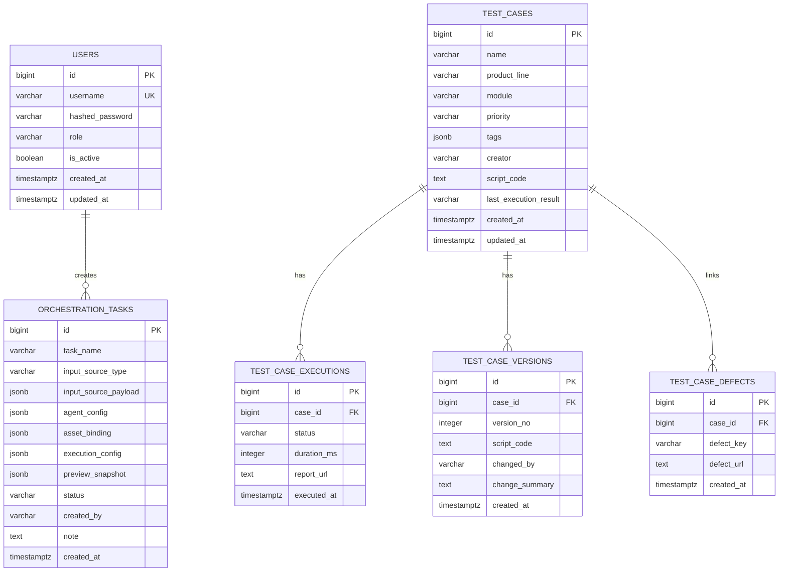
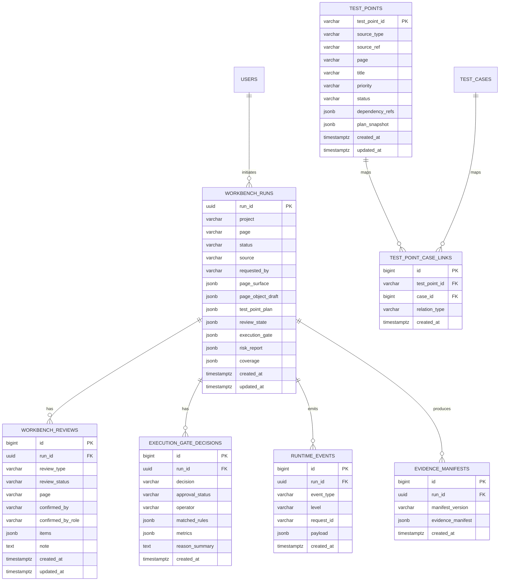

# 平台数据与部署升级方案（2026-03-23）

## 1. 当前事实

基于当前代码扫描，项目在 `2026-03-23` 的真实状态是：

1. `apps/web-ui-service` 默认数据库仍是 SQLite，配置入口是 [`apps/web-ui-service/app/core/config.py`](/Users/bettyhuang/PycharmProjects/ai-test-platform/apps/web-ui-service/app/core/config.py)。
2. `apps/web-ui-service` 的 SQLAlchemy 模型当前主要包括：
   - [`apps/web-ui-service/app/models/user.py`](/Users/bettyhuang/PycharmProjects/ai-test-platform/apps/web-ui-service/app/models/user.py)
   - [`apps/web-ui-service/app/models/test_case.py`](/Users/bettyhuang/PycharmProjects/ai-test-platform/apps/web-ui-service/app/models/test_case.py)
   - [`apps/web-ui-service/app/models/orchestration_task.py`](/Users/bettyhuang/PycharmProjects/ai-test-platform/apps/web-ui-service/app/models/orchestration_task.py)
3. Redis 在现有代码里几乎还没有形成真实业务读写闭环，只有 `.env` / 文档中的预留配置，没有发现成体系的生产级缓存使用点。
4. `legacy_workbench.py` 当前运行态数据、审计、确认点、execution gate 仍大量落在 `web-ui/state/*.json`。
5. `docker-compose.yml` 在本次改造前只有单 `web` 服务，且数据库是 SQLite 文件挂载。

结论：

1. PostgreSQL 迁移是合理且必要的。
2. Redis 目前应先作为“平台级缓存/锁/短期运行态”引入，而不是宣称已经 fully integrated。
3. ELK 适合先接平台日志与接口链路日志，不宜在当前阶段把所有测试证据都直接塞进 ES。

---

## 2. 本次升级目标

本轮目标不是一次性做完“所有数据重构”，而是先把企业级可落地基础设施骨架搭起来：

1. 数据库主存储升级为 PostgreSQL。
2. Web UI -> Orchestrator 的调用链具备统一 `X-Request-Id`。
3. 服务统一输出 JSON 日志，便于 Docker + ELK 收集。
4. Docker 环境一次性拉起：
   - `web`
   - `orchestrator`
   - `postgres`
   - `redis`
   - `elasticsearch`
   - `logstash`
   - `kibana`
5. 明确 Redis / PostgreSQL 的数据边界，避免“什么都想放 Redis”。

---

## 3. 企业级 ER 设计

当前项目的“企业级 ER”建议分两层看：

1. `已落地实体`
2. `下一阶段应收口实体`

### 3.1 已落地实体

### 3.2 下一阶段建议补齐的核心实体

这些实体和当前业务最贴近，而且能直接承接现在还落在 JSON 文件中的运行态：

---

## 4. 接口到数据实体的映射

### 4.1 Web UI 现有主要接口

| 接口前缀 | 当前主要职责 | 建议主存储 |
|---|---|---|
| `/api/auth/*` | 用户认证、角色 | PostgreSQL |
| `/api/test-cases/*` | 用例资产、版本、执行记录、缺陷关联 | PostgreSQL |
| `/api/workbench/run` | URL 驱动运行编排 | PostgreSQL + Redis |
| `/api/workbench/runs/*` | run 查询、详情、状态刷新 | PostgreSQL，热点状态可走 Redis |
| `/api/workbench/reviews` | 元素/测试点/风险确认点 | PostgreSQL |
| `/api/workbench/execution-gate/*` | 门禁决策、审批、撤销 | PostgreSQL |
| `/api/workbench/history` | 审计历史、时间线 | PostgreSQL |
| `/api/dashboard/*` | 仪表盘聚合数据 | PostgreSQL 聚合，Redis 短缓存 |
| `/api/report/*` | 报告汇总与读取 | PostgreSQL 元数据 + 文件存储 |

### 4.2 Orchestrator 现有主要接口

| 接口 | 当前职责 | 建议主存储 |
|---|---|---|
| `/orchestrate` | requirement -> case / run | PostgreSQL 元数据，Redis 任务缓存可选 |
| `/requirements/parse` | requirement parse | PostgreSQL telemetry，Redis 短缓存可选 |
| `/scripts/generate` | 脚本生成 | PostgreSQL 元数据，文件产物落磁盘/对象存储 |
| `/execution/plan` | 执行计划生成 | PostgreSQL |
| `/risk/evaluate` | 风险评估 | PostgreSQL |
| `/failures/triage` | 失败归因/分类 | PostgreSQL |
| `/reports/*` | 聚合结果查询 | PostgreSQL + 文件存储 |

---

## 5. Redis 和 PostgreSQL 的边界

### 5.1 PostgreSQL 中应该存什么

适合放 PostgreSQL 的数据：

1. 用户、角色、权限。
2. 测试用例主数据、版本、执行记录、缺陷关联。
3. workbench run 主记录。
4. review / execution gate / 审计事件。
5. 风险评估、失败归因、质量聚合结果。
6. 测试点资产、覆盖关系、回归筛选快照。

判断原则：

1. 需要追溯。
2. 需要事务。
3. 需要多维查询。
4. 需要长期保留。

### 5.2 Redis 中应该存什么

适合放 Redis 的数据：

1. 会话态或短期 token 黑名单。
2. 仪表盘聚合缓存。
3. 热点 run 状态缓存。
4. 前后端链路中的短期幂等键。
5. 分布式锁。
6. 队列/调度中的短生命周期任务状态。

判断原则：

1. 可丢失。
2. 可重建。
3. 查询模式简单。
4. 生命周期短。

### 5.3 明确不建议放 Redis 的数据

1. review 审计主记录。
2. execution gate 最终决策。
3. 用例资产主数据。
4. 风险评估最终报告。
5. 失败归因最终结论。

这些数据必须可追溯，不应只放 Redis。

---

## 6. ELK 接入范围

本次接入 ELK 的建议范围：

1. Web UI 应用日志。
2. Orchestrator 应用日志。
3. 请求级链路日志，按 `X-Request-Id` 贯通。

暂不建议直接进入 ELK 的内容：

1. 大量截图、视频、trace。
2. 完整 HTML 证据内容。
3. 大体积 Allure 原始产物。

这些更适合文件系统或对象存储，只把索引和摘要进 PostgreSQL / Elasticsearch。

---

## 7. 本次已落地改动

完成时间：`2026-03-23 13:26:09 CST`

已完成的最小基础设施收口：

1. Web 服务增加 PostgreSQL 连接池参数、Redis 配置、Orchestrator 超时配置。
2. Web 服务增加 `health/ready`，检查数据库、Redis、Orchestrator。
3. Web 服务请求链路增加 `X-Request-Id`。
4. Web -> Orchestrator 调用开始透传 `X-Request-Id`。
5. Web 与 Orchestrator 共用 JSON 日志配置模块。
6. Docker Compose 增加：
   - PostgreSQL
   - Redis
   - Elasticsearch
   - Logstash
   - Kibana
   - Orchestrator
7. Logstash 增加最小 pipeline，收集平台日志文件。
8. `workbench` 四类核心运行态已具备数据库优先存储适配：
   - `runtime_runs`
   - `review_decisions`
   - `execution_gate_decisions`
   - `history`
9. 适配策略为：
   - PostgreSQL 环境默认走数据库
   - 文件快照保留为兼容兜底与迁移镜像
   - 首次读库为空时会从现有 JSON 快照回填
10. Web UI 服务已补齐 Alembic 最小迁移骨架：
   - `alembic.ini`
   - `migrations/env.py`
   - 初始迁移版本 `20260323_143500_initial_enterprise_schema`
11. Docker 中的 `web` 服务会先执行 `alembic upgrade head`，再启动 FastAPI
12. 开发环境与 Docker 环境建表策略分离：
   - 开发环境：`DATABASE_AUTO_CREATE_TABLES=true`
   - Docker / PostgreSQL：`DATABASE_AUTO_CREATE_TABLES=false`
13. 真实迁移验证链路已跑通（SQLite + PostgreSQL）：
   - SQLite：`alembic upgrade head` 成功，`alembic_version=20260323_143500`
   - PostgreSQL：`bootstrap_database.py` 可处理“旧库无版本号”场景并 `stamp head`
   - PostgreSQL 当前版本：`alembic_version=20260323_143500`
14. 兼容旧库治理说明：
   - 当数据库存在历史 `create_all` 表但无 `alembic_version` 时，使用 `make db-bootstrap`
   - 该脚本会补齐受管表并打版本戳，避免直接 `upgrade` 撞表
15. 环境排障结论（本次验证中已出现）：
   - 本机可能同时存在旧 `web-ui` 进程占用 `8013`
   - Docker compose 的 `web` 与旧服务并存时，`curl 127.0.0.1:8013` 可能命中旧服务
   - 验证迁移时应优先用容器内脚本和 `psql` 检查，而不是只看端口返回
16. `workbench` 第二批运行态数据库优先存储适配已补齐：
   - `defect-links`
   - `failure-source-calibrations`
   - `state_store` 已支持这两类 JSON 状态在 PostgreSQL 模式下的读库优先、首读回填和文件镜像兼容
17. Alembic 第二个迁移版本已新增并验证通过：
   - 版本号：`20260323_170800`
   - 新增表：`workbench_defect_links`、`workbench_failure_source_calibrations`
   - 已通过 SQLite + PostgreSQL 双环境 `upgrade head` 验证
18. 针对数据库优先行为已补回归测试：
   - 新增单测覆盖 `defect-links` / `failure-source-calibrations` 的“文件回填 DB + DB 替换写入 + 文件快照同步”链路
   - 新增集成测试覆盖 `/api/defects` 在数据库模式下的写入、去重、查询与文件镜像一致性
19. PostgreSQL 旧库结构兼容热修复已补齐：
   - 新增迁移版本：`20260323_221200_fix_users_password_column`
   - 处理场景：历史 `users.password_hash` 与当前模型 `users.hashed_password` 列名漂移
   - 结果：`web` 服务在旧库场景下可完成 bootstrap + startup

涉及文件：

1. [`apps/shared_backend/observability/logging.py`](/Users/bettyhuang/PycharmProjects/ai-test-platform/apps/shared_backend/observability/logging.py)
2. [`apps/web-ui-service/app/main.py`](/Users/bettyhuang/PycharmProjects/ai-test-platform/apps/web-ui-service/app/main.py)
3. [`apps/web-ui-service/app/core/config.py`](/Users/bettyhuang/PycharmProjects/ai-test-platform/apps/web-ui-service/app/core/config.py)
4. [`apps/web-ui-service/app/core/database.py`](/Users/bettyhuang/PycharmProjects/ai-test-platform/apps/web-ui-service/app/core/database.py)
5. [`apps/web-ui-service/app/core/redis_client.py`](/Users/bettyhuang/PycharmProjects/ai-test-platform/apps/web-ui-service/app/core/redis_client.py)
6. [`apps/web-ui-service/app/routers/legacy_workbench.py`](/Users/bettyhuang/PycharmProjects/ai-test-platform/apps/web-ui-service/app/routers/legacy_workbench.py)
7. [`apps/ai-orchestrator/src/app.py`](/Users/bettyhuang/PycharmProjects/ai-test-platform/apps/ai-orchestrator/src/app.py)
8. [`docker-compose.yml`](/Users/bettyhuang/PycharmProjects/ai-test-platform/docker-compose.yml)
9. [`deploy/elk/logstash/pipeline/logstash.conf`](/Users/bettyhuang/PycharmProjects/ai-test-platform/deploy/elk/logstash/pipeline/logstash.conf)
10. [`apps/web-ui-service/app/models/workbench_state.py`](/Users/bettyhuang/PycharmProjects/ai-test-platform/apps/web-ui-service/app/models/workbench_state.py)
11. [`apps/web-ui-service/app/services/workbench_state_store.py`](/Users/bettyhuang/PycharmProjects/ai-test-platform/apps/web-ui-service/app/services/workbench_state_store.py)
12. [`apps/web-ui-service/alembic.ini`](/Users/bettyhuang/PycharmProjects/ai-test-platform/apps/web-ui-service/alembic.ini)
13. [`apps/web-ui-service/migrations/env.py`](/Users/bettyhuang/PycharmProjects/ai-test-platform/apps/web-ui-service/migrations/env.py)
14. [`apps/web-ui-service/migrations/versions/20260323_143500_initial_enterprise_schema.py`](/Users/bettyhuang/PycharmProjects/ai-test-platform/apps/web-ui-service/migrations/versions/20260323_143500_initial_enterprise_schema.py)
15. [`apps/web-ui-service/scripts/bootstrap_database.py`](/Users/bettyhuang/PycharmProjects/ai-test-platform/apps/web-ui-service/scripts/bootstrap_database.py)
16. [`apps/web-ui-service/migrations/versions/20260323_170800_add_workbench_reporting_tables.py`](/Users/bettyhuang/PycharmProjects/ai-test-platform/apps/web-ui-service/migrations/versions/20260323_170800_add_workbench_reporting_tables.py)
17. [`apps/web-ui-service/tests/unit/test_workbench_services.py`](/Users/bettyhuang/PycharmProjects/ai-test-platform/apps/web-ui-service/tests/unit/test_workbench_services.py)
18. [`apps/web-ui-service/tests/integration/test_workbench_multisource_endpoints.py`](/Users/bettyhuang/PycharmProjects/ai-test-platform/apps/web-ui-service/tests/integration/test_workbench_multisource_endpoints.py)
19. [`apps/web-ui-service/migrations/versions/20260323_221200_fix_users_password_column.py`](/Users/bettyhuang/PycharmProjects/ai-test-platform/apps/web-ui-service/migrations/versions/20260323_221200_fix_users_password_column.py)

补充完成时间：`2026-03-23 14:19:37 CST`

进一步补充完成时间：`2026-03-23 15:54:23 CST`

迁移验证补充完成时间：`2026-03-23 16:37:32 CST`

第二批运行态切库与迁移补充完成时间：`2026-03-23 17:27:21 CST`

Docker 启动链路兼容热修复完成时间：`2026-03-23 22:12:03 CST`

---

## 8. 下一步收口顺序

建议不要同时开多条基础设施大线，按下面顺序推进：

1. 继续推进 `workbench` 其余 JSON 运行态去文件化。
   - 已完成：`runtime_runs / review_decisions / execution_gate_decisions / history / defect-links / failure-source-calibrations`
   - 未完成：test-point 资产快照、报告聚合快照、其他历史兼容文件的 DB 化
2. 在查询 API 层逐步改为“DB 主读 + 文件仅兼容镜像”，收口 `legacy_workbench.py` 的文件依赖。
3. 给 Redis 增加明确的 key 规范与 TTL 策略（先从 dashboard 聚合缓存开始）。
4. 给 ELK 增加 Kibana Dashboard 模板，并按 `X-Request-Id` 提供 web→orchestrator 链路检索视图。

核心原则：

1. PostgreSQL 是事实主库。
2. Redis 是短期状态与缓存。
3. ELK 是排障与检索，不是主业务存储。
