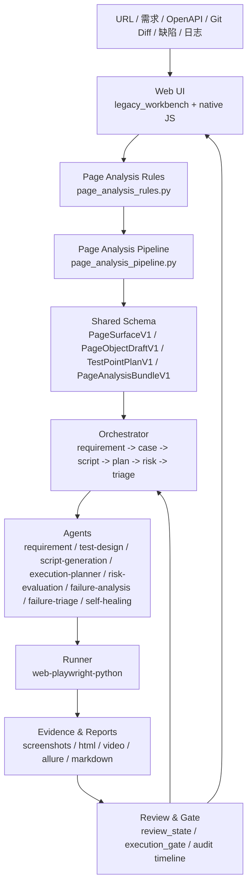

# 项目模块与风险审计（2026-03-21）

## 结论先说

当前仓库不是“纯 AI 质量保障平台”，而是一个以**确定性执行链**为底座、以**AI 生成与归因为增量**的混合系统。

更准确地说，它已经具备这些能力：

1. URL 驱动的页面分析与一键生成入口。
2. 共享契约收口到 `PageSurfaceV1 / PageObjectDraftV1 / TestPointPlanV1 / PageAnalysisBundleV1`。
3. `review_state`、`execution_gate`、历史审计、风险决策的落盘与回显。
4. Playwright YAML 执行链可落地，报告和证据链可追溯。

当前最需要控制的不是“有没有功能”，而是**哪一段是确定性的，哪一段是 AI 推断的**。真正的高风险不确定性主要集中在：

1. 需求语义解析。
2. 页面语义推断。
3. 测试点设计。
4. 失败归因与风险解释。

因此，这个平台更适合被定义成：

**回归测试优先的混合式自动化平台**，而不是“AI 全自动替代测试人员的平台”。

## 证据来源

本审计基于仓库内这些文件与模块：

- [apps/ai-orchestrator/src/orchestrator_service.py](../../apps/ai-orchestrator/src/orchestrator_service.py)
- [apps/web-ui-service/app/core/page_analysis_rules.py](../../apps/web-ui-service/app/core/page_analysis_rules.py)
- [apps/web-ui-service/app/core/page_analysis_pipeline.py](../../apps/web-ui-service/app/core/page_analysis_pipeline.py)
- [apps/shared_backend/schemas/contracts.py](../../apps/shared_backend/schemas/contracts.py)
- [apps/web-ui-service/app/routers/legacy_workbench.py](../../apps/web-ui-service/app/routers/legacy_workbench.py)
- [agents/requirement-parser-agent/src/agent.py](../../agents/requirement-parser-agent/src/agent.py)
- [agents/test-design-agent/src/agent.py](../../agents/test-design-agent/src/agent.py)
- [agents/test-design-agent/src/test_points.py](../../agents/test-design-agent/src/test_points.py)
- [agents/script-generation-agent/src/agent.py](../../agents/script-generation-agent/src/agent.py)
- [agents/execution-planner-agent/src/agent.py](../../agents/execution-planner-agent/src/agent.py)
- [agents/risk-evaluation-agent/src/agent.py](../../agents/risk-evaluation-agent/src/agent.py)
- [agents/failure-analysis-agent/analyze.py](../../agents/failure-analysis-agent/analyze.py)
- [agents/failure-triage-agent/src/agent.py](../../agents/failure-triage-agent/src/agent.py)
- [agents/self-healing-advisor-agent/self_healing_orchestrator.py](../../agents/self-healing-advisor-agent/self_healing_orchestrator.py)

## 统一术语

为了避免“同一能力在不同文档里换名字”，当前建议统一使用下面这组词：

| 术语 | 当前定义 |
|---|---|
| `PageSurfaceV1` | 页面表层结构、元素候选、低置信度元素与置信度摘要 |
| `PageObjectDraftV1` | 页面对象草稿、覆盖摘要、缺失元素与质量告警 |
| `TestPointPlanV1` | 测试点计划、依赖元素、置信度、review 摘要 |
| `PageAnalysisBundleV1` | `PageSurfaceV1 + PageObjectDraftV1 + TestPointPlanV1` 的 bundle 视图 |
| `review_state` | 元素确认、测试点确认、风险确认三类治理状态 |
| `execution_gate` | 系统门禁决策、人工覆盖、审批状态与生效决策 |
| `execution_record` | 标准化运行记录主体 |
| `evidence_manifest` | 标准化证据索引主体 |

当前建议的责任边界也统一按下面理解：

- 确定性底座：URL 解析、DOM 提取、schema 归一化、runner 执行、断言裁决、审计落盘。
- AI 辅助层：需求解析、测试点设计、失败归因解释、风险解释与建议。
- 人工门禁层：元素确认、测试点确认、风险决策、门禁覆盖、自愈审批。

## 1. 模块分层

| 目录 | 作用 | 当前状态 |
|---|---|---|
| `apps/ai-orchestrator/` | 多 Agent 编排、质量门禁、报告和执行链中心 | 已落地，仍偏“大编排器” |
| `apps/web-ui-service/` | Web UI、URL-first 生成页、review_state、execution_gate、审计入口 | 已落地，业务密度最高 |
| `apps/shared_backend/` | 共享契约和归一化逻辑 | 已落地，是三模型收口关键 |
| `agents/` | 解析、设计、脚本、规划、风险、失败、 triage、自愈等 Agent | 大部分可用，`data-generation-agent` 已完成最小可用确定性服务 |
| `runners/web-playwright-python/` | YAML 执行、Playwright 运行、证据采集、失败分析接入 | 已落地，是真正执行层 |
| `assets/` | Page Object、测试用例、数据模板、标签、业务流资产 | 已落地，是共享资产层 |
| `reports/` | 执行报告、生成脚本、统计结果 | 已落地，属于产物层 |
| `web-ui/state/` | 运行态持久化、审计、历史回显 | 已落地，但属于运行缓存，不应手工维护 |
| `docs/` | 架构、产品、规范、评估、回溯文档 | 已形成较完整知识库 |
| `analytics/` / `evidence/` / `integrations/` / `infra/` / `shared/` / `configs/` / `scripts/` / `tests/` | 平台支撑与预留层 | 部分落地，部分仍是骨架 |

## 2. 系统架构

## 3. 技术架构

### 3.1 Web UI 层

Web UI 仍然是 FastAPI 模板 + 原生 JS，而不是 Vue。这个选择是对的，因为它与当前仓库的工程现状一致，避免了栈迁移成本。

核心职责已经不只是“展示页面”，而是：

1. 提供 URL-first 入口。
2. 保存并回显 `review_state`。
3. 维护 `execution_gate` 的系统决策和人工决策。
4. 维护历史审计和回放入口。
5. 在确认后做即时刷新，而不是只改按钮状态。

关键实现集中在：

- [apps/web-ui-service/app/routers/legacy_workbench.py](../../apps/web-ui-service/app/routers/legacy_workbench.py)
- [apps/web-ui-service/app/core/page_analysis_rules.py](../../apps/web-ui-service/app/core/page_analysis_rules.py)
- [apps/web-ui-service/app/core/page_analysis_pipeline.py](../../apps/web-ui-service/app/core/page_analysis_pipeline.py)

### 3.2 共享契约层

共享契约层是当前平台最关键的“确定性收口点”。

`contracts.py` 已经把三类核心中间模型规范化：

1. `PageSurfaceV1`
2. `PageObjectDraftV1`
3. `TestPointPlanV1`
4. `PageAnalysisBundleV1`

它们的共同特征是：

1. 带 `confidence`。
2. 带 `warnings`。
3. 带 `requires_review`。
4. 可从旧数据归一化。

这意味着平台已经不只是“AI 说了算”，而是**AI 结果必须通过契约才能进入后续链路**。

### 3.3 Orchestrator 层

`OrchestratorService` 仍然是主编排器，但现在更像一个“质量门禁 + 产物拼装器”。

它负责：

1. 读入多源输入。
2. 做 requirement 质量门禁。
3. 调用 test-design、script-generation、execution-planner、risk-evaluation、failure-analysis、failure-triage、self-healing。
4. 写报告和脚本产物。

最值得关注的点是，它已经不是纯粹的自由编排，而是带阈值和阻断逻辑的：

- 解析置信度阈值。
- 测试意图数量阈值。
- 覆盖缺口阈值。
- 高歧义阻断。

### 3.4 Runner 层

`runners/web-playwright-python/` 是真正的执行层。

它的价值在于：

1. 执行路径确定。
2. 断言结果确定。
3. 失败证据可采集。
4. 失败后可以进入分析、自愈、再运行链路。

这部分是当前平台里**确定性最高**的部分。

## 4. 业务逻辑链路

### 4.1 URL-first 主流程

当前生成页已经能走“URL-first”主流程，而不是只要求用户写需求描述。

实际链路可以概括为：

1. 用户输入 URL，必要时补一个业务目标。
2. 页面分析规则模块抽取 surface。
3. 共享 schema 归一化 surface / object / test points。
4. 生成 review_state，标记低置信度元素、测试点和风险项。
5. 执行门禁决定 allow / manual_review / block。
6. 触发 runner 执行。
7. 生成 report 和 evidence。
8. 失败时进入 failure-analysis -> failure-triage -> self-healing。

### 4.2 现在真正落地的三个确认点

当前确认点不是前端装饰，而是已经落盘的治理链：

1. 页面元素确认。
2. 测试点确认。
3. 风险决策确认。

这些确认点会通过 `review_state` 进入运行记录，也会在历史页和工作台中回显。

### 4.3 一个典型例子

以商品列表页为例：

1. `page_analysis_rules.py` 会优先识别菜单、标题、搜索框、查询按钮、表格等稳定元素。
2. `test_points.py` 会围绕 `login / click / fill / assert_visible / assert_url` 等动作生成测试点。
3. `script-generation-agent` 会把这些步骤模板化为 Playwright Python。
4. `risk-evaluation-agent` 会对执行状态、复杂度、失败分析、 triage 等信息打分。
5. `failure-triage-agent` 决定队列与责任团队。

如果页面缺少稳定 page object，例如某些页面找不到 `flash.page-object.yaml`，系统会回退到 fallback case，但这也暴露了“资产覆盖不足”的现实问题。

## 5. Agent 能力矩阵

| Agent | 当前实现 | 优点 | 卡点 | Hallucination 风险 | 人工介入 |
|---|---|---|---|---|---|
| `requirement-parser-agent` | 多源输入解析、实体/意图/歧义/优先级/质量门禁 | 能吃 PRD、URL、OpenAPI、Git Diff、缺陷、日志 | 语义推断仍然可能误判，尤其是模糊需求 | 中高 | 低置信度需求需确认 |
| `test-design-agent` | 从 requirement / steps 生成测试点与用例，带 `confidence / warnings / requires_review` | 已能输出企业级 bundle 思路 | 仍偏“需求驱动”，页面语义驱动还不够强 | 中 | P0/P1 测试点建议人工审核 |
| `script-generation-agent` | Playwright Python 模板生成 | 格式稳定、产物可执行 | 只支持当前 MVP 的 Playwright/Python | 低中 | 只需抽样检查 |
| `execution-planner-agent` | 执行阶段规划、重试、资源画像 | 逻辑简单、确定性高 | 还不是全局调度器 | 低 | 一般不需要人工 |
| `risk-evaluation-agent` | 基于优先级、状态、复杂度、triage 的确定性打分 | 可解释、可落盘、可回显 | 规则启发式，不是预测模型 | 中 | 最终发布决策应人工确认 |
| `failure-analysis-agent` | 规则 + 模型双路径，识别 locator/assertion/auth/network/timeout 等 | 能快速分类，能读证据 | 可能把应用 bug 和测试 bug 混淆 | 中高 | 高风险失败建议人工复核 |
| `failure-triage-agent` | 责任队列、severity、owner team、ticket action | 责任路由清晰 | 依赖 failure-analysis 的质量 | 中 | 只在边界案例人工介入 |
| `self-healing-advisor-agent` | 限制性补丁建议、回放、回滚 | 只允许 locator/timeout/selector 类修复 | 不能碰业务断言与业务流程 | 中 | 建议始终人工审批 |
| `data-generation-agent` | 已有最小可用确定性实现 | 输入输出 schema、字段生成、模板复用、registry、cleanup 标记 | **企业级治理仍需增强** | 中 | 继续补企业级模板 / 治理闭环，而不是从零实现 |

### 5.1 最关键的现实判断

`data-generation-agent` 已经不再是空壳。当前代码已经具备最小可用的确定性生成能力，至少能完成输入输出契约、基础字段生成、模板复用、registry 落盘和 cleanup 标记。

这意味着平台在“回归测试真实落地”上已经补上了最基础的一块：**稳定测试数据生成的最小闭环**。后续真正缺的是企业级数据治理，而不是从零实现。

## 6. 确定性 vs 不确定性

### 6.1 确定性高的部分

| 环节 | 为什么确定性高 | 风险 |
|---|---|---|
| URL 解析 | 工程处理问题，不需要语义推理 | 低 |
| DOM 提取 | Playwright / DOM API 可重复执行 | 低 |
| 结果执行 | Runner 按步骤执行，状态可见 | 低 |
| 断言判定 | pass/fail 由断言决定 | 低 |
| 报告生成 | 格式化输出，规则明确 | 低 |
| 审计落盘 | 写记录是确定性动作 | 低 |

### 6.2 混合型部分

| 环节 | 不确定性来源 | 当前控制手段 | 风险 |
|---|---|---|---|
| 元素识别 | 文案变化、DOM 不稳定、iframe、路由偏移 | 规则优先 + 置信度 + review | 中 |
| 页面类型判断 | 同页多语义、复杂 SPA | 规则初判 + 语义补充 | 中高 |
| 测试点提取 | 业务目标和覆盖边界 | 依赖元素、review_summary | 中 |
| 用例设计 | 业务流程选择、步骤顺序 | 模板约束 + 静态校验 | 中 |
| 失败归因 | 证据不足、应用与脚本交织 | 规则 + 模型双路径 | 中高 |
| 风险评估 | 业务优先级与实际失败的映射 | gate / confidence / manual review | 中 |

### 6.3 这套系统真正的“AI 幻觉率”

这里不能给一个伪精确的单点数字，因为不同阶段的风险差异很大。更合理的说法是：

1. **执行链幻觉率很低**，因为 runner、断言和报告是确定性的。
2. **生成链幻觉率中等**，主要来自页面语义、测试意图和失败归因。
3. **如果跳过确认点，系统整体风险会明显上升**。

按当前实现，我会给一个工程上的估计区间：

| 阶段 | 估计风险带 | 说明 |
|---|---|---|
| URL / DOM | 0-5% | 主要是工程可靠性问题 |
| 元素识别 | 10-20% | 规则能兜底，但复杂页面仍可能误判 |
| 页面语义判断 | 20-35% | 同一页面可能对应多个业务解释 |
| 测试点设计 | 15-30% | 涉及业务边界与优先级 |
| 用例/脚本生成 | 10-20% | 模板可控，但依赖上游输入质量 |
| 执行与断言 | 0-5% | 由 runner 和页面状态决定 |
| 失败归因 | 20-40% | 最容易把“应用 bug”和“脚本 bug”混淆 |
| 风险决策 | 10-25% | 有门禁与人工确认后会下降 |

> 说明：这是基于当前实现的**工程估计**，不是统计学测量值。

## 7. 人工 vs AI 责任边界

### 7.1 当前更合理的分工

| 环节 | AI 负责 | 人工负责 | 现在是否已落地 |
|---|---|---|---|
| 页面分析 | 元素候选、置信度、低置信度标记 | 确认关键元素 | 已落地 |
| 测试点设计 | 场景列举、优先级建议 | 确认 P0/P1、跳过低置信度项 | 已落地 |
| 用例/脚本生成 | 步骤填充、模板渲染 | 抽样审核 | 部分落地 |
| 执行 | 自动执行、重试、证据采集 | 触发执行 | 已落地 |
| 结果验证 | 汇总、异常摘要 | 以断言为准，不让 AI 裁判 | 已落地 |
| 风险评估 | 风险评分、依据解释 | 最终发布决策 | 已落地 |
| 自愈 | 仅 locator / timeout / selector 建议 | 批准或拒绝修复 | 已落地 |
| 失败治理 | 分队列、分责任 | 处理真实业务问题 | 已落地 |

### 7.2 不应该让 AI 直接决定的事

1. pass / fail 的最终判定。
2. 业务流程是否可以发布。
3. 是否删除断言。
4. 是否修改业务逻辑。
5. 是否把低置信度问题直接跳过。

## 8. 当前优势

1. **确定性执行层已经成熟**  
   Playwright/YAML/断言/报告链路明确，适合回归。

2. **治理链已经不是口头承诺**  
   `review_state`、`execution_gate`、历史审计、人工覆盖都已落盘。

3. **契约化程度在提升**  
   三个中间模型 + bundle 收口，降低了前后端/Agent 之间的漂移。

4. **风险边界收得比较紧**  
   self-healing 不允许碰业务逻辑，这点非常重要。

5. **URL-first 的方向是对的**  
   用户不需要先理解内部抽象，再去点复杂按钮。

## 9. 当前缺点

1. **`legacy_workbench.py` 仍然过重**  
   它还承担了过多编排、兼容、回显、门禁和审计逻辑。

2. **测试设计仍偏 requirement 驱动**  
   页面语义驱动还不够强，企业级“从 URL 到测试点”的自动化还未完全成型。

3. **`data-generation-agent` 已完成最小可用，但企业级治理仍要补强**  
   对回归测试来说，数据治理仍然重要，只是它已经不是空白点。

4. **失败归因仍有误判空间**  
   这是所有 AI 质量保障平台的共性问题。

5. **旧式运行产物很多**  
   仓库中积累了大量报告与 state，容易干扰判断，需要定期清理。

## 10. 当前卡点

### 10.1 产品卡点

1. 用户想要“只输 URL 就能跑”，但复杂业务仍需要业务目标补充。
2. 用户想要“自动理解页面业务”，但很多页面没有稳定语义标签。
3. 用户想要“回归测试可直接落地”，但数据准备和 page object 覆盖还不完整。

### 10.2 技术卡点

1. 页面分析仍是规则优先的混合模型，还没有独立成稳定的 `PageAnalysisAgent`。
2. `PageObject` 与 `TestPoint` 的业务语义治理还不够深。
3. `FailureAnalysis` / `RiskEvaluation` 对失败与业务风险的区分仍是启发式。
4. `self-healing` 还不能形成大规模自动修复，只能做有限建议。

### 10.3 组织卡点

1. 文档与实现同步的速度不一致。
2. 运行缓存、报告产物、历史 state 容易堆积。
3. Agent 能力与产品预期之间存在“看起来都有，实际上有些只是占位”的差距。

## 11. 回归测试视角的真实判断

如果你的重心是**回归测试**，那么当前平台的优点和风险是非常清楚的：

### 11.1 优点

1. 执行链确定性高。
2. 报告和证据链完整。
3. 能从历史失败中做 triage 和风险聚合。
4. 门禁和审计已经可以拦住一部分高风险动作。

### 11.2 风险

1. 页面对象不稳定时，回归结果会先受影响。
2. 需求语义误判会导致测试点设计偏移。
3. 失败归因错了，会让修复方向错。
4. 数据缺失会让“看似自动化”变成“自动制造假失败”。

### 11.3 结论

这套框架**已经可以用于真实项目回归测试**，但前提是：

1. 让确定性规则优先。
2. 让 AI 只做辅助推断。
3. 让高风险节点保留人工确认。

这不是妥协，而是企业级落地必须遵守的边界。

## 12. 当前阶段判断

当前阶段可以定义为：

**URL-first 可运行 + 三模型收口 + 规则优先页面分析 + review/gate/audit 闭环已落地，但独立 PageAnalysis / Data Generation / 深度自愈仍未完全成型。**

换句话说：

1. 不是“还不能用”。
2. 也不是“已经完全自动化”。
3. 而是“已具备真实可用的回归底座，但还需要继续压缩不确定性”。

## 13. 本次清理说明

本次已将旧的 mismatch 说明替换为这一份总审计，并清理了运行缓存与 Python 缓存。

已清理的典型内容包括：

1. 旧的测试不匹配说明文档。
2. Python `__pycache__` 与 `.pytest_cache`。
3. 若干 Web UI 运行态临时文件。

后续如果要继续清理，建议只清理**可再生的产物**，不要碰仍在用的 tracked 报告和证据链。

## 14. 当前模块职责、卡点、下一步优先级

这一节是给实际推进用的“执行版清单”。原则很简单：

1. 先补最影响回归确定性的模块。
2. 先解决会放大幻觉风险的模块。
3. 先做能直接提升真实项目落地性的能力。

### 14.1 模块职责

| 模块 | 当前职责 | 关键产出 |
|---|---|---|
| `apps/web-ui-service/` | URL-first 入口、review/gate/audit 回显、历史查看 | `review_state`、`execution_gate`、run 详情、历史审计 |
| `apps/web-ui-service/app/core/page_analysis_rules.py` | 页面分析规则优先的元素抽取和置信度计算 | `PageSurfaceV1` 候选、低置信度元素、规则结果 |
| `apps/web-ui-service/app/core/page_analysis_pipeline.py` | 三模型编排与 bundle 消费 | `PageAnalysisBundleV1`、三模型摘要 |
| `apps/shared_backend/schemas/contracts.py` | 中间模型归一化与契约收口 | `PageSurfaceV1`、`PageObjectDraftV1`、`TestPointPlanV1`、`PageAnalysisBundleV1` |
| `apps/ai-orchestrator/src/orchestrator_service.py` | 多 Agent 编排、质量门禁、报告拼装 | `RequirementSpecV1`、case、script、plan、risk、triage、report |
| `agents/requirement-parser-agent/` | 多源需求解析与歧义识别 | `RequirementSpec`、`test_intents`、`parse_confidence` |
| `agents/test-design-agent/` | 测试点设计、测试用例生成、traceability | `TestPointPlan`、`design_bundle`、`review_summary` |
| `agents/script-generation-agent/` | Playwright Python 脚本模板生成 | `GeneratedScriptV1`、可执行脚本 |
| `agents/execution-planner-agent/` | 执行阶段规划、重试与资源画像 | `ExecutionPlanV1` |
| `agents/risk-evaluation-agent/` | 风险评分、门禁建议、发布建议 | `RiskReportV1` |
| `agents/failure-analysis-agent/` | 失败归因、证据摘要、风险提示 | failure category / likely cause / confidence |
| `agents/failure-triage-agent/` | 失败分类路由、责任团队、队列与票据动作 | `FailureTriageV1` |
| `agents/self-healing-advisor-agent/` | 限制性自愈建议、回放、回滚 | patch plan、rollback/repair decision |
| `agents/data-generation-agent/` | 最小可用数据生成能力 | 已有确定性最小实现，企业级治理仍待补 |
| `runners/web-playwright-python/` | 实际执行、断言、证据采集、失败报告 | YAML 执行结果、截图、HTML、视频、Allure |
| `assets/` | 页面对象、测试用例、数据模板、标签和业务流 | 可执行资产与回归资产 |
| `reports/` | 执行报告、分析结果、生成脚本存档 | report json / md / generated scripts |
| `web-ui/state/` | 运行态缓存、回显数据、历史轨迹 | runtime-runs、review decisions、gate decisions |

### 14.2 当前卡点

| 卡点 | 具体表现 | 影响 |
|---|---|---|
| `data-generation-agent` 最小可用已完成 | 目录里已存在可运行的确定性服务 | 企业级数据治理仍需增强，但不是空白 |
| 页面语义推断仍偏规则+启发式 | 复杂页面容易多义 | 测试点偏差、误判风险上升 |
| 失败归因仍可能混淆测试 bug 和应用 bug | 证据不足时分类不稳定 | 自愈和 triage 容易走偏 |
| `legacy_workbench.py` 仍然偏大 | 编排、兼容、回显、门禁、审计都集中在一起 | 维护复杂，后续扩展成本高 |
| 页面对象覆盖不完整 | 某些页面找不到稳定 page object | 回归执行会 fallback 或失败 |
| 运行态和报告产物堆积 | 历史缓存很多 | 容易影响定位和维护效率 |
| 高风险节点仍需人工确认 | 风险、发布、自愈都不能完全自动 | 自动化速度会受确认节拍影响 |

### 14.3 下一步优先级

#### P0：先做，直接影响回归确定性

| 项目 | 目标 | 为什么优先 |
|---|---|---|
| 收口 `data-generation-agent` 企业级治理 | 在最小可用基础上继续增强模板 / registry / cleanup | 回归测试的数据治理深度 |
| 提升页面语义推断收敛度 | 减少页面类型和元素误判 | 直接降低测试点偏差 |
| 强化 page object 覆盖 | 降低 fallback 和执行失败 | 直接提升回归稳定性 |
| 强化失败来源分类 | 更准确地区分应用 bug 与测试 bug | 直接影响 triage 和回归可信度 |

#### P1：紧接着做，提升企业级可用性

| 项目 | 目标 | 为什么优先 |
|---|---|---|
| 分拆 `legacy_workbench.py` | 降低耦合，提升可维护性 | 让架构更稳定 |
| 强化失败归因分类 | 更准地区分应用 bug 与测试 bug | 直接影响 triage 和自愈 |
| 强化测试点依赖追踪 | 让测试点更可解释 | 适合回归治理 |
| 做运行缓存生命周期治理 | 定期清理 state 和报告产物 | 避免历史脏数据干扰 |

#### P2：中期增强，形成平台化能力

| 项目 | 目标 | 为什么优先 |
|---|---|---|
| 独立化 PageAnalysis / PageObject 编排 | 把规则优先模块做成真正 Agent 化 | 提升架构边界清晰度 |
| 自愈边界治理完善 | 只允许 locator / timeout / selector 修复 | 控制 AI 误改业务逻辑 |
| 风险评估与人工决策联动优化 | 让风险门禁更平滑 | 提升企业使用体验 |
| 文档与实现同步机制 | 保证文档不落后于代码 | 让团队协作更稳定 |

### 14.4 一句话版本

如果只保留最关键的行动路线，那么就是：

1. 先补数据生成能力。
2. 再压低页面语义和测试点设计的不确定性。
3. 同步把 page object 覆盖和回归门禁做稳。
4. 最后再做更深的 Agent 拆分和自愈治理。

## 15. 对外部补充建议的采纳评估

你补充的这组建议整体是合理的，但需要分成三类来写进文档：

1. **应立即写入为真实卡点**：当前就是事实缺口。
2. **应写入为中期建设项**：方向正确，但还不是当前主优先级。
3. **应写入为治理指标或未来目标**：值得跟踪，但不能冒充已经落地。

### 15.1 建议完全采纳并明确写入

#### A. `data-generation-agent` 最小可用收口问题

这条建议的核心方向是正确的，但当前状态已经不是“空壳”。

为什么要写得更重一点：

1. 回归测试没有稳定数据治理，等于把“数据问题”误判为“应用问题”。
2. 数据缺失会放大失败归因误差。
3. 自动生成用例如果没有稳定数据，价值会被明显削弱。

文档里建议保留的表述是：

> `data-generation-agent` 已完成最小可用确定性服务，但企业级数据治理仍需继续增强。

建议在文档里补一个单独的小节，写成：

- 当前状态
- 预期职责
- 最小可行能力
- 优先级
- 风险

#### B. 测试点中间层缺失

这条也应该写成真实卡点。

原因：

1. 测试点是“需求语义”和“可执行用例”之间的桥。
2. 如果没有独立测试点层，需求到用例会跳得太快。
3. 这会让人工确认、覆盖率治理、traceability 都变弱。

建议在文档中把它归类为：

- **P0 / P1 之间的关键中间层**
- 属于回归测试治理的核心资产，而不是单纯生成物

#### C. 失败归因误判风险

这条也应该保留，而且建议写得更具体：

1. 应增加归因置信度。
2. 应记录备选假设。
3. 应把人工修正结果纳入反馈闭环。

文档中可直接把它写成：

- 失败来源分类不稳定
- 应用 bug 与测试脚本 bug 容易混淆
- 归因结论必须带置信度和证据

### 15.2 建议部分采纳，适合作为中期建设项

#### A. 页面分析模块独立成 Agent

这个方向是对的，但文档里不建议把它写成当前已存在的事实。

更准确的写法应该是：

1. 当前页面分析已经模块化到 `page_analysis_rules.py` / `page_analysis_pipeline.py`。
2. 下一步可考虑将其升级为独立 `PageAnalysisAgent`。
3. 这个升级的价值是边界更清晰、规则可配置、置信度更可解释。

也就是说，**建议写成“未来演进方向”而不是“当前缺失事实”**。

#### B. `legacy_workbench.py` 拆分

这个建议合理，但应写成“架构治理项”，不是功能短板。

原因：

1. 当前它虽然重，但已经能支撑真实链路。
2. 拆分的价值主要是维护性、可测试性、边界清晰度。
3. 它不属于当前最优先的业务能力缺口。

建议在文档中将其放入：

- `P1` 或 `P2`
- 归类为“架构收敛”

#### C. Page Object 覆盖不完整

这条建议应当保留，但不要只写成“缺少文件”。

应补充为：

1. Page Object 覆盖度会直接影响回归稳定性。
2. 某些页面的 fallback 说明资产覆盖不足。
3. 需要 PO 健康度和变更影响分析，而不仅是补 YAML。

#### D. 风险评估透明度

这条建议也合理，但要写成“可解释性增强”。

建议文档里补三项：

1. 风险评分来源。
2. 风险因素权重。
3. 人工最终决策入口。

不要把它写成“AI 风险模型不足”，而要写成“当前采用规则启发式，适合企业可解释治理”。

### 15.3 建议作为治理指标和未来目标

#### A. 运行缓存和报告产物生命周期管理

这条不是可选项，应该写进“治理能力”。

建议文档中明确：

1. 哪些产物可再生。
2. 哪些产物必须保留。
3. 保留多久。
4. 归档还是删除。

这一条非常适合单独放在“平台治理”章节里。

#### B. 文档与实现同步机制

这条也值得保留，但属于工程治理，不是产品主链路能力。

建议写成：

- 文档需要跟着版本走
- 文档中的路径和接口需要可验证
- 文档不应长期滞后于代码

#### C. AI 幻觉率实际测量

这条很重要，但应明确区分：

1. 当前审计给的是工程估计。
2. 真正的幻觉率需要长期采样和 golden case。
3. 可以作为后续治理指标，而不是现阶段的硬结论。

建议文档中写成：

- 当前风险为估计值
- 后续应建立测量体系
- 以历史修正和 golden set 来校准

### 15.4 不建议直接写成“当前已存在能力”的点

以下内容方向合理，但不能在审计文档里写成“已经实现”：

1. `agents/page-analysis-agent` 已存在。
2. `legacy_workbench.py` 已拆成多个 controller / service。
3. `data-generation-agent` 已具备完整生成器和 validator。
4. 幻觉率已有真实统计值。

这些都应该写成：

- 待建设
- 建议方案
- 中期目标

### 15.5 建议如何并入现有文档结构

最合理的方式不是在原文里散着补，而是按下面四个位置插入：

1. **第 9 节“当前缺点”**  
   增补失败来源分类、Page Object 覆盖不足、失败归因误判风险。

2. **第 10 节“当前卡点”**  
   增补测试点中间层缺失、页面分析独立化需求、缓存治理问题。

3. **第 14 节“当前模块职责、卡点、下一步优先级”**  
   增补 P0/P1/P2 列表，尤其是数据生成、测试点层、PO 覆盖、失败归因闭环。

4. **新增本节“对外部补充建议的采纳评估”**  
   用来区分事实、建议、目标，避免文档口径混乱。

### 15.6 你这份补充建议的最终判断

总体判断：

1. 方向是对的。
2. 优先级排序大体合理。
3. 需要把“建议”与“当前事实”区分开。
4. `失败来源分类`、测试点中间层和 Page Object 覆盖，确实应该被提升到更高优先级。

如果只挑最值得立刻补进文档的三项，我会选：

1. 失败来源分类。
2. 测试点中间层缺失。
3. Page Object 覆盖与依赖追踪。

## 16. 分层职责补充版

你刚才给出的分层拆解很有参考价值，尤其适合补充到这份审计里作为“实施视角”的补丁。下面这版我按**当前项目真实状态**重写了一遍，避免把未来目标写成既成事实。

### 16.1 输入源层

输入源层的角色不是“让 AI 看更多文本”，而是把不同来源统一成可处理的结构化输入。

| 输入源 | 当前职责 | 关键注意点 | 建议优先级 |
|---|---|---|---|
| PRD / 需求文档 | 提取业务目标、规则、边界条件 | 语义歧义要显式标记 | P1 |
| Swagger / OpenAPI | 提取接口契约、参数、响应 | 这是确定性输入，优先级高 | P0 |
| Git Diff | 识别变更范围、影响文件、潜在回归点 | 适合驱动回归范围缩小 | P0 |
| 缺陷单 | 提取复现步骤、根因、修复点 | 适合反向补充回归场景 | P1 |
| 线上日志 | 提炼真实用户路径和错误模式 | 容易噪声大，需置信度 | P2 |

**当前建议**：

1. 输入源先统一到 `InputSource` 或等价结构。
2. 先支持 Swagger / Git Diff / PRD 的结构化接入。
3. 线上日志与缺陷单放到后续增强，不要抢主链路优先级。

### 16.2 测试资产中心

测试资产中心是当前回归测试可落地的核心底座。

| 资产类型 | 当前职责 | 关键注意点 | 建设状态 |
|---|---|---|---|
| 用例库 | 存储可执行测试用例 | 需要版本化、标签化、可追溯 | 已存在 |
| 页面对象 | 维护元素定位器和操作入口 | 覆盖率和稳定性要治理 | 已存在但不完整 |
| API 契约 | 存储接口定义和验证依据 | 与 Swagger 同步 | 部分存在 |
| 数据模板 | 控制测试数据的生成和复用 | 这是当前明显短板 | **缺失较大** |
| 标签体系 | 分类 smoke / regression / 风险等级 | 避免标签泛滥 | 已存在但需治理 |

**当前最需要补的**不是再多堆 YAML，而是：

1. 测试点中间层。
2. 数据模板和数据治理。
3. Page Object 健康度和变更影响分析。

### 16.3 AI 编排层

AI 编排层的职责是“把结构化输入串成可执行链路”，而不是让所有决策都交给模型。

| Agent | 当前职责 | 关键注意点 | 说明 |
|---|---|---|---|
| Requirement Parser | 解析多源输入，生成需求规格 | 需要置信度和歧义标记 | 已落地 |
| Test Design | 生成测试点、测试场景、用例骨架 | 不能脱离页面语义和资产 | 已落地但还可加强 |
| Script Generation | 生成脚本 / YAML | 必须依赖稳定模板 | 已落地 |
| Failure Analysis | 失败归因与摘要 | 最容易误判应用 bug / 测试 bug | 已落地 |
| Risk Evaluation | 风险评分与门禁建议 | 只能辅助决策 | 已落地 |

**补充判断**：

1. 当前最需要的是**Agent 边界更清晰**。
2. 真正的编排中心已经存在，但还偏大。
3. `PageAnalysis` 和 `DataGeneration` 目前不是成熟 Agent，应该写成演进目标。

### 16.4 自动化执行层

执行层必须保持确定性优先。

| 执行类型 | 当前状态 | 核心任务 | 关键注意点 |
|---|---|---|---|
| Web | 最成熟 | 页面交互、断言、视觉/证据采集 | Playwright 为主 |
| API | 目录存在/局部建设 | 接口调用、契约校验 | 需要统一 runner 规范 |
| Mobile | 预留/部分建设 | 移动端交互与手势 | 暂不是主链路 |

**建议**：

1. 统一 Runner 接口。
2. 执行层和编排层要解耦。
3. 失败重试只针对临时性问题，不针对业务失败。

### 16.5 执行与调度中心

这层是当前项目的明显短板之一，但它不是“马上要做成 K8s 大系统”，而是先把任务模型和优先级治理做好。

| 功能 | 作用 | 当前判断 |
|---|---|---|
| CI/CD 集成 | 在 PR / 发布前自动执行 | 重要但可逐步接入 |
| 并发调度 | 多任务并行与资源管理 | 目前不完善 |
| 环境分配 | 区分 dev/staging/prod | 需要统一策略 |
| 重试策略 | 区分 flaky 和真实失败 | 需要门禁配合 |

**当前优先级**：

1. 先统一任务模型。
2. 再补队列与 Worker。
3. 最后再考虑更复杂的编排平台。

### 16.6 证据采集层

证据采集层是平台可信度的基础。

| 证据类型 | 核心用途 | 存储建议 | 当前状态 |
|---|---|---|---|
| Trace | 还原完整执行过程 | 按 run/case 分层 | 部分存在 |
| Screenshot | 定位页面状态 | 失败优先 | 已存在 |
| Video | 辅助人工复核 | 仅失败保留 | 已存在 |
| Console | 追踪前端错误 | 结构化存储 | 部分存在 |
| Network | 识别接口问题 | 脱敏后存储 | 部分存在 |
| Logs | 形成检索索引 | 按时间/任务索引 | 已存在但分散 |

**建议**：

1. 证据必须绑定 `run_id` / `case_id`。
2. 成功/失败的保留策略要分开。
3. 要有统一证据 schema，不然后续分析很难做深。

### 16.7 质量分析与洞察层

这一层不是为了“好看报表”，而是为了把平台从执行工具变成治理工具。

| 分析项 | 作用 | 当前状态 | 风险 |
|---|---|---|---|
| Flaky 分析 | 识别不稳定用例 | 还不成熟 | 容易误判 |
| 失败聚类 | 相似失败归类 | 有基础但不完整 | 过度聚类 |
| 趋势分析 | 看质量变化趋势 | 需要历史沉淀 | 数据不足 |
| 风险评分 | 版本/变更风险量化 | 已有规则版 | 仍偏启发式 |

**建议**：

1. 不要急着上复杂模型。
2. 先把历史数据积累起来。
3. 先定义 flaky 和失败聚类的判定口径。

### 16.8 发布决策与治理层

这层对应你文档里一直强调的“高风险节点人工确认”。

| 门禁类型 | 核心任务 | 当前建议 |
|---|---|---|
| PR 门禁 | 用 Git Diff 缩小回归范围 | P0 |
| 冒烟门禁 | 保障核心流程 | P0 |
| 回归门禁 | 控制发布风险 | P0/P1 |
| 风险放行 | 高风险人工审批 | 必须保留人工 |

**关键点**：

1. 风险评分必须可解释。
2. 自动门禁不能替代人工最终决策。
3. 变更影响分析比“全量回归”更重要。

### 16.9 基础设施层

基础设施层不应该成为主叙事，但它决定平台能不能长期跑。

| 组件 | 当前角色 | 建议 |
|---|---|---|
| Docker | 执行环境容器化 | 保持 |
| K8s | 大规模并发编排 | 暂缓，别过早复杂化 |
| 配置管理 | 环境/密钥管理 | 必须规范化 |
| 存储 | 报告与证据持久化 | 要有生命周期 |
| 队列 | 调度任务 | 中期补齐 |
| 监控 | 平台健康度 | 应持续建设 |

### 16.10 这一层结构对当前项目的真正意义

把这九层补进审计里以后，文档就不只是“有哪些 Agent”，而是更清楚地告诉我们：

1. 哪些层已经落地。
2. 哪些层有能力但还没治理好。
3. 哪些层是明确短板。
4. 哪些层该优先做，哪些层不要过早复杂化。

### 16.11 结合当前状态的优先级重排

如果把你这份分层建议合并到当前审计里，我会把优先级排成这样：

1. **P0**：数据生成、测试点中间层、Swagger/Git Diff 输入治理、Page Object 覆盖提升。
2. **P1**：失败归因闭环、证据 schema、PR 门禁、运行产物生命周期管理。
3. **P2**：PageAnalysisAgent 独立化、legacy_workbench 拆分、风险评分可解释性增强。
4. **P3**：更复杂的调度平台、监控告警深化、AI 幻觉率长期统计。
