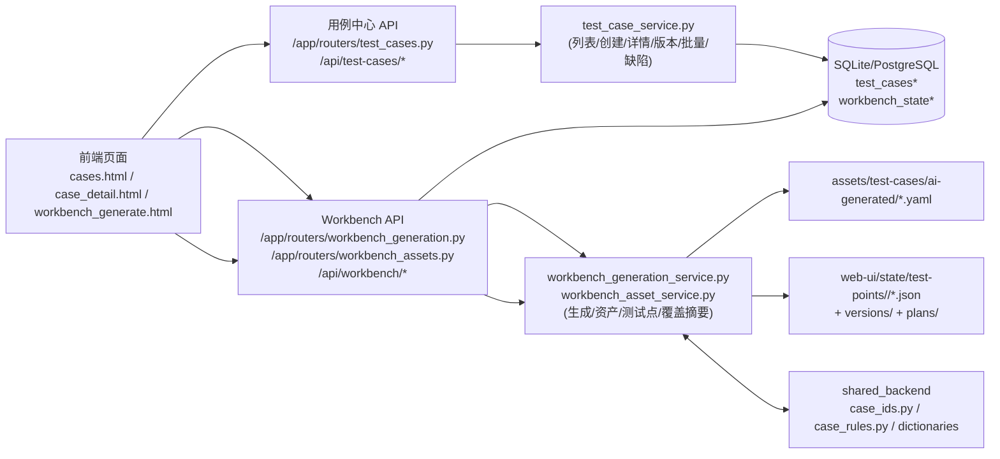
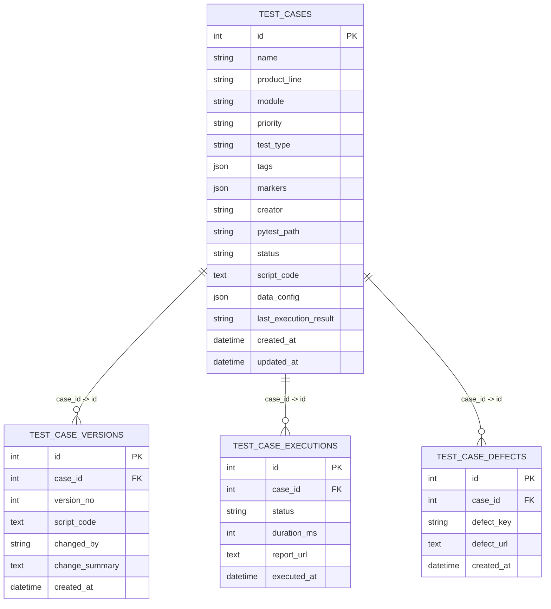

# 测试用例管理层当前实现快照（2026-04-05）

> 文档类型：现状留存（As-Is Snapshot）  
> 目标：把当前仓库中“用例管理层”的业务调用链、技术架构、数据结构、代码实现一次性留档，作为后续改造基线。  
> 说明：本文件只描述**已落地事实**，不把目标方案写成现状。

---

## 0. 结论先行

当前实现是“两条主链并存，部分连通”：

1. `用例中心链（DB）`  
`/api/test-cases` + `test_cases/test_case_versions/test_case_executions/test_case_defects`，用于列表、详情、版本、批量、缺陷。
2. `AI/Workbench 资产链（文件态）`  
`/api/workbench/*` + `assets/test-cases/ai-generated/*.yaml` + `web-ui/state/test-points/<project>/*.json`，用于 AI 生成、测试点资产、review/gate 上下文。

关键断点（当前事实）：

- AI 生成结果主要写入 YAML/State，不会自动进入 `test_cases` 主表。
- `用例中心` 主链以 `id:int` 为核心；AI 链以 `case_id:string`（如 `atp-web-...`）为核心。
- 项目维度在 Workbench 链有（`project=default` + 分目录），在 `test_cases` 主表链无项目字段与隔离过滤。

---

## 1. 范围与边界

本次留存覆盖：

- 用例管理主链（Web UI Service + DB）
- AI 生成与 Workbench 资产链（Web UI Service + 文件态资产）
- shared_backend 中已被调用的 ID/规则能力

本次不展开：

- Runner 细节实现（仅描述与用例管理的接口关系）
- 未来目标模型（`v2` 设计）与重构迁移方案

---

## 2. 当前技术架构（As-Is）

说明：

- `API2 -> DB` 主要是 workbench 历史/审计相关状态（见 `workbench_state_store.py`），不是 `test_cases` 主表。
- `test_cases` 与 `YAML/STATE` 目前没有统一持久化抽象层。

---

## 3. 业务调用链（当前真实路径）

## 3.1 用例列表与筛选（用例中心）

调用链：

1. 页面：`/cases` -> `apps/web-ui-service/app/templates/cases.html`
2. 前端：`cases.js` 调 `CasesApi.list()` (`cases_api.js`)
3. 接口：`GET /api/test-cases`
4. 服务：`test_case_service.list_test_cases()`
5. 数据：查询 `test_cases`，补充 `test_case_versions` 最大版本号，返回列表与筛选项

当前筛选字段：

- `q/tag/priority/status/creator/last_result/product_line/module/test_type`
- 分页排序：`page/page_size/sort_field/sort_order`
- 支持 `q` 语法解析：`类型:api 状态:启用 创建人:qa 结果:失败`（`test_case_search_service.py`）

当前 UI 展示特征（事实）：

- 主 ID 列渲染 `item.id`（整数自增）
- 状态与最新结果同列堆叠显示（`状态 / 结果`）

## 3.2 手动新建用例（用例中心）

调用链：

1. 页面弹窗：`_cases_new_case_dialog.html`
2. 前端提交：`cases_dialog.js` 固定 `mode: "manual"` -> `POST /api/test-cases`
3. 服务：`test_case_service.create_test_case()`
4. 落库：
   - 新增 `test_cases`
   - 新增 `test_case_versions(version_no=1, change_summary="case created by manual")`

注意：

- 用例中心页面已明确提示 AI 生成去 `/ai-generation`。
- 主链创建并不生成标准 `case_id` 字段（仍是整数主键模式）。

## 3.3 用例详情、脚本版本、执行历史、缺陷

调用链：

1. 详情页路由：`/assets/cases/{case_id}`（`case_id: int`）
2. 前端：`case_detail.js`
3. 接口：
   - `GET /api/test-cases/{case_id}`
   - `PUT /api/test-cases/{case_id}`
   - `PUT /api/test-cases/{case_id}/script`
   - `GET /api/test-cases/{case_id}/versions/compare`
   - `POST /api/test-cases/{case_id}/defects`
4. 服务：
   - `get_test_case_detail()`
   - `update_test_case()`
   - `update_script()`
   - `compare_case_versions()`
   - `add_test_case_defect()`

版本机制（当前）：

- 只有脚本或部分状态/配置更新会落版本快照（`test_case_versions`）
- 对比基于 `script_code` 做 unified diff

## 3.4 批量治理（用例中心）

接口：

- `POST /api/test-cases/batch/delete`
- `POST /api/test-cases/batch/tags`
- `POST /api/test-cases/batch/status`
- `POST /api/test-cases/batch/export`

对应服务：

- `batch_delete_test_cases`
- `batch_update_test_case_tags`
- `batch_update_test_case_status`
- `list_test_cases_for_export`

## 3.5 AI 生成（Workbench 生成链）

调用链：

1. 页面：`/ai-generation` -> `workbench_generate.html`
2. 前端：`workbench_generate.js` + `workbench_generate_shared.js`
3. 接口：
   - `POST /api/workbench/preview-test-points`
   - `POST /api/workbench/generate`
   - `POST /api/workbench/auto-run`
4. 服务：
   - `workbench_generation_service.build_preview_test_points_payload()`
   - `workbench_generation_service.build_generated_case_payload()`
   - `workbench_generation_service.persist_auto_run_generated_case()`
5. 落盘（核心）：
   - `assets/test-cases/ai-generated/{case_id}.yaml`
   - `web-ui/state/test-points/{project}/{case_id}.json`
   - `web-ui/state/test-points/{project}/versions/{case_id}/0001.json...`
   - `web-ui/state/test-points/{project}/plans/{case_id}.json`

关键事实：

- 生成侧 `project` 参数默认 `default`，且 UI 只有 `default` 选项。
- 生成侧 `case_id` 采用标准格式（由 `shared_backend.case_ids` 能力生成/归一化）。

## 3.6 Workbench 资产查询与编辑链

接口：

- `GET /api/workbench/cases?project=default`
- `GET /api/workbench/cases/{case_id}?project=default`
- `PUT /api/workbench/cases/{case_id}`（保存 YAML 并写 state）
- `GET /api/workbench/test-point-assets*`

服务：

- `workbench_asset_service.build_cases_payload()`
- `workbench_asset_service.build_case_detail()`
- `workbench_asset_service.build_saved_case_payload()`
- `workbench_asset_service.build_test_point_asset_items()/detail()`

---

## 4. 数据结构留存（当前模型）

## 4.1 数据库表（用例中心主链）

来源：`apps/web-ui-service/app/models/test_case.py`

### `test_cases`

- `id` (PK, int, autoincrement)
- `name`, `product_line`, `module`
- `priority`, `test_type`
- `tags` (JSON array), `markers` (JSON array)
- `creator`, `pytest_path`, `status`
- `script_code`, `data_config` (JSON)
- `last_execution_result`
- `created_at`, `updated_at`

### `test_case_versions`

- `id`, `case_id(FK->test_cases.id)`, `version_no`
- `script_code`, `changed_by`, `change_summary`, `created_at`

### `test_case_executions`

- `id`, `case_id(FK)`, `status`, `duration_ms`, `report_url`, `executed_at`

### `test_case_defects`

- `id`, `case_id(FK)`, `defect_key`, `defect_url`, `created_at`

现状要点：

- `test_cases` 无 `project` 字段、无标准 `case_id` 字段。
- 生命周期枚举在本链仍是 `active/inactive/deprecated`（标准化函数约束）。

## 4.2 API 数据结构（用例中心）

来源：`app/schemas/test_case.py` + `app/services/test_case_mapper.py`

`TestCaseCreate` 关键字段：

- `mode(manual|ai)`, `name`, `product_line`, `module`
- `priority`, `test_type`, `tags`, `markers`
- `creator`, `pytest_path`, `status`
- `script_code`, `requirement`, `data_config`

`GET /api/test-cases` 返回结构：

- `items[]`（每项含 `id/name/.../latest_version_no`）
- `pagination`
- `filters`
- `search_context`

## 4.3 Workbench 生成与资产结构（文件态）

来源：`workbench_generation_service.py` + `workbench_asset_service.py`

### 生成请求核心字段（`GenerateCasePayload`）

- `project(default)`
- `page`, `requirement`, `title`, `case_id`
- `priority`, `tags`, `source`
- `input_sources`, `openapi_spec`
- `prd_text/prd_url/user_story/git_diff/git_diff_path/openapi_url/defect_ticket/runtime_logs`

### State 资产快照核心字段（`save_case_state` / `upsert_test_point_asset_snapshot`）

- `asset_id`, `version`, `updated_at`
- `title`, `page`, `priority`, `source_type/source_name/source_ref`
- `requirement[]`, `references[]`
- `point_count`, `point_types`, `point_keys`
- `precondition_count/navigation_count/input_count/assertion_count/action_count`
- `semantic_summary`, `technique_summary`, `coverage_matrix` 等扩展

目录结构（当前）：

- `web-ui/state/test-points/<project>/*.json`
- `web-ui/state/test-points/<project>/versions/<case_id>/*.json`
- `web-ui/state/test-points/<project>/plans/<case_id>.json`

## 4.4 Shared Backend ID/规则结构（被 Workbench 链调用）

来源：`shared_backend/case_ids.py`, `shared_backend/case_rules.py`, `shared_backend/data/case_dictionaries.json`

- 标准 ID 格式：`{project}-{client}-{page}-{module}-{case_type}-{source}-{sequence}`
- 字典维度：`project/client/page/module/case_type/source/case_status/run_status/ai_status/migration_status`
- 提供：
  - `build_case_id/next_case_sequence/normalize_case_id`
  - `validate_case_payload/enrich_case_metadata`

---

## 5. 关键代码实现索引（按职责）

## 5.1 入口与路由

- `apps/web-ui-service/app/main.py`  
注册 `test_cases_router` 与 `workbench_*` 路由。
- `apps/web-ui-service/app/routers/test_cases.py`  
用例中心 API。
- `apps/web-ui-service/app/routers/workbench_generation.py`  
AI 生成与 auto-run API。
- `apps/web-ui-service/app/routers/workbench_assets.py`  
Workbench 资产查询/保存 API。
- `apps/web-ui-service/app/routers/ui.py`  
页面路由（`/cases`、`/assets/cases/{case_id:int}`、`/ai-generation`）。

## 5.2 用例中心核心服务

- `apps/web-ui-service/app/services/test_case_service.py`
- `apps/web-ui-service/app/services/test_case_mapper.py`
- `apps/web-ui-service/app/services/test_case_search_service.py`
- `apps/web-ui-service/app/services/test_case_data_service.py`
- `apps/web-ui-service/app/services/test_case_bootstrap_service.py`

## 5.3 Workbench 生成与资产服务

- `apps/web-ui-service/app/services/workbench_generation_service.py`
- `apps/web-ui-service/app/services/workbench_asset_service.py`
- `apps/web-ui-service/app/services/workbench_state_store.py`

## 5.4 前端实现

- 用例中心：
  - `app/templates/cases.html`
  - `app/templates/_cases_new_case_dialog.html`
  - `app/static/cases.js`
  - `app/static/cases_api.js`
  - `app/static/cases_dialog.js`
  - `app/static/cases_presenter.js`
  - `app/static/case_detail.js`
- AI 生成：
  - `app/templates/workbench_generate.html`
  - `app/static/workbench_generate.js`
  - `app/static/workbench_generate_shared.js`

## 5.5 Shared Backend

- `shared_backend/case_ids.py`
- `shared_backend/case_rules.py`
- `shared_backend/case_dictionary.py`
- `shared_backend/data/case_dictionaries.json`

---

## 6. 现状断点与一致性问题（事实记录）

## 6.1 AI 自动生成用例与用例管理主表“半打通”

证据：

- AI 生成链写入 YAML + state（`workbench_generation_service.py`）。
- 用例中心列表只读 `test_cases`（`test_case_service.list_test_cases`）。
- 两链共享 UI 导航，但无统一持久化收口。

影响：

- “生成完成去用例中心审核”在体验上连通，但数据不是同一主表对象。

## 6.2 项目维度缺失（用例中心链）

证据：

- `test_cases` 表无 `project` 字段（`models/test_case.py`）。
- `/api/test-cases` 无 `project` 查询参数（`routers/test_cases.py`）。
- Workbench 链按 `project` 分目录和查询（`workbench_asset_service.py`）。

影响：

- 无法在用例中心主链按项目隔离、统计、治理。

## 6.3 ID 体系割裂

证据：

- 用例中心主键 `id:int`，UI 列表显示 `item.id`。
- AI 链使用标准 `case_id:string`（`atp-web-...`）。
- `ui.py` 中详情页路由参数为 `case_id:int`（`/assets/cases/{case_id}`）。

影响：

- 跨链追踪与统一引用成本高，企业级追踪链（PRD->Case->Run->Bug）难做强一致。

## 6.4 生命周期语义不一致

证据：

- 用例中心状态归一化仅 `active/inactive/deprecated`（`normalize_status`）。
- shared dictionary 定义了更丰富 `case_status`（`draft/review/ready/deprecated/automated`）。

影响：

- UI、治理规则、AI 资产状态语义难统一。

## 6.5 Schema 维护方式存在运行时漂移风险

证据：

- `ensure_test_cases_schema_compatibility()` 在运行时执行 `ALTER TABLE` 补列。
- `apps/web-ui-service/migrations/versions/` 下仅见 `__pycache__`，迁移脚本源码未在仓库中。

影响：

- 环境一致性与可审计迁移链存在风险。

---

## 7. 当前 ER（现实模型，不含目标重构）

补充（非同库但同域）：

- Workbench 资产层实体为文件快照：`state/test-points/<project>/*.json` + `plans` + `versions`。
- AI 用例主体为 YAML：`assets/test-cases/ai-generated/*.yaml`。

---

## 8. 调用链附录（接口清单）

## 8.1 用例中心 API

- `GET /api/test-cases/tree`
- `GET /api/test-cases`
- `POST /api/test-cases`
- `GET /api/test-cases/{case_id}`
- `PUT /api/test-cases/{case_id}`
- `PUT /api/test-cases/{case_id}/script`
- `GET /api/test-cases/{case_id}/versions/compare`
- `POST /api/test-cases/{case_id}/defects`
- `POST /api/test-cases/batch/delete`
- `POST /api/test-cases/batch/tags`
- `POST /api/test-cases/batch/status`
- `POST /api/test-cases/batch/export`

## 8.2 Workbench / AI API（与用例管理相关）

- `POST /api/workbench/preview-test-points`
- `POST /api/workbench/generate`
- `POST /api/workbench/auto-run`
- `GET /api/workbench/cases`
- `GET /api/workbench/cases/{case_id}`
- `PUT /api/workbench/cases/{case_id}`
- `GET /api/workbench/test-point-assets`
- `GET /api/workbench/test-point-assets/coverage-summary`
- `GET /api/workbench/test-point-assets/{asset_id}`
- `GET /api/workbench/test-point-assets/{asset_id}/coverage-matrix`

---

## 9. 本文档用途与后续维护

建议作为“当前实现事实底稿”使用：

1. 架构评审时用于确认真实边界。
2. 重构拆分时用于核对是否破坏现有链路。
3. 规划“AI 生成与用例中心打通、项目维度隔离、ID 统一”时作为基线。

后续更新原则：

- 只追加事实变化，不覆盖历史结论。
- 每次追加需标注对应变更文件与上线日期。
