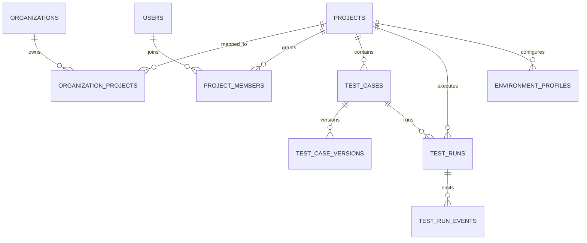

# Web UI 企业级数据库与 API 设计

本文档为历史阶段的企业级数据设计快照，最初对应 Flask 版本实现。  
当前代码已迁移到 FastAPI 骨架（`apps/web-ui-service/app/`），该骨架目前只落地了 `users` + JWT 的最小认证能力，其余表与 API 仍可作为后续扩展蓝图。

## 1. ER 图（企业平台级）

## 2. 表设计与字段含义

### 2.1 租户与权限域

#### `organizations`
- `org_id`: 组织唯一业务 ID（多租户主键）
- `name`: 组织名称
- `status`: 组织状态（如 `active` / `suspended`）
- `plan_tier`: 套餐或能力等级（如 `enterprise`）
- `metadata_json`: 扩展字段（组织标签、策略等）

#### `projects`
- `project_id`: 项目唯一业务 ID
- `name`: 项目显示名称
- `created_at` / `updated_at`: 审计时间

#### `organization_projects`
- `org_id`: 组织 ID
- `project_id`: 项目 ID
- `is_primary`: 是否主映射（支持未来多组织协作场景）

#### `users`
- `username`: 登录账号
- `password_hash`: 密码哈希
- `role`: 全局角色（`admin` / `operator` / `viewer`）
- `is_active`: 是否可用

#### `project_members`
- `project_id`: 项目 ID
- `user_id`: 用户 ID
- `member_role`: 项目内角色（项目级 RBAC）
- `status`: 成员状态
- `invited_by`: 邀请者
- `metadata_json`: 扩展信息（来源、备注）

### 2.2 测试资产域

#### `test_cases`
- `project_id` + `case_id`: 用例业务键
- `title`: 用例标题
- `case_path`: YAML 文件路径
- `version`: 当前版本号
- `yaml_hash`: 当前 YAML 哈希

#### `test_case_versions`
- `project_id` + `case_id` + `version`: 版本定位键
- `title`: 对应版本标题
- `yaml_hash`: 版本内容哈希
- `yaml_text`: 版本 YAML 正文
- `change_summary`: 版本摘要（创建/更新/快照）
- `source`: 来源（`web-ui` / `api` / `worker`）
- `created_by`: 操作者

### 2.3 执行调度与可观测性

#### `test_runs`
- `run_id`: 执行唯一 ID
- `project_id` + `case_id`: 执行对象
- `status`: `queued/running/passed/failed`
- `command`: 实际执行命令
- `step_summary`: 步骤摘要
- `report`: 报告聚合
- `evidence_index`: 证据索引
- `worker_id`: 消费任务的 worker

#### `test_run_events`
- `run_id`: 关联执行
- `event_type`: 事件类型（`run_enqueued`、`run_started`、`run_completed`、`run_failed`）
- `event_status`: 事件状态
- `message`: 事件描述
- `details`: 结构化事件上下文
- `actor_type` + `actor_id`: 事件发起者（`system` / `worker`）

### 2.4 环境治理域

#### `environment_profiles`
- `profile_id`: 环境配置唯一 ID
- `project_id`: 所属项目
- `name`: 环境名（`dev/staging/prod`）
- `base_url`: 被测地址
- `browser`: 浏览器类型
- `headless`: 是否无头
- `tags`: 标签（回归分组、风险分组）
- `is_default`: 项目默认环境

## 3. API 设计（已落地）

### 3.1 架构元数据
- `GET /api/meta/architecture`
  - 返回 ER Mermaid、表字典、API 目录

### 3.2 管理域（Admin）
- `POST /api/admin/users`
  - 创建/更新用户
- `POST /api/admin/projects`
  - 创建项目并绑定组织、可指定 owner
- `GET /api/admin/projects/<project_id>/members`
  - 查询项目成员
- `POST /api/admin/projects/<project_id>/members`
  - 新增或更新项目成员

### 3.3 环境域
- `GET /api/projects/<project_id>/environments`
  - 查询项目环境配置
- `POST /api/projects/<project_id>/environments`
  - 创建或更新项目环境配置

### 3.4 资产版本域
- `GET /api/cases/<project_id>/<case_id>/versions`
  - 查询用例版本历史

### 3.5 执行可观测域
- `GET /api/runs/<run_id>/events`
  - 查询执行事件流水

## 4. 与当前项目的实际集成点

已在代码中完成以下集成（非文档层）：

1. `/api/run` 入队时自动写入 `test_run_events(run_enqueued)`
2. worker 认领任务时自动写入 `run_started`
3. 执行完成/失败时自动写入 `run_completed` / `run_failed`
4. 用例保存与执行前会触发 `test_cases` 更新，并同步写入 `test_case_versions`
5. 项目与组织建立映射关系（`organization_projects`）
6. 管理 API 可创建用户、项目、成员、环境配置

这套设计使 Web UI 从“单机脚本式页面”升级到“可多租户、多角色、可审计、可追踪”的平台级数据底座。
