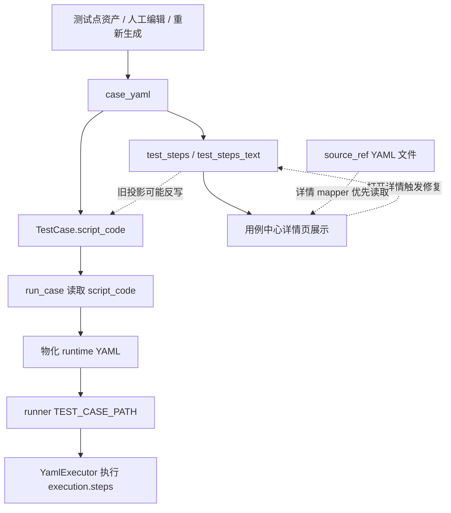
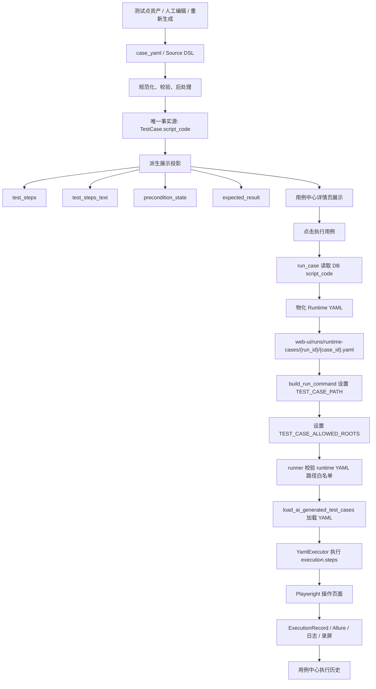
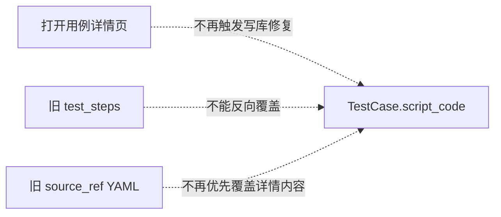

# 2026-05-22 用例中心 script_code 到 runner 执行链路 Bug 修复留档

## 1. 日期与事情

- 日期：2026-05-22
- 事项：修复用例中心 `script_code -> test_steps -> 页面展示 -> runner 执行` 链路断点。
- 范围：用例中心脚本事实源、展示投影派生、详情页读取边界、runner runtime YAML 加载白名单、runner YAML schema 兼容。
- 铁律：不修改被测系统地址。被测系统登录地址仍为 `http://localhost:5174/#/login`。

## 2. 背景

用例中心出现过以下现象：

- 页面展示的步骤、脚本源码、实际 runner 执行步骤可能不一致。
- 用户修改过账号密码或步骤后，后续查看详情或执行时疑似又被旧数据恢复。
- runner 执行本次运行物化出来的 runtime YAML 时，可能被旧的 `ai-generated` 路径白名单拒绝。
- 当前生成 YAML 已包含 `input`、`target_name`、`locator_value`、`expected_result`、`execution.page_url`、`selected_intent_ids` 等字段，但 runner schema 仍按旧字段集校验。

本次修复目标不是重构 DSL，而是先把现有链路收敛为“唯一事实源 + 单向派生投影”。

## 3. 修复前链路



## 4. 根因

### 4.1 唯一事实源倒挂

`TestCase.script_code` 理应是自动化用例的唯一事实源，但 `get_test_case_detail()` 读取详情时会调用 `_repair_case_detail_payload_in_storage()`。

该修复函数以 `case.test_steps` 为输入修复 `case.script_code`，并可能写回 YAML 文件。这样一来，只要 `test_steps` 是旧投影，打开详情页本身就可能把新的 `script_code` 改回旧内容。

### 4.2 脚本更新不刷新展示投影

`update_script()` 和 `update_test_case(..., script_code=...)` 只更新 `script_code`，没有从 YAML 重新派生：

- `test_steps`
- `test_steps_text`
- `precondition_state`
- `expected_result`
- `TestCaseStep` 明细表

结果是页面展示使用旧步骤，runner 执行使用新脚本，用户感知为“页面和实际执行不一致”。

### 4.3 详情 mapper 优先读取旧文件

普通用例详情 mapper 会优先从 `source_ref` 指向的 YAML 文件读取详情内容，再回退到 DB `script_code`。如果文件没有及时同步，详情页可能展示旧文件内容。

### 4.4 runtime YAML 被 runner 白名单拒绝

后端执行时会把 DB `script_code` 物化到：

```text
web-ui/runs/runtime-cases/{run_id}/{case_id}.yaml
```

但 runner 在 `RUN_MODE=ai` 下只允许 `TEST_CASE_PATH` 位于：

```text
assets/test-cases/ai-generated
```

这会导致“后端已生成本次运行 YAML，但 runner 拒绝加载”。

### 4.5 runner schema 与当前 YAML 脱节

当前生成 YAML 已经包含当前执行链路需要的字段，但 `yaml_testcase.schema.json` 仍是旧 schema，导致合法生成 YAML 可能被校验拒绝。

## 5. 冲突范围

本次问题影响以下链路：

- 用例中心详情页展示步骤。
- 用例中心脚本源码展示。
- 用例执行前 `run_case` 读取脚本。
- runtime YAML 物化。
- runner `TEST_CASE_PATH` 加载。
- runner schema 校验。
- 用例执行历史和报告可信度。

本次未扩大到以下范围：

- 未修改被测系统地址。
- 未修改页面对象导入逻辑。
- 未重构 DSL V3.0。
- 未调整前端交互布局。
- 未改 Docker 部署配置。

## 6. 解决方案

### 6.1 确定唯一事实源

规则：

- `TestCase.script_code` 是唯一事实源。
- `test_steps`、`test_steps_text`、`precondition_state`、`expected_result` 是展示投影。
- 展示投影只能从 `script_code` 派生，不能反向覆盖 `script_code`。
- 查询详情只能读，不能悄悄写库修复。

### 6.2 脚本更新时单向派生展示投影

新增 `_derive_case_projection_from_script(script_code)`，从 YAML 中派生：

- `execution.steps -> test_steps`
- `execution.steps -> test_steps_text`
- `precondition_state -> precondition_state`
- `expected_result / requirement / description -> expected_result`

在以下入口调用：

- `update_test_case(..., script_code=...)`
- `update_script(...)`

并在 `update_script(...)` 中同步刷新 `TestCaseStep` 明细表。

### 6.3 禁止详情读取反向写库

`get_test_case_detail()` 不再调用 `_repair_case_detail_payload_in_storage()`。

这样打开详情页不会再改变数据库，也不会用旧 `test_steps` 覆盖新 `script_code`。

### 6.4 详情 mapper 优先读取 DB script_code

`test_case_mapper._load_case_yaml()` 改为：

1. 优先解析 DB `case.script_code`。
2. 只有 DB 脚本为空或不可解析时，才回退读取 `source_ref` 文件。

### 6.5 runtime YAML 显式加入 runner 白名单

`build_run_command()` 增加：

```text
TEST_CASE_ALLOWED_ROOTS
```

包含：

- `assets/test-cases/ai-generated`
- 当前 runtime YAML 所在目录

runner 的 `test_case_loader` 支持读取 `TEST_CASE_ALLOWED_ROOTS`，在原有安全白名单基础上允许本次 run 隔离目录。

### 6.6 runner schema 补齐当前字段

`yaml_testcase.schema.json` 补齐当前生成 YAML 所需字段：

- 顶层 `requirement` 支持 object / array / string。
- 顶层支持 `precondition_state`、`expected_result`。
- `execution` 支持 `page_url`、`selected_intent_ids`。
- step 支持 `input` 动作。
- step 支持 `target_name`、`locator_value`、`role`、`expected_result`。

## 7. 修复后链路



被切断的危险反向链路：



## 8. 改动代码清单

### 后端服务

- `apps/web-ui-service/app/services/test_case_service.py`
  - 新增 `_derive_case_projection_from_script()`。
  - `get_test_case_detail()` 移除读时修复写库。
  - `update_test_case()` 在更新 `script_code` 时刷新展示投影。
  - `update_script()` 在更新 `script_code` 时刷新展示投影并同步 `TestCaseStep`。

- `apps/web-ui-service/app/services/test_case_data_service.py`
  - `normalize_test_steps()` 保留更多执行和追踪字段，避免展示投影丢失关键信息。

- `apps/web-ui-service/app/services/test_case_mapper.py`
  - `_load_case_yaml()` 优先读取 DB `script_code`，再回退 `source_ref` 文件。

- `apps/web-ui-service/app/services/workbench_runtime_service.py`
  - `build_run_command()` 设置 `TEST_CASE_ALLOWED_ROOTS`，允许本次 runtime YAML 所在目录。

### Runner

- `runners/web-playwright-python/runner/test_case_loader.py`
  - 支持 `TEST_CASE_ALLOWED_ROOTS` 扩展白名单。

- `runners/web-playwright-python/schemas/yaml_testcase.schema.json`
  - 补齐当前 YAML 生成链路所需字段。

### 测试

- `apps/web-ui-service/tests/test_case_id_flow.py`
  - 更新详情查询不再读时修复的测试口径。
  - 新增 `update_script` 后展示投影同步测试。

- `apps/web-ui-service/tests/unit/test_workbench_runtime_service.py`
  - 增加 runtime YAML 白名单环境变量测试。

- `runners/web-playwright-python/tests/test_ai_generated_loader.py`
  - 增加 `TEST_CASE_ALLOWED_ROOTS` 加载 runtime YAML 测试。

## 9. 为什么这样解决

### 9.1 避免事实源竞争

如果 `script_code`、`test_steps`、`source_ref YAML` 都可以互相覆盖，任何一次打开详情、重新生成、执行都可能触发不可预期的数据回滚。

把 `script_code` 定为唯一事实源后，链路变成单向：

```text
script_code -> 展示投影 -> 页面展示
script_code -> runtime YAML -> runner执行
```

这样更符合可追溯、可测试、可恢复的工程规范。

### 9.2 查询接口必须只读

详情查询如果有写库副作用，会造成“用户只是看了一眼，数据就变了”。这类问题非常难排查，也会破坏用户信任。

因此读时修复不应继续存在于详情查询主链路。

### 9.3 runtime YAML 需要隔离但也要可执行

把本次执行脚本物化到 runtime 目录，可以保证每次执行有独立快照，避免执行中受源文件变化影响。

但 runner 必须显式知道该目录是安全白名单的一部分，所以通过 `TEST_CASE_ALLOWED_ROOTS` 传递本次 run 的允许目录。

### 9.4 schema 必须跟随当前 DSL 事实

schema 是执行入口的门禁。如果 schema 落后于实际生成 YAML，会让合法用例在执行前失败。

本次只补齐现有字段，不引入 DSL V3.0 新结构。

## 10. 风险点

- 历史依赖“打开详情自动修复”的旧数据不会再自动被修复，需要后续提供显式治理入口。
- 如果某些旧用例 `script_code` 不是 YAML，而是 Python 片段，派生投影会跳过，保留原有展示字段。
- `TEST_CASE_ALLOWED_ROOTS` 扩展了 runner 白名单，但只由后端 `build_run_command()` 设置为当前 runtime YAML 父目录，仍保持路径边界。
- schema 兼容了更多当前字段，但没有放开 `additionalProperties`，避免 DSL 字段失控。

## 11. 验证方法

### 11.1 语法检查

已执行：

```bash
python3 -m py_compile \
  apps/web-ui-service/app/services/test_case_service.py \
  apps/web-ui-service/app/services/test_case_data_service.py \
  apps/web-ui-service/app/services/test_case_mapper.py \
  apps/web-ui-service/app/services/workbench_runtime_service.py \
  runners/web-playwright-python/runner/test_case_loader.py \
  apps/web-ui-service/tests/test_case_id_flow.py \
  apps/web-ui-service/tests/unit/test_workbench_runtime_service.py \
  runners/web-playwright-python/tests/test_ai_generated_loader.py
```

结果：通过。

### 11.2 单元测试

已执行：

```bash
.venv/bin/pytest \
  apps/web-ui-service/tests/test_case_id_flow.py::test_get_detail_does_not_repair_legacy_login_steps_on_read \
  apps/web-ui-service/tests/test_case_id_flow.py::test_get_detail_does_not_repair_password_input_to_remember_checkbox \
  apps/web-ui-service/tests/test_case_id_flow.py::test_get_detail_does_not_repair_login_like_steps_when_page_code_is_not_login \
  apps/web-ui-service/tests/test_case_id_flow.py::test_update_script_refreshes_projection_from_script_code \
  apps/web-ui-service/tests/unit/test_workbench_runtime_service.py \
  runners/web-playwright-python/tests/test_ai_generated_loader.py \
  -q
```

结果：

```text
18 passed in 0.39s
```

### 11.3 schema JSON 校验

已执行：

```bash
python3 -m json.tool runners/web-playwright-python/schemas/yaml_testcase.schema.json >/tmp/yaml_testcase_schema_check.json
```

结果：通过。

## 12. 验收项

- 打开用例详情页不会修改数据库中的 `script_code`。
- 更新 `script_code` 后，`test_steps`、`test_steps_text`、`precondition_state`、`expected_result` 同步派生。
- 页面展示步骤与 `script_code.execution.steps` 保持一致。
- 执行时 `run_case` 读取 DB `script_code`。
- 每次执行物化独立 runtime YAML。
- runner 能加载本次 runtime YAML，不再被旧 `ai-generated` 白名单误杀。
- runner schema 接受当前生成 YAML 中的执行字段。
- 被测系统地址仍保持 `http://localhost:5174/#/login`。

## 13. 后续建议

- 增加一个只读诊断接口，对比 DB `script_code.execution.steps`、DB `test_steps`、runtime YAML `execution.steps` 是否一致。
- 为历史脏数据提供显式“从 script_code 重建展示投影”的治理按钮或管理命令。
- 在 DSL V3.0 规划落地前，继续坚持 `script_code` 是唯一事实源，不允许其它字段反向覆盖。
