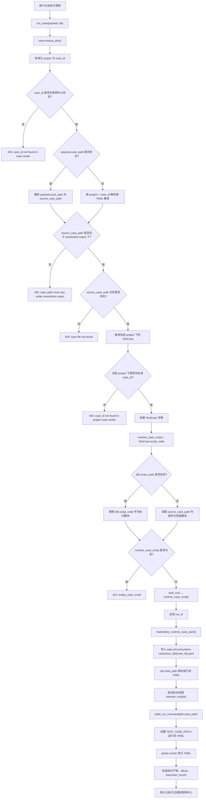

# 2026-05-21 run_case 执行链路流程图

## 1. 留档目的

本文档记录 `WorkbenchFacade.run_case()` 当前执行链路，重点说明以下事实：

- 执行入口会先校验源 YAML 路径安全，再读取或使用脚本内容。
- 当前项目下的 `TestCase.script_code` 优先作为执行脚本。
- 只有当 DB `script_code` 为空时，才回退读取源 YAML 文件内容。
- 执行阶段不再把 DB 脚本反写回源 YAML。
- Runner 实际执行的是运行态 YAML：`web-ui/runs/runtime-cases/{run_id}/{case_id}.yaml`。
- 被测系统地址铁律：`http://localhost:5174/#/login` 不允许被改写为平台地址、Docker 内部地址或其他默认地址。

## 2. 代码范围

涉及核心文件：

- `apps/web-ui-service/app/api/workbench/facade.py`
- `apps/web-ui-service/app/services/workbench_runtime_service.py`

核心函数：

- `WorkbenchFacade.run_case()`
- `workbench_runtime_service.start_run()`
- `workbench_runtime_service.materialize_runtime_case_yaml()`
- `workbench_runtime_service.execute_run()`

## 3. 当前流程图



## 4. 数据来源与写入边界

| 数据 | 当前角色 | 是否作为执行源 | 是否在执行阶段被写回 |
|---|---|---:|---:|
| `TestCase.script_code` | 用例中心当前脚本 | 是，最高优先级 | 否 |
| `assets/test-cases/**/*.yaml` | 源 YAML 文件 | 仅 DB 脚本为空时兜底 | 否 |
| `web-ui/runs/runtime-cases/{run_id}/{case_id}.yaml` | 单次运行态脚本 | 是，Runner 实际读取 | 是，仅写运行态目录 |
| `TestCase.source_ref` | 源文件引用 | 当前执行链路不写 | 否 |
| 历史 run 的 `case_path` | 历史记录 | 普通再次执行不直接复用 | 否 |

## 5. 为什么不在 run_case 中同步写回源 YAML

执行入口的职责是“执行当前确认脚本”，不是“修改源资产”。如果在 `run_case()` 中恢复类似下面的逻辑：

```python
test_case_service.sync_generated_case_yaml_file(
    str(source_case_path),
    runtime_case_script,
)
```

会重新引入执行副作用：

- 用户只是点击执行，却可能悄悄改写源 YAML。
- 旧 DB 脚本可能覆盖用户刚修过的 YAML。
- 历史脚本、旧账号密码、旧断言可能在执行时复活。
- 失败排查时无法判断是“保存动作”改了文件，还是“执行动作”改了文件。

因此当前设计选择：

- 生成或编辑保存阶段负责同步源文件。
- 执行阶段只物化运行态 YAML。
- 源 YAML 与 DB 不一致时，执行优先使用 DB `script_code`，不会因为源 YAML 旧而跑旧步骤。

## 6. 关键判断结论

关于“去掉同步写回是否会导致执行读旧文件”的结论：

- 如果 DB `script_code` 非空：不会读旧源 YAML，执行的是 DB 脚本物化出的运行态 YAML。
- 如果 DB `script_code` 为空：才读取源 YAML 作为兜底。
- 如果 DB 与源 YAML 不一致：这是保存/生成阶段的数据一致性问题，不应在执行阶段通过反写源文件解决。

## 7. 验收项

- `case_path` 必须在 `assets/test-cases` 下，否则返回 400。
- 源 YAML 文件不存在时返回 404。
- 当前 project 下不存在该 case 时返回 404，不跨项目兜底。
- DB `script_code` 非空时，运行态 YAML 内容来自 DB。
- DB `script_code` 为空时，运行态 YAML 内容来自源 YAML。
- 执行后源 YAML 文件内容和 mtime 不应因为 `run_case()` 被改写。
- `job.case_path` 应指向 `web-ui/runs/runtime-cases/{run_id}/{case_id}.yaml`。
- Runner 环境变量 `TEST_CASE_PATH` 应指向运行态 YAML。
- 默认被测地址保持 `http://localhost:5174/#/login`。

## 8. 后续建议

后续如果要保证 DB `script_code` 与源 YAML 长期一致，应在这些入口处理，而不是在 `run_case()` 中处理：

- 用例生成成功后。
- 用例编辑保存后。
- 页面对象定位器升级并重新编译脚本后。
- 显式“同步到源 YAML”治理动作。

同步动作需要记录审计日志、版本号和操作者，避免再次出现“执行时悄悄改文件”的隐性副作用。
