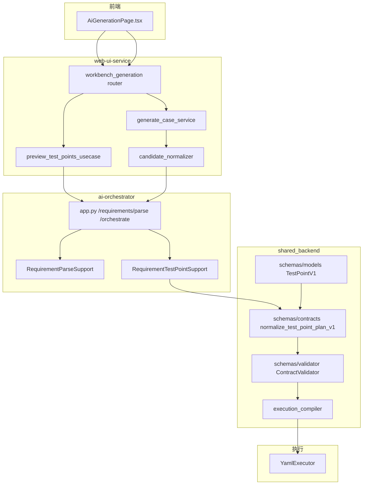
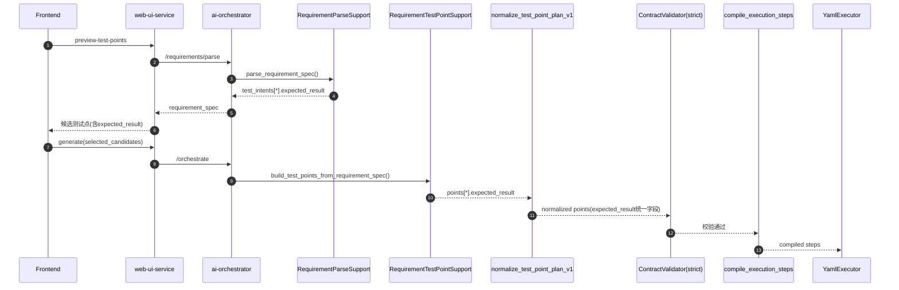

# `expected_result` 补回（仅当前改动点）评审与执行蓝图

## 摘要
本次只聚焦你指定的“测试点计划 `points` 补回 `expected_result`”这一条，不扩展到其它链路改造。  
目标是把 `expected_result` 从 `requirement_spec.test_intents` 稳定透传到 `test_points.points`，并在主链严格校验，但不新增任何额外功能。

## 业务流程图（当前真实链路，含改动点）

```mermaid
flowchart LR
  U[用户在AI生成工作台输入需求] --> P1[/POST /api/workbench/preview-test-points/]
  P1 --> WB1[web-ui-service preview usecase]
  WB1 --> O1[/POST /requirements/parse/]
  O1 --> RP[RequirementParseSupport]
  RP --> RS[RequirementSpec.test_intents.expected_result]

  RS --> U2[前端候选展示与勾选]
  U2 --> P2[/POST /api/workbench/generate/]
  P2 --> WB2[GenerateCaseService + candidate_normalizer]
  WB2 --> O2[/POST /orchestrate/]

  O2 --> TP[RequirementTestPointSupport.build_test_points_from_requirement_spec]
  TP --> NM[normalize_test_point_plan_v1]
  NM --> VD[ContractValidator strict]
  VD --> CP[compile_execution_steps]
  CP --> RN[Pytest/YamlExecutor执行]
  RN --> R[执行结果/报告]

  TP -. 当前缺口 .-> GAP[points 未稳定包含 expected_result]
```

## 技术架构图（仅本次涉及模块）

## UML 时序图（`expected_result` 透传目标态）

## 计划方案不合理点（需先修正）
1. 直接把 `expected_result` 设为 strict 必填会误伤现状。  
当前 pytest 确定性解析路径里 `test_intents` 未填 `expected_result`，先上硬门禁会直接阻断。
2. 校验规则若不豁免 precondition/login 会产生噪音失败。  
这些点常用于前置动作，不应按业务断言点同标准卡死。
3. 字段标准若只改后端不改兼容入口，会出现“写入 expected / 存储 expected_result”割裂。  
需要明确“主字段 `expected_result`，输入兼容 `expected`”。
4. 若不同步契约文档，会再次出现 OpenAPI 与运行时漂移。  
`TestPointV1` 契约需要补 `expected_result`（至少内部契约与测试先对齐）。

## 执行方案（不加功能版）
1. 统一契约：`TestPointV1` 增加 `expected_result`，仅字段补齐，不改编译语义。  
2. 生产透传：`build_test_points_from_requirement_spec()` 从 intent 读 `expected_result` 写入 point。  
3. 归一化统一：`normalize_test_point_plan_v1()` 输出统一字段 `expected_result`，兼容读取 `expected`。  
4. 严格校验：`ContractValidator.validate_full(strict=True)` 增加规则：非 precondition/login 点 `expected_result` 不能为空。  
5. 测试补齐：增加成功/失败用例，覆盖“缺失 expected_result 必须失败（严格模式）”与“兼容 expected 输入”。  
6. 文档同步：仅更新本次字段契约说明，不扩展其它接口改造。

## 约束与默认
- 不新增接口、不改路径、不改页面交互、不改编译/执行能力。  
- 不改批量上限、路由结构、状态存储策略。  
- 仅做 `expected_result` 字段贯通与对应校验/测试。  
- 任何超出本范围的“顺手优化”全部禁止。
