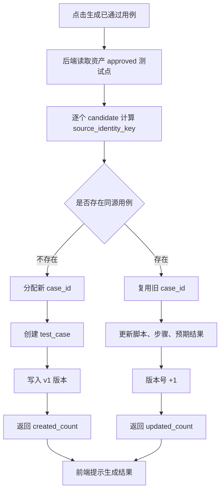
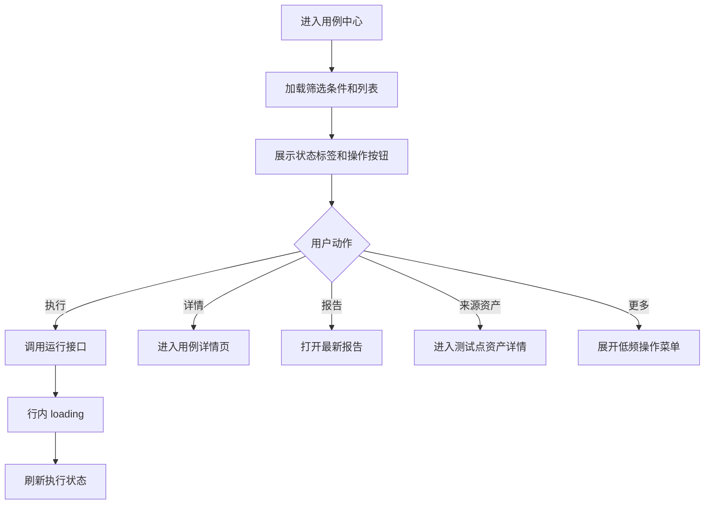

# 用例中心去重生成与列表页 UI 交互设计

更新时间：2026-05-08

适用范围：

- `/api/workbench/test-point-assets/batch/generate-cases`
- `/api/workbench/test-cases`
- `/cases` 用例中心列表页
- `/cases/{case_id}` 用例详情页

## 1. 结论摘要

用户提出的重复用例问题基本属实，但唯一键需要专业化修正。

当前系统确实存在“重复生成同一测试点用例”的风险和本地数据证据。根因不是简单的前端重复点击，而是生成链路缺少以“来源测试点”为主键的幂等生成逻辑。

需要将生成逻辑从：

```text
每次生成 -> 分配一个新 case_id -> 新建/同步到用例中心
```

调整为：

```text
每次生成 -> 查找 project + source_asset_id + intent_id 是否已有用例
  -> 没有：创建新用例
  -> 已有：更新旧用例并生成新版本
```

注意：不能只使用裸 `intent_id` 作为全局唯一标识。`intent-01` 这类编号通常只在单个资产内唯一，不同项目、不同资产都可能存在相同 intent 编号。

推荐唯一键：

```text
project_code + source_asset_id + source_intent_id
```

可选增强：

```text
project_code + client + page_code + source_asset_id + source_intent_id
```

## 2. 当前判断是否属实

### 2.1 后端生成逻辑核验

当前批量生成入口会：

1. 读取资产文件。
2. 过滤 `review_status=approved` 的测试点。
3. 构造 `selected_candidates` 和 `selected_intent_ids`。
4. 调用生成 usecase。
5. 底层分配 `case_id` 并同步到 `test_cases`。

但在批量生成入口处没有看到：

```text
根据 source_asset_id + intent_id 查询已有用例
```

也没有看到：

```text
若已有则复用旧 case_id 并更新版本
```

底层 `upsert_test_case_from_workbench` 当前是按生成出的 `case_id` 更新或创建。只要每次生成分配了新的 `case_id`，就会变成新的用例记录。

### 2.2 数据库结构核验

当前 `test_cases` 表有：

- `case_id`
- `project_code`
- `page_code`
- `source_ref`
- `script_code`
- `test_steps`

但没有稳定字段：

- `source_asset_id`
- `source_intent_id`
- `source_identity_key`

这意味着当前列表页的来源资产信息主要通过后端扫描资产与脚本内容反推，而不是数据库中稳定存储的来源关系。

### 2.3 本地数据证据

当前本地 `mall/login` 下已存在重复标题：

```text
首次登录成功：4 条
账号和密码都为空点击登录：3 条
```

这说明重复不是纯理论风险，已经在当前环境中发生。

## 3. 产品目标

### 3.1 去重生成目标

- 同一来源测试点在用例中心永远只保留一条当前有效用例。
- 多次点击“生成已通过用例”不新增重复记录，而是更新旧用例并产生版本历史。
- 生成接口对用户可重复点击保持幂等。
- 用例详情页和版本页能追溯每一次重新生成。

### 3.2 列表页体验目标

- 用例标题和来源资产不再重复。
- 用户能一眼识别执行状态、活跃状态和优先级。
- 操作列根据状态展示最相关入口。
- 高频操作外露，低频操作折叠。
- 用例编码更易读，但不破坏后端真实 `case_id`。

## 4. 后端去重生成方案

### 4.1 新增来源身份字段

推荐在 `test_cases` 增加字段：

```text
source_asset_id      string
source_asset_title   string
source_intent_id     string
source_identity_key  string
```

其中：

```text
source_identity_key = project_code + "::" + source_asset_id + "::" + source_intent_id
```

数据库唯一约束建议：

```text
unique(project_code, source_asset_id, source_intent_id)
```

如果短期不想加表字段，可以先在 `data_config` 或 `notes` 中存来源元信息，但这只是过渡方案，不建议长期依赖。

### 4.2 生成前查重逻辑

伪代码：

```python
for candidate in approved_candidates:
    source_asset_id = asset["asset_id"]
    source_intent_id = candidate["intent_id"]

    existing_case = find_case_by_source_identity(
        project_code=project,
        source_asset_id=source_asset_id,
        source_intent_id=source_intent_id,
    )

    if existing_case:
        payload.case_id = existing_case.case_id
        mode = "update"
    else:
        payload.case_id = ""
        mode = "create"

    generated = generate_case(payload)

    if existing_case:
        update_case(existing_case, generated)
        create_case_version(existing_case, change_summary="regenerated from test point asset")
    else:
        create_case(generated)
        create_case_version(new_case, change_summary="created from test point asset")
```

### 4.3 生成接口返回结构

建议增强返回：

```json
{
  "message": "generated 2 cases",
  "count": 2,
  "created_count": 1,
  "updated_count": 1,
  "items": [
    {
      "case_id": "mall-web-login-auth-fn-ai-0007",
      "title": "首次登录成功",
      "source_asset_id": "mall-web-login-auth-fn-ai-0021",
      "source_intent_id": "intent-01",
      "generation_action": "updated",
      "version_no": 3
    }
  ]
}
```

前端可展示：

```text
已生成 2 条：新增 1 条，更新 1 条。
```

### 4.4 版本策略

首次生成：

```text
v1 | 首次生成 | created from test point asset
```

再次生成：

```text
v2 | 重新生成 | regenerated from test point asset
```

版本内容：

- `script_code`
- `test_steps`
- `expected_result`
- `source_asset_id`
- `source_intent_id`
- `changed_by`
- `created_at`

### 4.5 并发与幂等

需要防止连续点击产生并发重复。

后端：

- 数据库唯一约束兜底。
- 生成前查一次。
- 写入时捕获唯一键冲突，重新查询并更新。

前端：

- 点击生成后按钮进入 loading。
- 同一个资产生成未完成前不允许重复点击。

## 5. 重复数据清理方案

### 5.0 当前临时清理策略：物理删除

在去重 Upsert 完成前，为了快速恢复用例中心的可演示状态，当前允许对“当前项目”的用例中心数据执行物理删除。

删除范围：

- `test_cases` 主记录
- `test_case_steps` 步骤记录
- `test_case_versions` 版本记录
- `test_case_executions` 执行历史
- `test_case_defects` 缺陷关联
- 用例 YAML 文件与执行报告文件

交互入口：

- 列表每行提供 `删除`，用于单条物理删除。
- 页面顶部提供 `清空当前项目用例`，用于物理删除当前项目下全部用例。
- 清空操作必须输入确认短语，避免误触。

边界说明：

- 物理删除不可恢复，只作为当前重复数据治理的临时动作。
- 默认按当前项目隔离，不跨项目删除。
- 后续 Upsert 与版本机制完成后，日常治理应优先使用“废弃/版本更新”，而不是频繁物理删除。

### 5.1 清理原则

按以下优先级保留一条：

1. 保留已执行过且最近执行结果有效的用例。
2. 若都未执行，保留 `updated_at` 最新的用例。
3. 若最新用例数据异常，保留脚本和步骤最完整的一条。

### 5.2 清理策略

分组键：

```text
project_code + page_code + source_asset_id + source_intent_id
```

过渡阶段如果缺少来源字段，可临时使用：

```text
project_code + page_code + name
```

但这个策略只适合一次性清理，不适合作为长期唯一键。

### 5.3 清理动作

推荐软清理：

```text
旧重复用例 -> status = deprecated
最新用例 -> status = active
```

不建议直接物理删除，因为执行历史和报告可能需要保留。

## 6. 用例中心列表页 UI 优化方案

## 6.1 当前问题

### 问题 A：来源资产与用例标题重复

当前用户看到的“来源资产”可能和“用例标题”相同或近似，导致信息重复。

目标：

- `用例标题` 展示具体测试点标题，例如 `首次登录成功`。
- `来源资产` 展示资产包标题，例如 `登录页身份验证测试点集`。

### 问题 B：状态缺少视觉层级

纯文本状态不利于快速扫描。

目标：

- 执行状态使用彩色 Tag。
- 活跃状态使用彩色 Tag。
- 优先级使用轻量 Tag。

### 问题 C：操作列缺少主次

未执行用例显示“查看报告”不合理。

目标：

- 高频操作外露：`执行`、`详情`、`报告`。
- 低频操作折叠：`废弃`、`查看源码`、`复制编码`。

## 6.2 列表页信息架构

```text
用例中心
├─ 页面标题与说明
├─ 快捷入口
├─ 统计卡片
├─ 筛选栏
├─ 批量操作栏
├─ 用例表格
└─ 分页
```

## 6.3 列表页布局原型图

```text
┏━━━━━━━━━━━━━━━━━━━━━━━━━━━━━━━━━━━━━━━━━━━━━━━━━━━━━━━━━━━━━━━━━━━━━━━━━━┓
┃ 用例中心                                                     [待审核用例] [测试点资产] ┃
┃ 管理所有已生成的自动化测试用例，可执行、查看报告和追溯来源资产。           ┃
┗━━━━━━━━━━━━━━━━━━━━━━━━━━━━━━━━━━━━━━━━━━━━━━━━━━━━━━━━━━━━━━━━━━━━━━━━━━┛

┏━━━━━━━━━━━━━━━━━━━━━━━━━━━━━━━━━━━━━━━━━━━━━━━━━━━━━━━━━━━━━━━━━━━━━━━━━━┓
┃ 当前列表 8      活跃用例 6      通过 2      失败 1      未执行 5          ┃
┗━━━━━━━━━━━━━━━━━━━━━━━━━━━━━━━━━━━━━━━━━━━━━━━━━━━━━━━━━━━━━━━━━━━━━━━━━━┛

┏━━━━━━━━━━━━━━━━━━━━━━━━━━━━━━━━━━━━━━━━━━━━━━━━━━━━━━━━━━━━━━━━━━━━━━━━━━┓
┃ 项目 [mall ▼] 页面 [login] 来源资产 [登录页身份验证测试点集] 类型 [全部]  ┃
┃ 优先级 [全部] 执行状态 [全部] 活跃状态 [活跃] 搜索 [标题/编码...] [查询] [重置] │
┗━━━━━━━━━━━━━━━━━━━━━━━━━━━━━━━━━━━━━━━━━━━━━━━━━━━━━━━━━━━━━━━━━━━━━━━━━━┛

┏━━━━━━━━━━━━━━━━━━━━━━━━━━━━━━━━━━━━━━━━━━━━━━━━━━━━━━━━━━━━━━━━━━━━━━━━━━┓
┃ 已选 0 条                                                  [批量执行] [批量废弃] ┃
┣━━━━┳━━━━━━━━━━━━━━┳━━━━━━━━━━━━━━┳━━━━━━━━━━━━━━━━━━━━┳━━━━━━┳━━━━━━┳━━━━┳━━━━━━━━┳━━━━━━┳━━━━━━━━━━━━━━━━━━┫
┃ □  ┃ 用例编码       ┃ 用例标题       ┃ 来源资产             ┃ 页面  ┃ 类型  ┃ 优先级 ┃ 执行状态 ┃ 活跃 ┃ 操作             ┃
┣━━━━╋━━━━━━━━━━━━━━╋━━━━━━━━━━━━━━╋━━━━━━━━━━━━━━━━━━━━╋━━━━━━╋━━━━━━╋━━━━╋━━━━━━━━╋━━━━━━╋━━━━━━━━━━━━━━━━━━┫
┃ □  ┃ TC-LOGIN-0007 ┃ 首次登录成功   ┃ 登录页身份验证测试点集 ┃ login ┃ 功能  ┃ P0 ┃ 未执行 ┃ 活跃 ┃ [执行] [详情] [更多] ┃
┃ □  ┃ TC-LOGIN-0008 ┃ 账号密码为空   ┃ 登录页身份验证测试点集 ┃ login ┃ 异常  ┃ P1 ┃ 未执行 ┃ 活跃 ┃ [执行] [详情] [更多] ┃
┃ □  ┃ TC-LOGIN-0009 ┃ 弱网环境登录   ┃ 登录页身份验证测试点集 ┃ login ┃ 交互  ┃ P2 ┃ 失败   ┃ 活跃 ┃ [执行] [报告] [更多] ┃
┗━━━━┻━━━━━━━━━━━━━━┻━━━━━━━━━━━━━━┻━━━━━━━━━━━━━━━━━━━━┻━━━━━━┻━━━━━━┻━━━━┻━━━━━━━━┻━━━━━━┻━━━━━━━━━━━━━━━━━━┛

分页：第 1 / 1 页，共 8 条
```

## 6.4 列定义

| 列 | 展示内容 | 交互 |
| --- | --- | --- |
| 选择 | checkbox | 支持批量执行、批量废弃 |
| 用例编码 | 展示短编码 `TC-LOGIN-0007`，hover 显示完整 `case_id` | 点击复制完整编码 |
| 用例标题 | 测试点标题 | 点击进入用例详情 |
| 来源资产 | 资产包标题 | 点击进入资产详情 |
| 页面 | `page_code` | 可筛选 |
| 类型 | 中文标签 | 可筛选 |
| 优先级 | `P0/P1/P2` 标签 | 可筛选 |
| 执行状态 | 通过/失败/未执行/执行中 | 彩色标签 |
| 活跃 | 活跃/已废弃 | 彩色标签 |
| 操作 | 执行、详情、报告、更多 | 动态展示 |

## 6.5 短编码规则

后端真实 `case_id` 不建议改，因为它已用于路由、同步和引用。

前端显示短编码即可：

```text
mall-web-login-auth-fn-ai-0007 -> TC-LOGIN-0007
```

规则：

```text
TC-{PAGE_CODE_UPPER}-{SEQUENCE}
```

示例：

| 完整编码 | 展示短编码 |
| --- | --- |
| `mall-web-login-auth-fn-ai-0007` | `TC-LOGIN-0007` |
| `mall-web-order-pay-fn-ai-0012` | `TC-ORDER-0012` |

## 6.6 状态标签规范

### 执行状态

| 状态 | 文案 | 颜色 |
| --- | --- | --- |
| `passed` | 通过 | 绿色 |
| `failed` | 失败 | 红色 |
| `running` | 执行中 | 蓝色 |
| `skipped` | 跳过 | 黄色 |
| `unknown` | 未执行 | 灰色 |

### 活跃状态

| 状态 | 文案 | 颜色 |
| --- | --- | --- |
| `active` | 活跃 | 绿色 |
| `deprecated` | 已废弃 | 灰色 |

### 优先级

| 状态 | 文案 | 颜色 |
| --- | --- | --- |
| `P0` | P0 | 红色强调 |
| `P1` | P1 | 橙色 |
| `P2` | P2 | 蓝色 |
| `P3` | P3 | 灰色 |

## 6.7 操作列交互

### 活跃 + 未执行

```text
[执行] [详情] [更多]
```

更多菜单：

- 查看源码
- 复制编码
- 废弃用例

### 活跃 + 失败

```text
[执行] [报告] [更多]
```

更多菜单：

- 详情
- 查看源码
- 复制编码
- 废弃用例

### 活跃 + 通过

```text
[执行] [报告] [更多]
```

更多菜单：

- 详情
- 查看源码
- 复制编码
- 废弃用例

### 已废弃

```text
[详情] [报告] [更多]
```

更多菜单：

- 查看源码
- 复制编码
- 恢复用例

## 6.8 行级交互

- 点击用例标题进入详情页。
- 点击来源资产进入测试点资产详情页。
- 点击执行按钮后该行进入 loading，按钮文案改为 `执行中`。
- 执行提交成功后刷新当前页数据。
- 报告不存在时不展示 `报告` 按钮，或展示禁用态。
- 更多菜单点击外部自动关闭。

## 6.9 批量交互

当选择 1 条或以上时显示批量操作栏：

```text
已选 N 条   [批量执行] [批量废弃]
```

规则：

- 批量执行只作用于活跃用例。
- 批量废弃需要二次确认。
- 已废弃用例不参与批量执行。

## 7. 交互流程图

### 7.1 生成 Upsert 流程



### 7.2 列表操作流程



## 8. 后端接口设计建议

### 8.1 生成接口请求

沿用当前结构：

```json
{
  "project": "mall",
  "asset_ids": ["mall-web-login-auth-fn-ai-0021"],
  "intent_ids": ["intent-01"],
  "source": "asset_detail"
}
```

### 8.2 生成接口响应

建议扩展：

```json
{
  "message": "generated 1 cases",
  "count": 1,
  "created_count": 0,
  "updated_count": 1,
  "items": [
    {
      "case_id": "mall-web-login-auth-fn-ai-0007",
      "display_case_id": "TC-LOGIN-0007",
      "title": "首次登录成功",
      "source_asset_id": "mall-web-login-auth-fn-ai-0021",
      "source_asset_title": "登录页身份验证测试点集",
      "source_intent_id": "intent-01",
      "generation_action": "updated",
      "version_no": 2
    }
  ]
}
```

### 8.3 列表接口响应

建议 `GET /api/workbench/test-cases` 返回：

```json
{
  "items": [
    {
      "case_id": "mall-web-login-auth-fn-ai-0007",
      "display_case_id": "TC-LOGIN-0007",
      "title": "首次登录成功",
      "source_asset_id": "mall-web-login-auth-fn-ai-0021",
      "source_asset_title": "登录页身份验证测试点集",
      "source_intent_id": "intent-01",
      "page": "login",
      "intent_type": "functional",
      "priority": "P0",
      "last_execution_result": "unknown",
      "active_status": "active",
      "last_executed_at": "",
      "last_report_url": ""
    }
  ]
}
```

## 9. 实施计划

### P0：后端幂等生成

- 增加来源身份字段或过渡存储。
- 生成前按 `project + asset_id + intent_id` 查重。
- 已存在则复用旧 `case_id` 更新用例。
- 更新时写入新版本。
- 响应中返回 `created_count` 和 `updated_count`。
- 增加并发唯一约束保护。

### P1：列表页 UI 优化

- 来源资产列展示真实资产标题并可点击。
- 用例编码列增加短编码展示，hover 显示完整编码。
- 执行状态、活跃状态、优先级改为标签。
- 操作列改为 `执行 / 详情 / 报告 / 更多`。
- 报告不存在时隐藏或禁用。

### P2：重复数据治理

- 编写一次性重复数据扫描脚本。
- 根据来源身份或临时分组规则识别重复用例。
- 保留最新或最完整用例。
- 旧用例软废弃。
- 输出清理报告。

## 10. 验收标准

### 10.1 去重生成验收

- 同一个 `asset_id + intent_id` 第一次生成时创建新用例。
- 同一个 `asset_id + intent_id` 第二次生成时更新旧用例，不新增列表记录。
- 第二次生成后版本号 +1。
- 生成接口返回 `updated_count=1`。
- 并发重复点击不会产生两条用例。
- 不同资产中的同名 `intent-01` 不互相覆盖。

### 10.2 列表页验收

- 用例标题显示测试点标题。
- 来源资产显示资产包标题。
- 来源资产可跳转资产详情页。
- 用例编码展示短编码，仍可复制或查看完整编码。
- 执行状态使用标签展示。
- 活跃状态使用标签展示。
- 未执行用例不展示可点击报告入口。
- 活跃用例展示执行按钮。
- 已废弃用例不展示执行按钮。
- 更多菜单收纳低频操作。

## 11. 风险与边界

- 如果短期不加来源字段，只靠 `name + page_code` 去重，可能误合并不同测试点。
- 如果只用裸 `intent_id` 去重，可能跨资产误覆盖。
- 如果旧数据没有 `selected_intent_ids`，需要用标题和来源资产做人工确认。
- 若已经产生重复执行历史，清理时应软废弃，不建议物理删除。

## 12. 推荐最终方案

推荐采用：

```text
后端 source identity 幂等生成 + 前端列表信息层级优化 + 旧重复数据软清理
```

这样可以一次性解决：

- 重复用例增长。
- 来源资产和用例标题混乱。
- 状态不直观。
- 操作入口不清晰。
- 后续版本追溯缺失。
