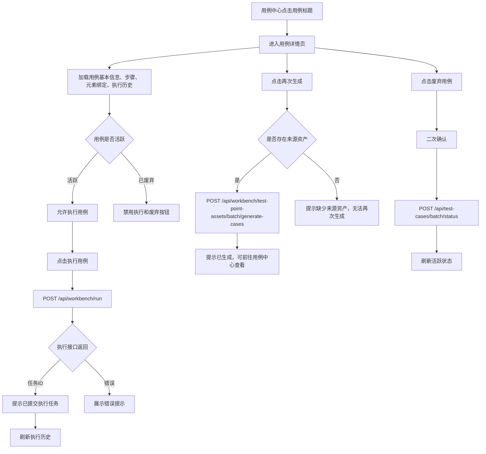
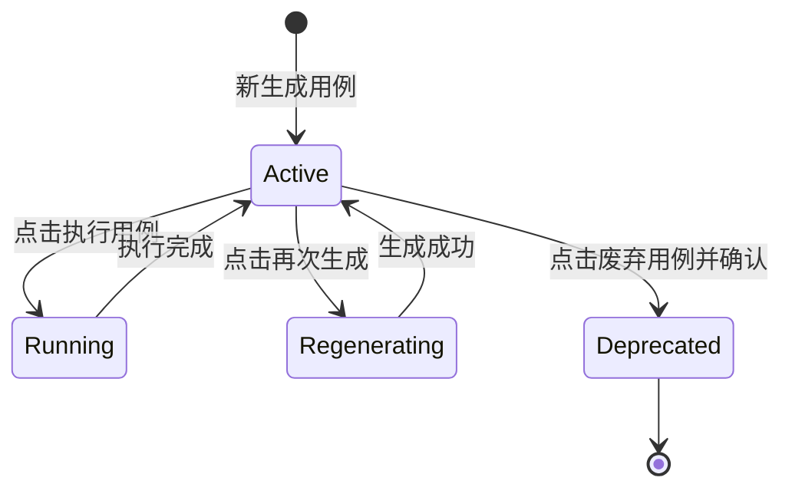

# 用例详情页 UI 布局与交互原型

更新时间：2026-05-08

适用页面：`/cases/{case_id}` 用例中心中的单条自动化用例详情页。

关联页面：

- `/cases` 用例中心列表页
- `/cases/review` 待审核用例页
- `/assets/test-points/{asset_id}` 测试点资产详情页

关联接口：

- `GET /api/workbench/test-cases/{case_id}`
- `POST /api/workbench/run`
- `POST /api/workbench/test-point-assets/batch/generate-cases`
- `POST /api/test-cases/batch/status`

## 1. 产品定位

用例详情页是已生成自动化用例的查看与执行工作台。它不负责审核测试点，也不负责编辑测试点内容，而是围绕单条可执行用例提供完整追溯、执行、脚本查看和状态管理。

核心目标：

- 测试人员能快速确认这条用例是什么、来自哪里、测哪个页面。
- 测试人员能用业务语言阅读步骤，而不是阅读底层执行指令。
- 测试人员能看到元素绑定是否正确，尤其能识别错误绑定。
- 测试人员能发起执行，并在执行历史中看到结果。
- 维护人员能再次生成、查看源码、废弃用例。

## 2. 设计约束

本设计不改变当前页面整体布局，只优化视觉层级、信息密度和交互反馈。

保留：

- 顶部标题与操作按钮区。
- 基本信息卡片。
- 测试步骤与预期。
- 涉及元素绑定。
- 执行历史。
- 脚本源码折叠区。

优化：

- 强化主操作 `执行用例`。
- 弱化辅助操作 `再次生成`、`查看脚本源码`、`返回列表`。
- 危险操作 `废弃用例` 保持红色描边并二次确认。
- 基本信息从平铺表单感改成卡片式信息组。
- 步骤表格使用业务表达，避免技术化指令。
- 元素绑定表明确展示“已绑定 / 错误绑定 / 缺失”。
- 执行历史空态增加明确行动引导。

## 3. 页面信息架构

```text
用例详情
├─ 顶部操作栏
├─ 基本信息卡片
├─ 测试步骤与预期
│  ├─ 前置条件
│  ├─ 操作步骤表
│  ├─ 预期结果
│  └─ 涉及元素绑定表
├─ 执行历史
└─ 脚本源码
```

## 4. 页面布局原型图

```text
┏━━━━━━━━━━━━━━━━━━━━━━━━━━━━━━━━━━━━━━━━━━━━━━━━━━━━━━━━━━━━━━━━━━━━━━┓
┃ 用例详情                                                            ┃
┃ 查看单条独立用例的完整信息、步骤、脚本源码和执行历史。               ┃
┃                                                                      ┃
┃ [执行用例] [再次生成] [查看脚本源码]           [废弃用例] [返回列表] ┃
┗━━━━━━━━━━━━━━━━━━━━━━━━━━━━━━━━━━━━━━━━━━━━━━━━━━━━━━━━━━━━━━━━━━━━━━┛

┏━━━━━━━━━━━━━━━━━━━━━━━━━━━━━━━━━━━━━━━━━━━━━━━━━━━━━━━━━━━━━━━━━━━━━━┓
┃ 首次登录成功                                             [活跃]       ┃
┃ mall-web-login-auth-fn-ai-0007                                      ┃
┣━━━━━━━━━━━━━━━━━━━━━━━━━━━━━━━━━━━━━━━━━━━━━━━━━━━━━━━━━━━━━━━━━━━━━━┫
┃ ┌────────────┬──────────────────────────────────────────────────┐    ┃
┃ │ 页面        │ login                                            │    ┃
┃ ├────────────┼──────────────────────────────────────────────────┤    ┃
┃ │ 测试地址    │ http://localhost:5174/#/login                    │    ┃
┃ ├────────────┼──────────────────────────────────────────────────┤    ┃
┃ │ 类型        │ 功能                                             │    ┃
┃ ├────────────┼──────────────────────────────────────────────────┤    ┃
┃ │ 优先级      │ P0                                               │    ┃
┃ ├────────────┼──────────────────────────────────────────────────┤    ┃
┃ │ 来源资产    │ 登录页身份验证测试点集 [查看]                    │    ┃
┃ ├────────────┼──────────────────────────────────────────────────┤    ┃
┃ │ 创建/更新   │ 2026/05/08 10:56 / 2026/05/08 11:16              │    ┃
┃ └────────────┴──────────────────────────────────────────────────┘    ┃
┗━━━━━━━━━━━━━━━━━━━━━━━━━━━━━━━━━━━━━━━━━━━━━━━━━━━━━━━━━━━━━━━━━━━━━━┛

┏━━━━━━━━━━━━━━━━━━━━━━━━━━━━━━━━━━━━━━━━━━━━━━━━━━━━━━━━━━━━━━━━━━━━━━┓
┃ 测试步骤与预期                                                       ┃
┃ 前置条件：-                                                          ┃
┃                                                                      ┃
┃ ┌────┬────────────────────────┬────────────┬─────────────────────┐  ┃
┃ │ 01 │ 打开登录页面             │ 目标 URL   │ http://localhost...  │  ┃
┃ │ 02 │ 在用户名输入框输入        │ 输入       │ test001              │  ┃
┃ │ 03 │ 在密码输入框输入          │ 输入       │ 123456               │  ┃
┃ │ 04 │ 点击登录按钮              │ 点击       │ login_button         │  ┃
┃ └────┴────────────────────────┴────────────┴─────────────────────┘  ┃
┃                                                                      ┃
┃ 预期结果：页面跳转至平台工作台首页，顶部展示当前登录用户名 admin...   ┃
┃                                                                      ┃
┃ 涉及元素绑定                                                         ┃
┃ ┌──────────────┬────────────────────┬────────────────────┬────────┐ ┃
┃ │ 元素中文名    │ 元素编码             │ 定位器              │ 状态   │ ┃
┃ │ 用户名输入框  │ username_input       │ css=input[name=...] │ 已绑定 │ ┃
┃ │ 密码输入框    │ password_input       │ css=input[type=...] │ 已绑定 │ ┃
┃ │ 登录按钮      │ login_button         │ role=登录           │ 已绑定 │ ┃
┃ └──────────────┴────────────────────┴────────────────────┴────────┘ ┃
┗━━━━━━━━━━━━━━━━━━━━━━━━━━━━━━━━━━━━━━━━━━━━━━━━━━━━━━━━━━━━━━━━━━━━━━┛

┏━━━━━━━━━━━━━━━━━━━━━━━━━━━━━━━━━━━━━━━━━━━━━━━━━━━━━━━━━━━━━━━━━━━━━━┓
┃ 执行历史（最近 5 条）                                                 ┃
┃                                                                      ┃
┃                         暂无执行历史                                  ┃
┃                  点击“执行用例”开始第一次测试运行                      ┃
┃                              [立即执行]                               ┃
┗━━━━━━━━━━━━━━━━━━━━━━━━━━━━━━━━━━━━━━━━━━━━━━━━━━━━━━━━━━━━━━━━━━━━━━┛

┏━━━━━━━━━━━━━━━━━━━━━━━━━━━━━━━━━━━━━━━━━━━━━━━━━━━━━━━━━━━━━━━━━━━━━━┓
┃ 脚本源码（默认折叠）                                                   ┃
┃ ▶ 展开查看生成的自动化脚本                                             ┃
┗━━━━━━━━━━━━━━━━━━━━━━━━━━━━━━━━━━━━━━━━━━━━━━━━━━━━━━━━━━━━━━━━━━━━━━┛
```

## 5. 顶部操作栏设计

### 5.1 按钮顺序

```text
[执行用例] [再次生成] [查看脚本源码]           [废弃用例] [返回列表]
```

### 5.2 按钮层级

| 按钮 | 层级 | 样式 | 说明 |
| --- | --- | --- | --- |
| 执行用例 | 主操作 | 深蓝实心 | 页面最重要动作 |
| 再次生成 | 次操作 | 蓝色描边 | 根据来源资产和 intent 重新生成 |
| 查看脚本源码 | 次操作 | 蓝色描边 | 展开/收起源码 |
| 废弃用例 | 危险操作 | 红色浅底描边 | 需二次确认 |
| 返回列表 | 导航操作 | 灰蓝描边 | 返回用例中心 |

### 5.3 禁用规则

| 状态 | 执行用例 | 再次生成 | 废弃用例 |
| --- | --- | --- | --- |
| 活跃 | 可点击 | 有来源资产时可点击 | 可点击 |
| 已废弃 | 禁用 | 可点击 | 禁用 |
| 执行中 | 禁用，显示执行中 | 禁用 | 禁用 |
| 无来源资产 | 可点击 | 禁用 | 可点击 |

## 6. 基本信息卡片

### 6.1 字段

| 字段 | 展示规则 |
| --- | --- |
| 用例标题 | 大标题展示 |
| 用例编码 | 等宽字体，位于标题下方 |
| 活跃状态 | 右侧状态标签 |
| 页面 | 展示 `page` |
| 测试地址 | 展示 `page_url`，长 URL 允许换行 |
| 类型 | 展示中文类型，如 `功能` |
| 优先级 | 展示 `P0/P1/P2` |
| 来源资产 | 展示资产标题，支持跳转 |
| 创建时间 | 使用本地格式 |
| 更新时间 | 使用本地格式 |

### 6.2 视觉优化

- 卡片顶部使用轻微蓝色渐变，突出用例标题。
- 状态标签固定在右上角。
- 信息区使用 2 行卡片网格，降低“表单感”。
- 来源资产标题不能误用用例标题，应展示真实资产标题。

## 7. 测试步骤与预期

### 7.1 操作步骤表

| 列 | 说明 |
| --- | --- |
| 序号 | 两位数字，如 `01` |
| 步骤说明 | 业务语言，如 `在密码输入框输入` |
| 动作 | `目标 URL`、`输入`、`点击`、`断言` |
| 参数/目标 | URL、输入值、元素编码 |

### 7.2 步骤展示规则

| 原始 action | 展示动作 | 展示说明 |
| --- | --- | --- |
| `goto` | 目标 URL | 打开登录页面 |
| `input/fill` | 输入 | 在 `{target_name}` 输入 |
| `click` | 点击 | 点击 `{target_name}` |
| `assert_*` | 断言 | 校验页面结果 |
| 其他 | 操作 | 使用原始描述兜底 |

### 7.3 错误绑定识别

若步骤语义与元素编码明显冲突，需要在元素绑定表中标记为 `错误绑定`。

示例：

| 步骤语义 | 实际绑定 | 判断 |
| --- | --- | --- |
| 在密码输入框输入 | `remember_password_checkbox` | 错误绑定 |
| 在用户名输入框输入 | `password_input` | 错误绑定 |
| 点击登录按钮 | `login_button` | 已绑定 |

## 8. 涉及元素绑定表

### 8.1 字段

| 字段 | 说明 |
| --- | --- |
| 元素中文名 | 业务可读名称 |
| 元素编码 | Page Object 元素编码 |
| 定位器 | `locator_type=locator_value` |
| 绑定状态 | 已绑定、错误绑定、缺失 |

### 8.2 状态样式

| 状态 | 样式 | 说明 |
| --- | --- | --- |
| 已绑定 | 绿色标签 | 元素编码和语义一致 |
| 错误绑定 | 红色标签 | 元素编码与步骤语义冲突 |
| 缺失 | 黄色标签 | 缺少页面对象或定位器 |

### 8.3 长定位器处理

- 定位器使用等宽字体。
- 超长时单行省略。
- 鼠标悬停展示完整定位器。
- 后续可增加复制按钮。

## 9. 执行历史

### 9.1 有数据状态

```text
┌──────────────┬──────────┬────────┬────────┬──────────┐
│ 执行时间      │ 触发方式  │ 结果   │ 耗时   │ 日志/报告 │
│ 2026/05/08   │ 手动     │ 通过   │ 1.2s   │ 查看报告   │
└──────────────┴──────────┴────────┴────────┴──────────┘
```

### 9.2 空态

```text
暂无执行历史
点击“执行用例”开始第一次测试运行
[立即执行]
```

设计要求：

- 空态不能只显示“暂无执行历史”。
- 必须告诉用户下一步做什么。
- 空态按钮与顶部 `执行用例` 行为一致。

## 10. 脚本源码

默认折叠。

展开后展示：

```text
脚本源码
import pytest
...
def test_intent_01(driver):
    ...
```

交互：

- 点击 `查看脚本源码` 展开。
- 展开后按钮文案变为 `收起脚本源码`。
- 脚本为空时显示 `暂无脚本源码，请重新生成用例`。

后续增强：

- 语法高亮。
- 复制源码。
- 查看版本差异。

## 11. 核心交互流程图



## 12. 状态变化图



## 13. 页面状态与反馈

| 场景 | 页面反馈 |
| --- | --- |
| 加载中 | 展示 `正在加载用例详情...` |
| 加载失败 | 展示错误卡片 |
| 执行提交成功 | 展示 `已提交执行任务` |
| 执行失败 | 展示接口错误 |
| 再次生成成功 | 展示生成数量和用例中心入口 |
| 再次生成失败 | 展示失败原因 |
| 废弃成功 | 状态变为 `已废弃`，执行按钮禁用 |
| 无执行历史 | 展示行动引导和 `立即执行` |

## 14. 视觉规范

### 14.1 颜色

| 场景 | 背景 | 文字 | 边框 |
| --- | --- | --- | --- |
| 页面背景 | `#EEF4FB` | `#0F172A` | - |
| 普通卡片 | `#FFFFFF` | `#0F172A` | `#DBE8FB` |
| 标题渐变 | `#FFFFFF -> #F5F9FF` | `#0F172A` | `#E4ECF9` |
| 主按钮 | `#0F4C81` | `#FFFFFF` | `#0F4C81` |
| 成功状态 | `#ECFDF3` | `#027A48` | `#ABEFC6` |
| 危险状态 | `#FEF2F2` | `#B42318` | `#FECDCA` |
| 表头 | `#F8FBFF` | `#475569` | `#EDF2FA` |

### 14.2 尺寸

| 对象 | 建议 |
| --- | --- |
| 页面最大宽度 | 沿用现有 shell 宽度 |
| 卡片圆角 | `14px - 16px` |
| 卡片间距 | `12px - 16px` |
| 卡片内边距 | `16px - 20px` |
| 表格行高 | `44px - 48px` |
| 表格字号 | `13px` |
| 正文字号 | `14px` |
| 页面标题 | `20px - 24px` |

## 15. 响应式规则

桌面端：

- 顶部操作按钮右对齐。
- 基本信息使用多列网格。
- 步骤表和元素表横向填满容器。

平板端：

- 顶部按钮允许换行。
- 基本信息改为 2 列。

移动端：

- 基本信息改为 1 列。
- 表格横向滚动。
- 危险操作与返回按钮可换到第二行。

## 16. 验收标准

- 用例标题、用例编码、活跃状态第一屏可见。
- 顶部操作区中 `执行用例` 是最突出的主按钮。
- 来源资产展示真实资产标题，不使用用例标题冒充。
- 测试步骤使用业务语言，不直接展示 `input username_input test001` 这类技术指令。
- 密码输入框不能展示为记住密码复选框。
- 元素绑定表能展示已绑定、错误绑定和缺失状态。
- 执行历史为空时，有明确的下一步引导。
- 脚本源码默认折叠，点击后可展开。
- 已废弃用例不能执行，废弃按钮不可重复点击。
- 再次生成失败时必须展示明确失败原因。

## 17. 实施优先级

### P0

- 顶部按钮层级调整。
- 基本信息卡片视觉优化。
- 步骤表业务化展示。
- 元素绑定表状态化展示。
- 执行历史空态引导。

### P1

- 再次生成成功后的用例中心入口。
- 脚本源码折叠展示。
- 废弃用例二次确认。

### P2

- 脚本源码语法高亮。
- 定位器复制。
- 版本历史。
- 执行报告摘要。
