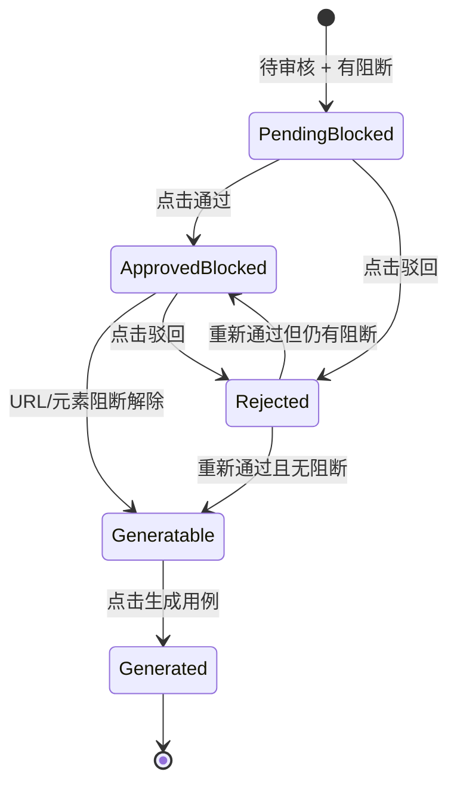
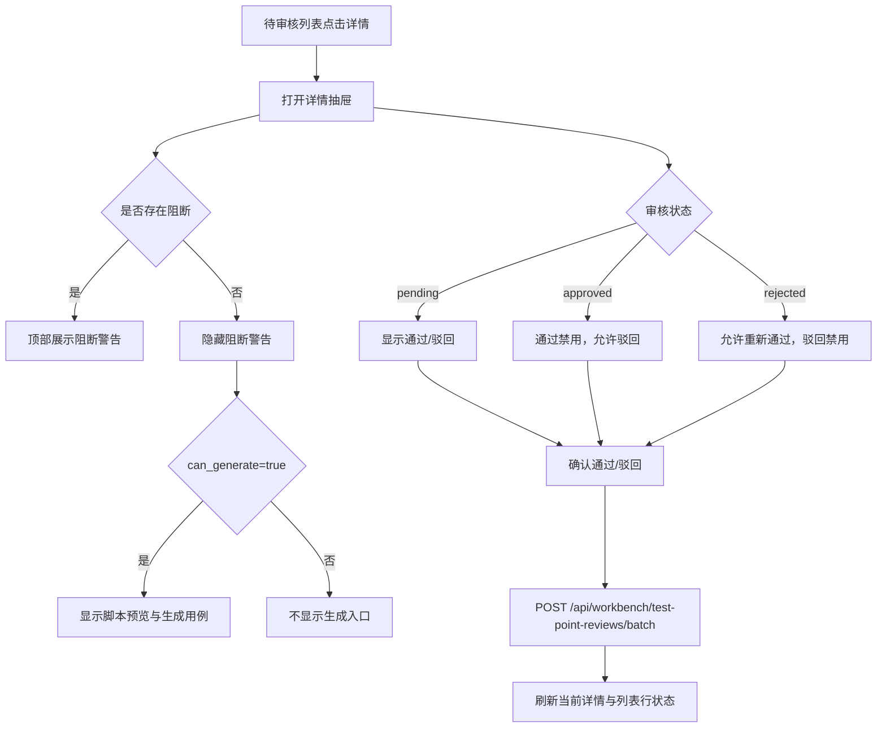

# 待审核用例详情页布局与交互设计

更新时间：2026-05-07

补充原型文档：`docs/core/test_point_review_detail_ui_prototype.md`

适用范围：`/cases/review` 待审核用例列表中的测试点详情抽屉/弹窗。

## 1. 页面定位

待审核用例详情不是独立编辑页，而是审核者工作台中的“快速核验面板”。它服务于审核者在不离开列表上下文的情况下，快速判断单条测试点是否可以通过、是否需要驳回，以及当前为什么不能生成自动化用例。

核心目标：

- 让审核者先看到阻断原因，再看测试点内容。
- 让审核者能直接完成“通过 / 驳回 / 上一条 / 下一条”。
- 让测试点、资产、页面对象绑定关系一屏内可追溯。
- 避免跳转到新的详情页，保持审核工作流连续。

## 2. 设计原则

- **审核优先**：操作按钮和阻断状态优先于内容详情，减少审核者来回滚动。
- **信息分层**：基础信息、前置条件、操作步骤、预期结果、元素绑定分卡片展示，避免当前弹窗中左右两列造成阅读断裂。
- **状态驱动操作**：按钮显隐和可点击状态由 `review_status` 与 `can_generate` 决定。
- **保留上下文**：关闭抽屉后回到原筛选、原分页、原滚动附近，不强制刷新整个页面。
- **开发可落地**：一期复用现有 `GET /api/workbench/test-point-reviews` 和 `POST /api/workbench/test-point-reviews/batch`；脚本预览和单 intent 生成作为二期接口扩展。

## 3. 信息架构

详情抽屉从上到下分为 8 个区块：

1. 顶部栏：返回待审核列表、关闭。
2. 阻断警告区：展示生成阻断原因。
3. 操作按钮区：驳回、通过、上一条、下一条。
4. 基本信息卡片：标题、ID、所属资产、页面、类型、优先级、审核状态。
5. 前置条件卡片。
6. 操作步骤卡片。
7. 预期结果卡片。
8. 涉及元素绑定卡片。
9. 审核历史折叠区。
10. 生成脚本预览折叠区，仅 `can_generate=true` 时显示。
11. 底部固定操作栏。

## 4. 页面布局设计图

```text
┏━━━━━━━━━━━━━━━━━━━━━━━━━━━━━━━━━━━━━━━━━━━━━━━━━━━━━━━━━━━━━━━┓
┃ ← 返回待审核列表                                      [× 关闭] ┃
┣━━━━━━━━━━━━━━━━━━━━━━━━━━━━━━━━━━━━━━━━━━━━━━━━━━━━━━━━━━━━━━━┫
┃                                                               ┃
┃ ┌─ 阻断警告区（黄色，仅有阻断时显示）──────────────────────┐ ┃
┃ │ ⚠ 生成阻断                                                │ ┃
┃ │ • 请到页面对象管理补齐页面 URL                            │ ┃
┃ │ • 测试点未审核通过，请先审批                              │ ┃
┃ └──────────────────────────────────────────────────────────┘ ┃
┃                                                               ┃
┃ ┌─ 操作按钮区 ────────────────────────────────────────────┐ ┃
┃ │ [驳回]  [通过]                              [← 上一条] [下一条 →] │
┃ └──────────────────────────────────────────────────────────┘ ┃
┃                                                               ┃
┃ ┌─ 基本信息卡片 ──────────────────────────────────────────┐ ┃
┃ │ 测试点标题：登录时模拟弱网超时                           │ ┃
┃ │ 测试点ID：intent-22                                      │ ┃
┃ │ 所属资产：登录页身份验证测试点集 [查看资产 ↗]             │ ┃
┃ │                                                           │ ┃
┃ │ ┌──────────┬──────────┬──────────┬──────────┐            │ ┃
┃ │ │ 页面     │ 类型     │ 优先级   │ 审核状态 │            │ ┃
┃ │ │ login    │ 交互异常 │ P2       │ 待审核   │            │ ┃
┃ │ └──────────┴──────────┴──────────┴──────────┘            │ ┃
┃ └──────────────────────────────────────────────────────────┘ ┃
┃                                                               ┃
┃ ┌─ 前置条件 ──────────────────────────────────────────────┐ ┃
┃ │ 用户未登录，处于登录页面，已输入正确账号和密码            │ ┃
┃ └──────────────────────────────────────────────────────────┘ ┃
┃                                                               ┃
┃ ┌─ 操作步骤 ──────────────────────────────────────────────┐ ┃
┃ │ ┌──┬──────────────────────────────────────┬──────────┐ │ ┃
┃ │ │ 1│ 开启弱网环境模拟                       │ 操作     │ │ ┃
┃ │ │ 2│ 点击登录按钮                           │ 点击     │ │ ┃
┃ │ └──┴──────────────────────────────────────┴──────────┘ │ ┃
┃ └──────────────────────────────────────────────────────────┘ ┃
┃                                                               ┃
┃ ┌─ 预期结果 ──────────────────────────────────────────────┐ ┃
┃ │ 页面提示网络超时相关信息，登录未成功                      │ ┃
┃ └──────────────────────────────────────────────────────────┘ ┃
┃                                                               ┃
┃ ┌─ 涉及元素绑定 ──────────────────────────────────────────┐ ┃
┃ │ ┌──────────┬──────────────┬──────────────┬──────────┐   │ ┃
┃ │ │ 元素名称 │ 绑定结果     │ 定位器       │ 元素编码 │   │ ┃
┃ │ │ 登录按钮 │ ✅ 已绑定    │ xpath=//...  │ login_button │ ┃
┃ │ └──────────┴──────────────┴──────────────┴──────────┘   │ ┃
┃ └──────────────────────────────────────────────────────────┘ ┃
┃                                                               ┃
┃ ┌─ 审核历史（可折叠）─────────────────────────────────────┐ ┃
┃ │ ▶ 展开审核历史                                            │ ┃
┃ └──────────────────────────────────────────────────────────┘ ┃
┃                                                               ┃
┃ ┌─ 生成脚本预览（仅 can_generate=true 时显示）─────────────┐ ┃
┃ │ ▶ 点击展开预览生成的 pytest 脚本                          │ ┃
┃ └──────────────────────────────────────────────────────────┘ ┃
┃                                                               ┃
┣━━━━━━━━━━━━━━━━━━━━━━━━━━━━━━━━━━━━━━━━━━━━━━━━━━━━━━━━━━━━━━━┫
┃ 底部固定栏：[驳回]                         [通过] [← 上一条] [下一条 →] ┃
┗━━━━━━━━━━━━━━━━━━━━━━━━━━━━━━━━━━━━━━━━━━━━━━━━━━━━━━━━━━━━━━━┛
```

## 5. 关键区块设计

### 5.1 顶部栏

内容：

- 左侧：`← 返回待审核列表`
- 右侧：`× 关闭`

行为：

- 两者都关闭当前抽屉。
- 不跳转页面。
- 关闭后保留列表筛选、分页和当前滚动上下文。

### 5.2 阻断警告区

显示条件：

- `generation_blockers.length > 0`

视觉：

- 黄色背景：`#FFFAEB`
- 左侧 4px 强调线：`#F79009`
- 标题：`⚠ 生成阻断`
- 内容按 bullet 展示，最多默认展示 4 条，超过后显示“展开全部”。

文案示例：

- `请到页面对象管理补齐页面 URL`
- `测试点未审核通过，请先审批`
- `元素未在 Page Object 注册或未审核通过：错误提示框`

### 5.3 操作按钮区

按钮顺序：

- 左侧：`驳回`、`通过`
- 右侧：`上一条`、`下一条`

视觉：

- `通过`：绿色主按钮。
- `驳回`：红色次按钮或红色描边按钮。
- `上一条 / 下一条`：灰色次按钮。

按钮规则：

| 状态 | 通过按钮 | 驳回按钮 | 生成用例 |
| --- | --- | --- | --- |
| 待审核 + 阻断 | 可点击 | 可点击 | 不显示 |
| 已通过 + 阻断 | 禁用，显示“✅ 已通过” | 可点击 | 不显示 |
| 已通过 + 可生成 | 禁用，显示“✅ 已通过” | 可点击 | 显示 |
| 已驳回 | 可点击，文案“重新通过” | 禁用，显示“已驳回” | 不显示 |

### 5.4 基本信息卡片

字段：

- 测试点标题
- 测试点 ID
- 所属资产
- 查看资产入口
- 页面
- 类型
- 优先级
- 审核状态

所属资产行为：

- `查看资产 ↗` 新标签页打开 `/assets/test-points/{asset_id}?project={project}`。
- 资产标题本身也可以作为链接，但不替代详情抽屉关闭行为。

### 5.5 操作步骤卡片

步骤建议用表格而不是普通列表。

字段：

- 序号
- 步骤描述
- 动作类型

动作类型推断规则：

| 步骤文本 | 动作类型 |
| --- | --- |
| 包含“点击” | 点击 |
| 包含“输入” | 输入 |
| 包含“打开 / 访问 / 跳转” | 导航 |
| 包含“刷新” | 刷新 |
| 包含“开启 / 模拟 / 设置” | 操作 |
| 其他 | 步骤 |

### 5.6 涉及元素绑定卡片

一期字段：

- 元素名称
- 绑定结果
- 元素编码
- 阻断原因

二期字段：

- 定位器类型
- 定位器值
- 稳定级别
- 审核状态

推荐数据结构：

```json
{
  "element_bindings": [
    {
      "element_name": "登录按钮",
      "binding_status": "bound",
      "element_code": "login_button",
      "locator_type": "xpath",
      "locator_value": "//button[text()='登录']",
      "blocker": ""
    }
  ]
}
```

### 5.7 审核历史

一期可展示当前记录：

- `reviewed_at`
- `reviewed_by`
- `review_status`
- `review_note`

二期建议后端追加 `review_history`：

```json
{
  "review_history": [
    {
      "reviewed_at": "2026-05-06T10:00:00+08:00",
      "reviewed_by": "admin",
      "status": "approved",
      "note": ""
    }
  ]
}
```

### 5.8 生成脚本预览

显示条件：

- `review_status=approved`
- `can_generate=true`

一期建议不展示真实脚本，仅展示禁用提示：

- `当前版本暂不支持详情内脚本预览，请在资产详情页生成已通过用例。`

二期接口：

- `GET /api/workbench/preview-script?asset_id={asset_id}&intent_id={intent_id}`

## 6. 状态变化设计



状态说明：

| 状态 | 阻断警告 | 审核按钮 | 脚本预览 | 生成用例 |
| --- | --- | --- | --- | --- |
| 待审核 + 阻断 | 显示全部阻断 | 通过/驳回可点击 | 不显示 | 不显示 |
| 已通过 + 阻断 | 显示剩余阻断 | 通过禁用，驳回可点 | 不显示 | 不显示 |
| 已通过 + 可生成 | 不显示 | 通过禁用，驳回可点 | 可展开 | 显示 |
| 已驳回 | 不显示或仅显示驳回原因 | 重新通过可点，驳回禁用 | 不显示 | 不显示 |

## 7. 交互流程图



## 8. 交互事件定义

| 元素 | 事件 | 行为 |
| --- | --- | --- |
| 返回待审核列表 | click | 关闭抽屉，保留列表上下文 |
| 关闭 | click | 关闭抽屉 |
| 通过 | click | 弹确认框，确认后调用 `POST /api/workbench/test-point-reviews/batch`，`status=approved` |
| 驳回 | click | 弹输入框，确认后调用同一接口，`status=rejected` |
| 上一条 | click | 切换当前列表中的上一条测试点 |
| 下一条 | click | 切换当前列表中的下一条测试点 |
| 查看资产 | click | 新标签页打开资产详情页 |
| 生成脚本预览 | expand | 二期调用脚本预览接口 |
| 生成用例 | click | 二期调用生成接口并跳转用例中心 |

## 9. 接口依赖

### 9.1 当前一期可复用接口

查询详情数据：

```http
GET /api/workbench/test-point-reviews?project=mall&page=login&status=pending&page_index=1&page_size=20
```

审核：

```http
POST /api/workbench/test-point-reviews/batch
```

```json
{
  "project": "mall",
  "status": "approved",
  "reviewed_by": "admin",
  "note": "",
  "decisions": [
    {
      "asset_id": "mall-web-login-auth-fn-ai-0021",
      "intent_id": "intent-22"
    }
  ]
}
```

生成用例：

```http
POST /api/workbench/test-point-assets/batch/generate-cases
```

### 9.2 建议新增/扩展接口

详情字段增强：

- 在 `GET /api/workbench/test-point-reviews` 返回中增加 `element_bindings`。
- 在批量审核接口中追加 `review_history`。

脚本预览：

```http
GET /api/workbench/preview-script?asset_id={asset_id}&intent_id={intent_id}
```

按 intent 精准生成：

```json
{
  "project": "mall",
  "asset_ids": ["mall-web-login-auth-fn-ai-0021"],
  "intent_ids": ["intent-22"],
  "source": "review_detail"
}
```

## 10. 文案规范

| 内部值 | 展示文案 |
| --- | --- |
| pending | 待审核 |
| approved | 已通过 |
| rejected | 已驳回 |
| bound | 已绑定 |
| missing | 元素缺失 |
| partial | 部分绑定 |
| not_required | 无需元素 |
| can_generate=true | 可生成 |
| can_generate=false | 阻断 |

按钮文案：

- 待审核：`通过`、`驳回`
- 已通过：`✅ 已通过`、`驳回`
- 已驳回：`重新通过`、`已驳回`
- 可生成：`生成用例`

## 11. 视觉规范

颜色建议：

| 场景 | 背景 | 文字 | 边框 |
| --- | --- | --- | --- |
| 阻断警告 | `#FFFAEB` | `#B54708` | `#FEDF89` |
| 通过/成功 | `#ECFDF3` | `#027A48` | `#ABEFC6` |
| 驳回/危险 | `#FEF2F2` | `#B42318` | `#FECDCA` |
| 信息标签 | `#EFF6FF` | `#175CD3` | `#B2CCFF` |
| 普通卡片 | `#FFFFFF` | `#0F172A` | `#D7E3F4` |

尺寸建议：

- 抽屉宽度：`min(960px, calc(100vw - 96px))`
- 最大高度：`calc(100vh - 96px)`
- 内容区滚动，顶部栏和底部栏固定。
- 卡片间距：`16px`
- 卡片内边距：`16px`
- 表格字号：`13px`
- 正文：`14px`
- 标题：`20px ~ 24px`

## 12. 分期落地建议

### 一期：当前最应该做

- 列表标题点击打开详情抽屉。
- 详情弹窗改为本设计中的纵向卡片布局。
- 阻断警告区置顶。
- 操作按钮区和底部固定栏。
- 上一条 / 下一条在当前页数据内切换。
- 元素绑定先展示：元素名称、绑定状态、元素编码、阻断原因。

### 二期：接口增强后再做

- 完整审核历史。
- 展示定位器类型和值。
- 生成脚本预览。
- 按单个 `intent_id` 生成用例。
- 跨分页上一条 / 下一条。

## 13. 验收标准

- 打开详情后，不离开待审核列表页。
- 阻断原因位于内容顶部，审核者无需滚动即可看到。
- 待审核状态下可通过/驳回。
- 已通过状态下通过按钮不可重复点击。
- 已驳回状态下允许重新通过。
- 标题、ID、资产、页面、类型、优先级、状态一屏可见。
- 步骤以序号表格展示，不再与预期结果并排挤压。
- 涉及元素能区分已绑定和缺失。
- 长内容在抽屉内滚动，底部操作栏始终可见。
