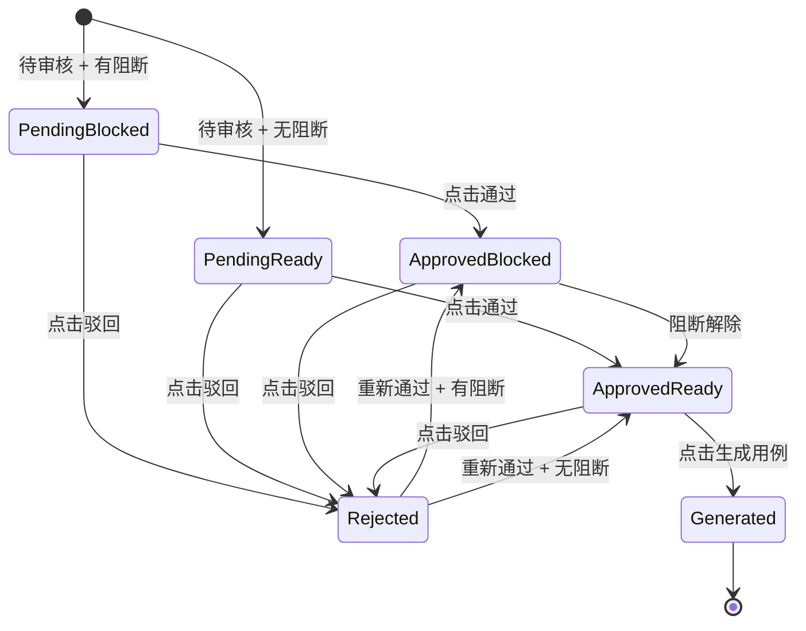
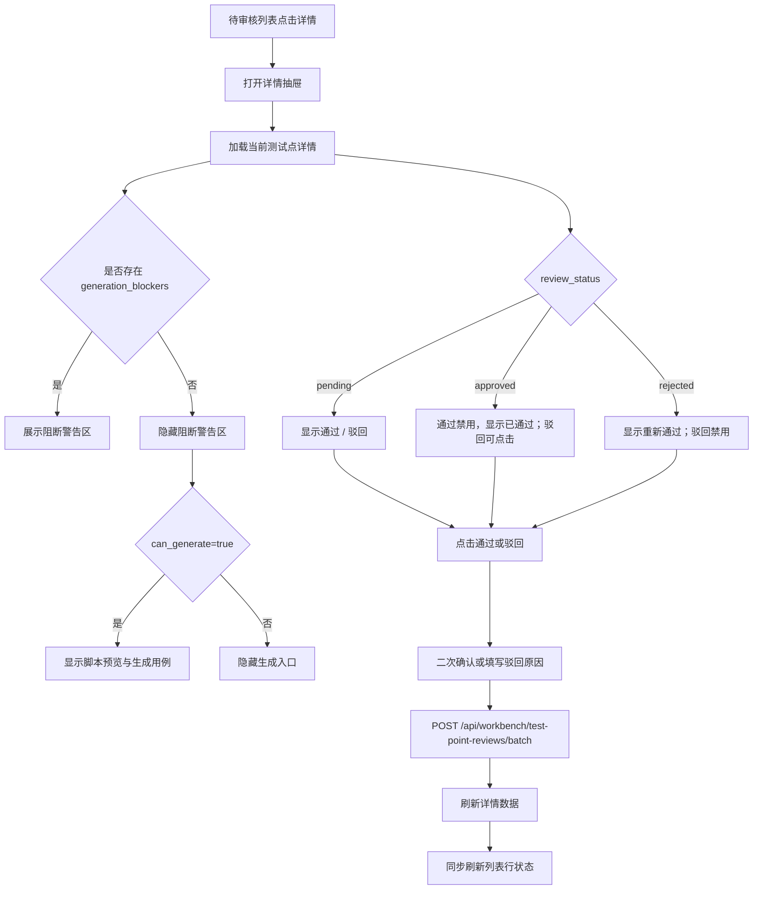

# 待审核用例详情页 UI 布局与交互原型

更新时间：2026-05-08

适用页面：`/cases/review` 待审核用例列表中的测试点详情抽屉/弹窗。

关联接口：

- `GET /api/workbench/test-point-reviews`
- `POST /api/workbench/test-point-reviews/batch`
- `GET /api/workbench/preview-script`
- `POST /api/workbench/test-point-assets/batch/generate-cases`

## 1. 产品定位

待审核用例详情页不是编辑页，而是审核者在列表上下文中快速完成“核验、审批、定位阻断”的工作台面板。

核心目标：

- 审核者进入详情后，第一眼知道当前测试点是否可生成。
- 审核者不用离开当前列表，就能完成通过、驳回、上一条、下一条。
- 审核者能快速追溯测试点来源资产、操作步骤、预期结果和页面对象绑定情况。
- 详情只负责查看和审核，不提供编辑；需要修改内容时跳转到资产详情页。

## 2. 设计约束

本次优化不改变页面整体布局，只优化视觉层级和交互表达。

保留：

- 顶部关闭/返回区域。
- 阻断警告区。
- 操作按钮区。
- 基本信息卡片。
- 前置条件、操作步骤、预期结果。
- 涉及元素绑定。
- 审核历史。
- 生成脚本预览。
- 底部固定操作栏。

优化：

- 让阻断信息更突出。
- 让审核操作更清晰。
- 让表格更适合测试人员阅读。
- 让状态标签更稳定统一。
- 让长定位器、长文本不破坏版面。

## 3. 页面信息架构

```text
待审核用例详情
├─ 顶部栏
├─ 阻断警告区
├─ 操作按钮区
├─ 基本信息卡片
├─ 前置条件
├─ 操作步骤
├─ 预期结果
├─ 涉及元素绑定
├─ 审核历史
├─ 生成脚本预览
└─ 底部固定操作栏
```

## 4. 页面布局原型图

```text
┏━━━━━━━━━━━━━━━━━━━━━━━━━━━━━━━━━━━━━━━━━━━━━━━━━━━━━━━━━━━━━━━━━━━━━━┓
┃ ← 返回待审核列表                                           [× 关闭] ┃
┣━━━━━━━━━━━━━━━━━━━━━━━━━━━━━━━━━━━━━━━━━━━━━━━━━━━━━━━━━━━━━━━━━━━━━━┫
┃                                                                      ┃
┃  ┌─ 生成阻断 ───────────────────────────────────────────────────┐    ┃
┃  │ ⚠ 当前测试点暂不能生成自动化用例                              │    ┃
┃  │ • 请到页面对象管理补齐页面 URL                                 │    ┃
┃  │ • 测试点未审核通过，请先审批                                    │    ┃
┃  │ • 元素未在 Page Object 注册或未审核通过：错误提示框             │    ┃
┃  └───────────────────────────────────────────────────────────────┘    ┃
┃                                                                      ┃
┃  ┌─ 审核操作 ───────────────────────────────────────────────────┐    ┃
┃  │ [驳回] [通过]                                  [← 上一条] [下一条 →] │
┃  └───────────────────────────────────────────────────────────────┘    ┃
┃                                                                      ┃
┃  ┌─ 基本信息 ───────────────────────────────────────────────────┐    ┃
┃  │ 登录时模拟弱网超时                              [待审核]       │    ┃
┃  │ intent-22                                                     │    ┃
┃  │ 所属资产：登录页身份验证测试点集 [查看资产 ↗]                  │    ┃
┃  │                                                               │    ┃
┃  │ ┌────────────┬────────────┬────────────┬────────────┐         │    ┃
┃  │ │ 页面        │ 类型        │ 优先级      │ 可生成状态   │         │    ┃
┃  │ │ login       │ 交互异常     │ P2         │ 阻断         │         │    ┃
┃  │ └────────────┴────────────┴────────────┴────────────┘         │    ┃
┃  └───────────────────────────────────────────────────────────────┘    ┃
┃                                                                      ┃
┃  ┌─ 前置条件 ───────────────────────────────────────────────────┐    ┃
┃  │ 用户未登录，处于登录页面，已输入正确账号和密码                 │    ┃
┃  └───────────────────────────────────────────────────────────────┘    ┃
┃                                                                      ┃
┃  ┌─ 操作步骤 ───────────────────────────────────────────────────┐    ┃
┃  │ ┌────┬──────────────────────────────┬────────┬────────────┐ │    ┃
┃  │ │ 01 │ 开启弱网环境模拟               │ 操作   │ -          │ │    ┃
┃  │ │ 02 │ 点击登录按钮                   │ 点击   │ login_button │ │    ┃
┃  │ └────┴──────────────────────────────┴────────┴────────────┘ │    ┃
┃  └───────────────────────────────────────────────────────────────┘    ┃
┃                                                                      ┃
┃  ┌─ 预期结果 ───────────────────────────────────────────────────┐    ┃
┃  │ 页面提示网络超时相关信息，登录未成功                           │    ┃
┃  └───────────────────────────────────────────────────────────────┘    ┃
┃                                                                      ┃
┃  ┌─ 涉及元素绑定 ───────────────────────────────────────────────┐    ┃
┃  │ ┌────────────┬────────────┬──────────────────────┬────────┐ │    ┃
┃  │ │ 元素名称     │ 元素编码     │ 定位器                │ 状态   │ │    ┃
┃  │ │ 登录按钮     │ login_button │ role=登录             │ 已绑定 │ │    ┃
┃  │ │ 错误提示框   │ -            │ -                    │ 缺失   │ │    ┃
┃  │ └────────────┴────────────┴──────────────────────┴────────┘ │    ┃
┃  └───────────────────────────────────────────────────────────────┘    ┃
┃                                                                      ┃
┃  ┌─ 审核历史 ───────────────────────────────────────────────────┐    ┃
┃  │ ▶ 展开审核历史                                                │    ┃
┃  └───────────────────────────────────────────────────────────────┘    ┃
┃                                                                      ┃
┃  ┌─ 生成脚本预览 ───────────────────────────────────────────────┐    ┃
┃  │ 当前不可用：测试点存在生成阻断                                 │    ┃
┃  └───────────────────────────────────────────────────────────────┘    ┃
┃                                                                      ┃
┣━━━━━━━━━━━━━━━━━━━━━━━━━━━━━━━━━━━━━━━━━━━━━━━━━━━━━━━━━━━━━━━━━━━━━━┫
┃ [驳回]                                      [通过] [← 上一条] [下一条 →] ┃
┗━━━━━━━━━━━━━━━━━━━━━━━━━━━━━━━━━━━━━━━━━━━━━━━━━━━━━━━━━━━━━━━━━━━━━━┛
```

## 5. UI 优化说明

### 5.1 顶部栏

目标：明确这是一个从列表打开的详情面板。

设计：

- 左侧使用 `← 返回待审核列表`。
- 右侧使用 `× 关闭`。
- 顶部栏固定，不随内容滚动。
- 关闭后保留列表筛选、分页、滚动位置。

### 5.2 阻断警告区

目标：把“为什么不能生成”放在审核者第一眼的位置。

显示条件：

- `generation_blockers.length > 0`

视觉：

- 背景：`#FFFAEB`
- 边框：`#FEDF89`
- 左侧强调线：`#F79009`
- 标题：`当前测试点暂不能生成自动化用例`

交互：

- 默认最多展示 4 条阻断。
- 超过 4 条显示 `展开全部`。
- 每条阻断可以按类型加前缀：`URL`、`审核`、`元素`、`数据`。

### 5.3 操作按钮区

目标：让审核动作和浏览动作分组。

按钮布局：

```text
[驳回] [通过]                                  [← 上一条] [下一条 →]
```

按钮层级：

- `通过`：绿色主按钮。
- `驳回`：红色描边按钮。
- `上一条/下一条`：灰色次按钮。

### 5.4 基本信息卡片

目标：一屏内明确“这是什么、来自哪里、当前状态是什么”。

字段：

- 测试点标题
- 测试点 ID
- 所属资产
- 查看资产入口
- 页面
- 类型
- 优先级
- 审核状态
- 可生成状态

视觉：

- 标题左对齐，状态标签右对齐。
- 测试点 ID 使用等宽字体。
- 所属资产作为链接，点击新标签页打开资产详情。
- 页面、类型、优先级、可生成状态使用 4 宫格展示。

### 5.5 操作步骤

目标：避免技术化表达，让测试人员按业务动作阅读。

表格列：

| 列 | 说明 |
| --- | --- |
| 序号 | 两位数字，如 `01`、`02` |
| 步骤说明 | 人话表达，如 `在用户名输入框输入` |
| 动作 | 标签化展示，如 `输入`、`点击`、`导航` |
| 参数/目标 | 输入值、元素编码或 URL |

动作推断规则：

| 原始步骤 | 展示动作 |
| --- | --- |
| `input:*` 或包含“输入” | 输入 |
| `click:*` 或包含“点击” | 点击 |
| `goto:*` 或包含“打开/访问/跳转” | 导航 |
| 包含“刷新” | 刷新 |
| 包含“等待” | 等待 |
| 其他 | 操作 |

### 5.6 涉及元素绑定

目标：快速判断生成阻断是否来自页面对象。

表格列：

| 列 | 说明 |
| --- | --- |
| 元素名称 | 测试点中的中文元素名 |
| 元素编码 | Page Object 中的 `element_code` |
| 定位器 | `locator_type=locator_value` |
| 状态 | 已绑定、缺失、部分绑定、无需元素 |

状态样式：

| 状态 | 样式 |
| --- | --- |
| 已绑定 | 绿色标签 |
| 缺失 | 红色标签 |
| 部分绑定 | 黄色标签 |
| 无需元素 | 灰色标签 |

长定位器处理：

- 单行展示，超出省略。
- 鼠标悬停显示完整内容。
- 详情中允许复制定位器。

### 5.7 审核历史

目标：保留决策留痕，但不抢主流程。

默认折叠。

展开后字段：

- 审核时间
- 审核人
- 审核动作
- 审核备注

空态：

```text
暂无审核历史
本次审批后会在这里生成留痕。
```

### 5.8 生成脚本预览

显示条件：

- `review_status=approved`
- `can_generate=true`

不可用状态：

```text
当前不可用：测试点存在生成阻断
```

可用状态：

```text
▶ 展开预览生成的 pytest 脚本
[生成用例]
```

交互：

- 展开时调用 `GET /api/workbench/preview-script`。
- 生成时调用 `POST /api/workbench/test-point-assets/batch/generate-cases`。
- 生成成功后提示：`已生成，前往用例中心查看`。

## 6. 状态变化设计图



## 7. 核心交互流程图



## 8. 按钮状态规则

| 页面状态 | 通过按钮 | 驳回按钮 | 脚本预览 | 生成用例 |
| --- | --- | --- | --- | --- |
| 待审核 + 阻断 | 可点击 | 可点击 | 不显示 | 不显示 |
| 待审核 + 可生成 | 可点击 | 可点击 | 不显示 | 不显示 |
| 已通过 + 阻断 | 禁用，显示“已通过” | 可点击 | 不显示 | 不显示 |
| 已通过 + 可生成 | 禁用，显示“已通过” | 可点击 | 可展开 | 显示 |
| 已驳回 | 可点击，显示“重新通过” | 禁用，显示“已驳回” | 不显示 | 不显示 |

## 9. 交互事件定义

| 元素 | 事件 | 行为 |
| --- | --- | --- |
| 返回待审核列表 | click | 关闭抽屉，保留列表上下文 |
| 关闭 | click | 关闭抽屉 |
| 通过 | click | 弹确认框，确认后调用批量审核接口，状态传 `approved` |
| 驳回 | click | 弹输入框，允许填写原因，确认后状态传 `rejected` |
| 重新通过 | click | 弹确认框，确认后状态传 `approved` |
| 上一条 | click | 切换到当前列表中的上一条 |
| 下一条 | click | 切换到当前列表中的下一条 |
| 查看资产 | click | 新标签页打开测试点资产详情页 |
| 展开审核历史 | click | 展开/收起审核历史 |
| 展开脚本预览 | click | 调用脚本预览接口并展示代码 |
| 生成用例 | click | 调用生成接口，成功后提示并提供用例中心入口 |

## 10. 视觉规范

### 10.1 颜色

| 场景 | 背景 | 文字 | 边框 |
| --- | --- | --- | --- |
| 页面背景 | `#EEF4FB` | `#0F172A` | - |
| 普通卡片 | `#FFFFFF` | `#0F172A` | `#DBE8FB` |
| 阻断警告 | `#FFFAEB` | `#B54708` | `#FEDF89` |
| 通过/成功 | `#ECFDF3` | `#027A48` | `#ABEFC6` |
| 驳回/危险 | `#FEF2F2` | `#B42318` | `#FECDCA` |
| 信息标签 | `#EFF6FF` | `#175CD3` | `#B2CCFF` |
| 次级按钮 | `#FFFFFF` | `#0F4C81` | `#9CB6DE` |

### 10.2 尺寸

| 对象 | 建议 |
| --- | --- |
| 抽屉宽度 | `min(960px, calc(100vw - 96px))` |
| 卡片圆角 | `16px` |
| 卡片间距 | `14px - 16px` |
| 卡片内边距 | `16px` |
| 表格行高 | `44px - 48px` |
| 表格字号 | `13px` |
| 正文字号 | `14px` |
| 标题字号 | `20px - 24px` |
| 底部固定栏高度 | `64px` |

### 10.3 表格样式

- 表头使用浅蓝灰底。
- 序号使用深蓝色等宽数字。
- 动作列使用标签样式。
- 定位器使用等宽字体。
- 长文本允许省略和悬停查看。

## 11. 数据字段建议

详情所需字段：

```json
{
  "asset_id": "mall-web-login-auth-fn-ai-0021",
  "asset_title": "登录页身份验证测试点集",
  "intent_id": "intent-22",
  "title": "登录时模拟弱网超时",
  "page": "login",
  "intent_type": "interaction_exception",
  "priority": "P2",
  "review_status": "pending",
  "can_generate": false,
  "generation_blockers": [
    "请到页面对象管理补齐页面 URL",
    "测试点未审核通过，请先审批"
  ],
  "precondition": "用户未登录，处于登录页面，已输入正确账号和密码",
  "steps": [
    "开启弱网环境模拟",
    "点击登录按钮"
  ],
  "expected_result": "页面提示网络超时相关信息，登录未成功",
  "element_bindings": [
    {
      "element_name": "登录按钮",
      "binding_status": "bound",
      "element_code": "login_button",
      "locator_type": "role",
      "locator_value": "登录",
      "blocker": ""
    }
  ],
  "review_history": []
}
```

## 12. 空态与错误态

### 12.1 无阻断

```text
当前测试点已满足生成条件。
```

不展示黄色阻断区，可在生成脚本区域显示绿色提示。

### 12.2 无元素

```text
该测试点不依赖真实页面元素。
```

适用于 `页面`、`浏览器地址栏`、`工作台 URL` 等虚拟元素。

### 12.3 脚本预览失败

```text
脚本预览生成失败，请检查页面对象 URL 和元素绑定状态。
[重试]
```

### 12.4 审核提交失败

```text
审核状态更新失败，请稍后重试。
[重试]
```

## 13. 响应式规则

桌面端：

- 抽屉靠右打开。
- 宽度不超过 `960px`。
- 顶部栏和底部栏固定。
- 内容区独立滚动。

小屏端：

- 抽屉宽度改为 `100vw`。
- 操作按钮允许换行。
- 基本信息 4 宫格改为 2 列或 1 列。
- 表格横向滚动，不压缩字段。

## 14. 验收标准

- 从待审核列表打开详情时，不离开当前列表页。
- 详情打开后第一屏能看到阻断原因和审核按钮。
- 待审核状态可以通过或驳回。
- 已通过状态不能重复通过。
- 已驳回状态可以重新通过。
- `can_generate=false` 时不展示生成按钮。
- `can_generate=true` 且已通过时展示脚本预览和生成用例入口。
- 所属资产可以跳转到资产详情页。
- 操作步骤以表格展示，动作和值清晰可读。
- 元素绑定能区分已绑定、缺失、部分绑定、无需元素。
- 长定位器不会撑破抽屉。
- 底部固定栏在滚动时始终可见。

## 15. 实施优先级

### P0

- 阻断警告区置顶。
- 审核按钮状态规则。
- 基本信息卡片。
- 操作步骤表格。
- 元素绑定表格。

### P1

- 审核历史折叠区。
- 上一条 / 下一条。
- 脚本预览入口。
- 生成用例入口。

### P2

- 定位器复制。
- 阻断项按类型分组。
- 跨分页上一条 / 下一条。
- 审核历史完整时间线。
