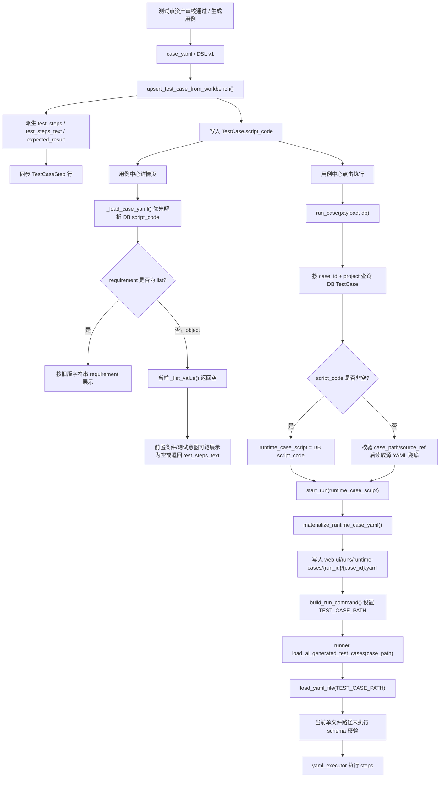
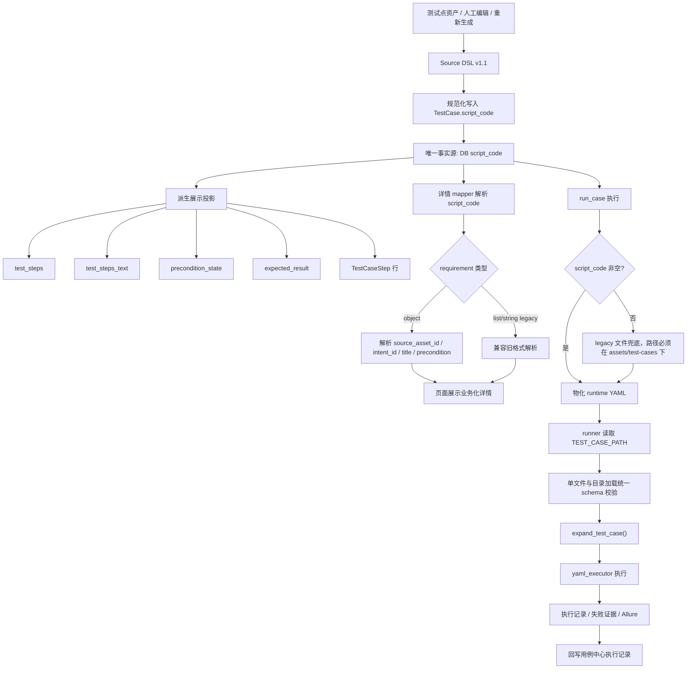

# 2026-05-22 DSL V1.1 script_code 唯一事实源流程图与代码评审

## 1. 日期与事项

- 日期：2026-05-22
- 事项：梳理 DSL V1.1 第一阶段中 `script_code` 唯一事实源的当前实现、目标流程、剩余代码风险与修复方向。
- 范围：用例中心 `script_code -> test_steps -> 页面展示 -> runner 执行` 链路。
- 不在本次范围内：不实现 DSL V2.0/V3.0，不迁移历史 YAML，不修改被测系统地址。

被测系统地址铁律：

- `http://localhost:5174/#/login` 是被测系统真实地址。
- DSL、runner、Docker、页面对象、导入流程都不得把它改写成平台地址、Docker 内部地址或代理地址。

## 2. 背景原因

本轮升级已经明确一条核心原则：

`TestCase.script_code` 必须成为自动化用例执行与展示派生的唯一事实源。

原因是历史链路中存在多份可写数据：

- DB `test_cases.script_code`
- DB `test_cases.test_steps`
- DB `test_case_steps`
- 本地 `assets/test-cases/**/*.yaml`
- 运行态 `web-ui/runs/runtime-cases/{run_id}/{case_id}.yaml`
- 页面详情 mapper 解析出的展示结构

如果这些数据互相反向覆盖，就会再次出现以下问题：

- 用户在页面上改过账号密码，后续又被旧 YAML 或旧投影恢复。
- 用例详情页展示的步骤和 runner 实际执行的步骤不一致。
- 本地 YAML 缺失时，即使 DB `script_code` 完整也无法执行。
- 结构化 DSL 字段被投影链路丢失，导致页面看起来“没有前置条件/没有步骤”。

## 3. 本次过程

1. 先做代码评审，确认 `run_case` 原先存在“先校验源 YAML，再读取 DB `script_code`”的事实源倒挂。
2. 已将运行入口调整为 DB `script_code` 优先、文件兜底。
3. 继续审查 DSL V1.1 第一阶段剩余链路，重点检查：
   - `script_code` 到页面详情展示是否一致。
   - `script_code.execution.steps` 到 DB `test_steps/TestCaseStep` 投影是否丢字段。
   - runner 单文件执行是否仍绕过 schema 校验。
   - 运行时路径白名单是否过宽。

## 4. 当前实现流程图

当前实现已经完成运行层 DB 优先，但展示与校验链路仍有断点。



## 5. 目标流程图

目标是 DSL V1.1 第一阶段闭环，不是大规模 DSL V3.0 迁移。



## 6. 代码评审结论

### Finding 1 [P1][已关闭] 结构化 requirement 详情页解析已完成

文件：

- `apps/web-ui-service/app/services/test_case_mapper.py`

位置：

- `_build_detail_content()` 中 `requirement_rows = _list_value(case_yaml.get("requirement"))`

原问题：

当前 `_load_case_yaml()` 已经优先解析 DB `script_code`，这符合唯一事实源。但详情 mapper 仍假设 `requirement` 是旧版 `list[str]`。当 DSL v1.1 使用结构化对象时：

```yaml
requirement:
  source_asset_id: mall-web-login-auth-fn-ai-0021
  intent_id: intent-01
  title: 首次登录成功
  precondition: 未登录状态
```

`_list_value()` 会直接返回空数组，导致前置条件、测试意图、来源资产等信息无法正确展示。

影响范围：

- 用例详情页业务信息展示。
- 测试人员判断“这个用例为什么生成、来自哪个测试点”。
- 后续 Allure labels 中 `source_asset/intent_id` 的可追踪展示。

已落地方案：

- 新增结构化 requirement 解析函数，例如 `_requirement_rows_from_yaml(case_yaml)`。
- 对 `dict` 格式解析 `title/precondition/intent_id/source_asset_id/type`。
- 对 `list/string` 保持 legacy 兼容。
- 详情页禁止用 `test_steps_text` 伪装 requirement，只能作为 legacy fallback。

为什么这样解决：

这样可以保证页面详情展示来自 `script_code` 的结构化事实，而不是从派生字段或旧文本中猜测。

### Finding 2 [P1][已关闭] test_steps 投影字段白名单已补齐

文件：

- `apps/web-ui-service/app/services/test_case_data_service.py`

位置：

- `normalize_test_steps()`

原问题：

当时白名单已经新增了 `target_name/page/selector/locator_type/locator_value/role/intent_id/traceability`，但 runner schema 已允许的以下字段曾在投影阶段被过滤：

- `element_code`
- `count`
- `metric_rule`
- `rule`
- `extract_regex`
- `metric_label`
- `source_point_key`

影响范围：

- `script_code.execution.steps` 到 DB `test_steps` 的投影不完整。
- `TestCaseStep` 行无法完整保留执行语义。
- 页面详情、失败分析、测试点追踪可能丢失来源点位。

已落地方案：

- 将 `normalize_test_steps()` 的 allowed keys 与 `yaml_testcase.schema.json` 中 `execution.steps.items.properties` 对齐。
- 保留空值过滤规则，但不要过滤 runner 已支持的结构化字段。
- 增加单测：包含 `element_code/source_point_key/metric_rule` 的 step 更新后仍能出现在 `test_steps` 中。

为什么这样解决：

`test_steps` 虽然是投影字段，但它承载页面展示、步骤表和失败归因。投影可以是派生物，但不能比事实源少关键语义。

### Finding 3 [P2][已关闭] runner 单文件路径已统一 schema 校验

文件：

- `runners/web-playwright-python/runner/test_case_loader.py`
- `runners/web-playwright-python/runner/yaml_loader.py`

位置：

- `load_expanded_test_cases()` 中指定 `case_path` 时直接调用 `load_yaml_file()`

原问题：

目录加载会执行 `validate_testcase_schema(parsed)`，但单文件 `TEST_CASE_PATH` 加载不会执行 schema 校验。当前运行态 YAML 正是通过 `TEST_CASE_PATH` 单文件执行，因此非法 YAML 可能直到 executor 阶段才失败。

影响范围：

- 运行态 DSL 校验口径不一致。
- 错误信息更晚、更难读。
- DSL V1.1 字段收敛时，无法通过 schema 形成稳定门禁。

已落地方案：

- 新增 `load_validated_yaml_file(file_path)`。
- 或在 `load_expanded_test_cases()` 的 `selected_case_path` 分支读取后调用 `validate_testcase_schema(raw_case)`。
- 增加单测：单文件缺少 `execution.steps` 时应在 loader 阶段失败。

为什么这样解决：

运行态 YAML 是 runner 真正执行的输入，必须和批量加载使用同一套 schema 门禁。

### Finding 4 [P2][已关闭] TEST_CASE_ALLOWED_ROOTS 已收紧

文件：

- `apps/web-ui-service/app/services/workbench_runtime_service.py`

位置：

- `build_run_command()` 中将 `case_path.resolve().parent` 加入 `TEST_CASE_ALLOWED_ROOTS`

原问题：

当前 facade 调用路径通常安全，因为 `case_path` 已经来自运行态物化路径或受控兜底路径。但 `build_run_command()` 本身是通用函数，未来其它入口如果传入任意 `case_path`，就会把任意父目录加入 runner 白名单。

影响范围：

- 路径安全边界依赖调用方，而不是函数自身约束。
- 后续新增入口时容易扩大可读取 YAML 范围。

已落地方案：

- `TEST_CASE_ALLOWED_ROOTS` 只允许固定根：
  - `assets/test-cases/ai-generated`
  - `web-ui/runs/runtime-cases`
- 不再把任意 `case_path.parent` 直接加入白名单。
- 如果需要 run_id 级别更细粒度白名单，应由 `start_run()` 或 `materialize_runtime_case_yaml()` 明确传入运行态根目录。

为什么这样解决：

路径白名单应表达平台允许范围，而不是根据输入路径动态扩大。

## 7. 解决方案优先级

### P0 已完成：运行层 DB script_code 优先

当前 `run_case()` 已调整为：

1. 先按 `case_id + project` 查询 DB `TestCase`。
2. 优先使用 DB `script_code`。
3. 只有 DB `script_code` 为空时，才校验并读取源 YAML 文件。
4. runner 实际执行运行态 YAML。

### P1 已完成：修详情 mapper 与工作台详情接口的结构化 requirement

完成内容：

- 页面详情中展示 `source_asset_id / intent_id / title / precondition`。
- 不再因为 `requirement` 是 object 而显示为空。
- 通用用例详情 mapper 支持结构化 `requirement`。
- 工作台用例详情接口 `/api/workbench/test-cases/{case_id}` 支持从 `script_code.requirement` 兜底读取 `precondition / source_asset_id / source_asset_title / intent_type`。

### P1 已完成：补齐 normalize_test_steps 字段白名单

完成内容：

- `script_code.execution.steps` 到 `test_steps/TestCaseStep` 不丢 DSL 字段。
- 页面展示、失败归因、测试点追踪保留结构化语义。
- `normalize_test_steps()` 已补齐 `element_code / count / metric_rule / rule / extract_regex / metric_label / source_point_key`。

### P2 已完成：统一 runner 单文件 schema 校验

完成内容：

- runtime YAML 与目录批量 YAML 使用同一套 schema 门禁。
- 新增 `load_validated_yaml_file()`，`TEST_CASE_PATH` 单文件加载也会执行 schema 校验。

### P2 已完成：收紧 TEST_CASE_ALLOWED_ROOTS

完成内容：

- 避免未来入口把任意 `case_path.parent` 加入 runner 允许根。
- 运行命令只允许固定 AI 用例根目录和明确的 `runtime-cases` 根目录。

## 8. 当前结果

已达成：

- `run_case` 执行入口已向 `script_code` 唯一事实源收敛。
- DB `script_code` 非空时，不再因为本地源 YAML 缺失阻断执行。
- 文件 YAML 已降级为 legacy fallback。
- 详情页结构化 requirement 解析已完成。
- 工作台用例详情接口结构化 requirement 兜底已完成。
- `normalize_test_steps()` 与 runner schema 当前步骤字段已对齐。
- runner 单文件 schema 校验已完成。
- 运行时路径白名单已收紧。

剩余状态：

- DSL V1.1 第一阶段的本轮代码评审问题已处理完毕。
- 后续进入验收阶段，重点验证页面真实展示、单用例执行、失败报告和 Allure 产物是否一致。

## 9. 验证方法

### 已完成链路验证

建议执行：

```bash
.venv/bin/pytest apps/web-ui-service/tests/test_case_id_flow.py::test_run_case_uses_db_script_code_when_source_yaml_is_missing -q
```

预期：

- DB 有 `script_code`。
- 源 YAML 文件不存在。
- `run_case()` 仍能启动运行。
- 传入 `start_run()` 的 `runtime_case_script` 来自 DB。

### 已完成修复验证

详情 mapper：

```bash
.venv/bin/pytest apps/web-ui-service/tests/unit/test_case_detail_content.py -q
```

已覆盖：

- `requirement` 为 object 时，通用详情 mapper 能展示 `intent_id/source_asset_id/precondition/title`。

工作台用例详情接口：

```bash
.venv/bin/pytest apps/web-ui-service/tests/integration/test_workbench_assets_api.py::test_workbench_test_case_detail_uses_structured_requirement_metadata -q
```

已覆盖：

- `/api/workbench/test-cases/{case_id}` 能从 `script_code.requirement` 返回 `precondition / source_asset_id / source_asset_title / intent_type`。

步骤投影：

```bash
.venv/bin/pytest apps/web-ui-service/tests/test_case_id_flow.py -q
```

已覆盖：

- `execution.steps[].element_code`
- `execution.steps[].source_point_key`
- `execution.steps[].metric_rule`

在 `test_steps` 投影中不丢失。

runner schema：

```bash
.venv/bin/pytest runners/web-playwright-python/tests/test_ai_generated_loader.py -q
```

已覆盖：

- `TEST_CASE_PATH` 单文件缺少必填字段时，在 loader 阶段 schema 校验失败。

运行时路径白名单：

```bash
.venv/bin/pytest apps/web-ui-service/tests/unit/test_workbench_runtime_service.py -q
```

已覆盖：

- runtime YAML 位于 `runtime-cases/{run_id}` 下时允许执行。
- 任意普通 `case_path.parent` 不会被加入 `TEST_CASE_ALLOWED_ROOTS`。

## 10. 代码规范要求

- 不允许在执行入口反写源 YAML。
- 不允许展示投影反向覆盖 `script_code`。
- 不允许打开详情页触发写库修复。
- 不允许为了兼容旧数据放宽路径安全边界。
- 不允许修改被测系统地址 `http://localhost:5174/#/login`。
- 每个修复点必须配套单测，优先覆盖当前断点，而不是扩大到无关模块。
