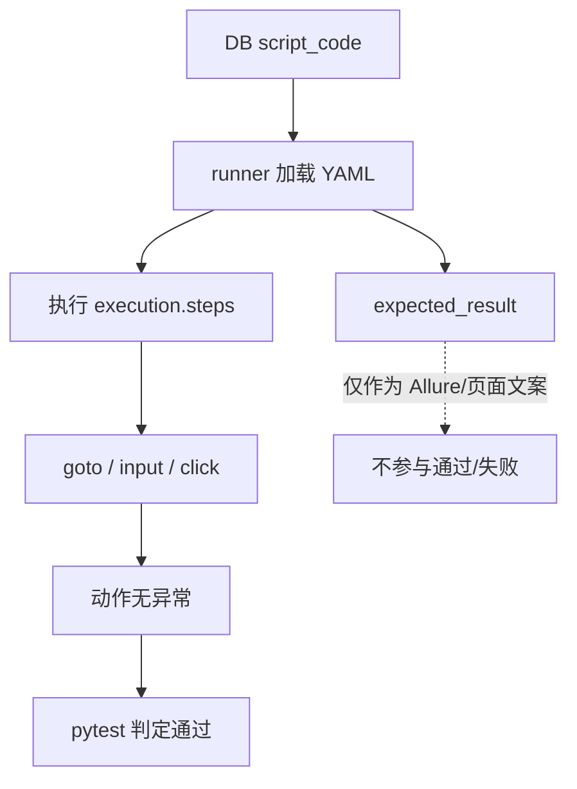
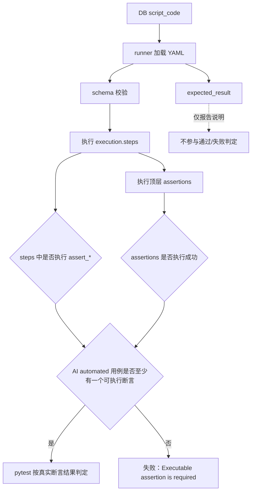

# 2026-05-23 DSL V1.1 可执行 Assertions 流程图与验收

文档日期：2026-05-23

事项：进入 DSL 的可执行 Assertions 阶段，修复“只有动作步骤、没有真实断言也被判定通过”的可信性问题。

被测系统地址铁律：

```text
http://localhost:5174/#/login
```

本次不修改、不替换、不写回被测系统地址。

## 1. 背景

当前 `script_code` 已经收敛为用例执行和展示的唯一事实源，但用例中大量 `expected_result` 仍只是自然语言说明。

典型问题：

- 用例标题是“首次登录成功”。
- 步骤输入了错误账号密码，例如 `test001 / 123456`。
- 步骤里只有 `goto / input / click`，没有 `assert_*`。
- runner 完成点击动作后没有业务校验，因此可能把错误账号登录场景误判为成功。

结论：

- `expected_result` 只能作为报告说明。
- 通过/失败必须由可执行 assertion 决定。
- AI 自动化用例如果没有任何可执行 assertion，应失败并暴露为用例质量问题。

## 2. 改动范围

本次只修改 runner DSL 执行与 schema 验证相关文件：

- `runners/web-playwright-python/runner/yaml_executor.py`
- `runners/web-playwright-python/schemas/yaml_testcase.schema.json`
- `runners/web-playwright-python/tests/test_yaml_executor_compat.py`
- `runners/web-playwright-python/tests/test_ai_generated_loader.py`

未修改范围：

- 不修改被测系统地址。
- 不修改页面对象数据。
- 不批量改写现有业务 YAML。
- 不新增语义断言编译器。
- 不把自然语言 `expected_result` 自动猜测成断言。

## 3. 修复前流程



风险：

- 点击成功不等于业务成功。
- 错误账号密码可能被误判为登录成功。
- 报告看起来通过，但没有真实业务校验。

## 4. 修复后目标流程



核心变化：

- `execution.steps` 中已有 `assert_*` 时，继续作为可执行断言。
- 新增顶层 `assertions`，用于 DSL V1.1 的独立断言区。
- `ai-generated + automated` 用例执行完如果没有任何可执行断言，runner 直接失败。

## 5. DSL 形态

继续兼容步骤内断言：

```yaml
execution:
  steps:
    - action: click
      target: element:login_button
      locator_type: role
      locator_value: 登录
      role: button
    - action: assert_visible
      target: element:home_menu
      locator_type: role
      locator_value: 首页
      role: menuitem
```

新增顶层 assertions：

```yaml
execution:
  steps:
    - action: click
      target: element:login_button
      locator_type: role
      locator_value: 登录
      role: button
assertions:
  - action: assert_url
    value: /#/home
    expected_result: 登录后进入首页
```

说明：

- `assertions` 只允许 `assert_visible / assert_count / assert_metric / assert_url`。
- `assert_url` 必须有 `value`。
- `assert_visible / assert_count / assert_metric` 必须有 `target` 或 `element_code`。
- `expected_result` 仍保留为说明文字，但不能决定通过/失败。

## 6. 为什么这样解决

这个方案把可信性边界放在 runner 层，而不是只依赖生成链路。

原因：

- 生成链路可能产生历史 YAML、旧格式 YAML 或缺失断言的脚本。
- 页面展示和报告只能反映事实，不能替 runner 做通过判定。
- runner 是最终执行者，必须在最靠近执行结果的位置阻断伪成功。

这样做的效果：

- 有真实断言：按断言结果通过或失败。
- 没有真实断言：AI 自动化用例失败，暴露“缺断言”质量问题。
- 自然语言 `expected_result` 不再被误认为业务成功依据。

## 7. 风险点

### 风险 1：历史 AI 用例会暴露为失败

历史 `ai-generated + automated` 用例如果只有 `goto / input / click`，再次执行时会失败。

这是预期行为，因为这些用例原本就没有可信的通过判定。

处理建议：

- 对登录成功类用例补 `assert_visible home_menu` 或 `assert_url`。
- 对登录失败类用例补错误提示、仍停留登录页、登录按钮仍可见等断言。
- 无法补断言的用例不应标记为 `automated`。

### 风险 2：顶层 assertions 与 steps 内断言并存

短期内允许两种形式并存。

处理建议：

- V1.1 兼容两种写法。
- V1.2 再决定是否把断言统一迁移到顶层 `assertions`。

### 风险 3：不能自动猜测断言

本次没有把 `expected_result` 自动转换成断言。

原因：

- 自然语言“跳转首页”“加载菜单”可能对应多个真实 DOM 条件。
- 自动猜测会重新引入误判。
- 断言应来自页面对象、生成编译器或测试人员显式维护。

## 8. 验证方法

静态编译：

```bash
python3 -m py_compile \
  runners/web-playwright-python/runner/yaml_executor.py \
  runners/web-playwright-python/runner/yaml_loader.py \
  runners/web-playwright-python/runner/test_case_loader.py
```

runner 行为测试：

```bash
.venv/bin/pytest runners/web-playwright-python/tests/test_yaml_executor_compat.py -q
```

schema 与 loader 测试：

```bash
.venv/bin/pytest runners/web-playwright-python/tests/test_ai_generated_loader.py -q
```

schema JSON 格式检查：

```bash
python3 -m json.tool runners/web-playwright-python/schemas/yaml_testcase.schema.json >/tmp/yaml_schema_check.json
```

## 9. 当前验收结果

2026-05-23 已执行：

- `python3 -m py_compile ...` 通过。
- `test_yaml_executor_compat.py`：`4 passed`。
- `test_ai_generated_loader.py`：`7 passed`。
- 合并执行 runner 两组测试：`11 passed`。
- `yaml_testcase.schema.json` JSON 格式检查通过。

非阻断提示：

- `test_ai_generated_loader.py` 仍有既有 `pytest.mark.contract` 未注册 warning。
- 该 warning 不影响本次 assertions 功能验收。

## 10. 后续建议

下一步建议进入生成链路治理：

- 登录成功类用例生成时必须产出至少一个可执行断言。
- 登录失败类用例生成时必须产出错误提示或仍停留登录页断言。
- 如果生成器无法确定断言，应阻断自动化状态，标记为 `needs_assertion`。
- 用例详情页可以提示“缺少可执行断言”，但不得把 `expected_result` 当作通过依据。
