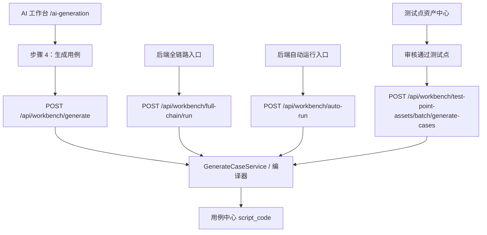
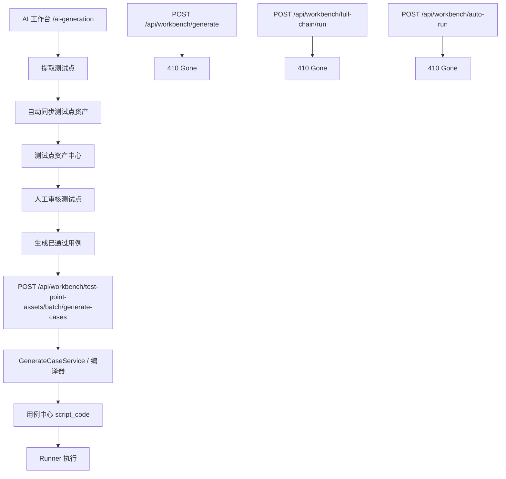

# 2026-05-23 生成入口收口与旧入口下线留档

## 1. 日期与事项

- 日期：2026-05-23
- 事项：下线绕过测试点资产审核的旧生成入口，保留最干净的正式链路。
- 铁律：不修改被测系统地址，`http://localhost:5174/#/login` 不能被生成器、runner、Docker 配置或页面对象流程改写。

## 2. 原因

当前系统同时存在多条生成入口：

- AI 工作台 `/ai-generation` 可直接调用 `/api/workbench/generate` 生成用例。
- 后端保留 `/api/workbench/full-chain/run` 和 `/api/workbench/auto-run`。
- 测试点资产中心可通过 `/api/workbench/test-point-assets/batch/generate-cases` 从已通过测试点生成用例。

这些入口的治理等级不一致。前几类入口可能绕过测试点资产审核、缺少 `source_asset_id + intent_id`，与 DSL V1.1 的唯一事实源和去重契约冲突。

## 3. 修复前链路

问题：`/generate`、`/full-chain/run`、`/auto-run` 都可能绕过测试点资产中心，使生成用例缺少稳定来源身份。

## 4. 修复后目标链路

## 5. 实施方式

采用最土但最稳的方式：

- 不删除底层 `GenerateCaseService` 和编译器，避免误伤资产生成主链路。
- 后端旧公开入口统一返回 `410 Gone`，明确提示改用测试点资产生成入口。
- AI 工作台删除直接生成调用，步骤 4 改为“进入资产治理”。
- 保留测试点提取、测试点资产自动同步、预校验、测试点资产批量生成。
- 不修改历史测试资产、历史用例、YAML、数据库数据。

## 6. 涉及文件

- `apps/web-ui-service/app/routers/workbench_generation.py`
- `apps/web-ui-service/frontend/src/pages/AiGenerationPage.tsx`
- `apps/web-ui-service/frontend/src/api/workbench.ts`
- `docs/代码流程图/2026-05-23_generation_entry_retirement_flow.md`

## 7. 八个坑的规避结果

- 防止删入口时误删底层能力：只封公开路由，不删 `GenerateCaseService`、编译器和资产生成 facade。
- 防止只删前端不删后端：后端 `/generate`、`/full-chain/run`、`/auto-run` 已统一返回 `410 Gone`。
- 防止只删后端不改前端：AI 工作台不再展示直接生成按钮，改为引导到测试点资产中心。
- 防止误动历史数据：本次不删除、不重写历史用例、测试资产、YAML、执行记录。
- 防止误删 full-chain / auto-run 底层依赖：本次只封路由，服务代码后续确认无依赖后再清理。
- 防止 DSL V1.1 被普通入口拖脏：正式生成入口只保留测试点资产生成链路。
- 防止误改被测地址：本次没有修改页面对象、runner 地址、Docker 地址或测试脚本地址。
- 防止无留档：本文件记录日期、原因、过程、结果、验证方法。

## 8. 验证方法

- 静态检查：确认前端不再引用 `generateCase()` 和 `runFullChain()`。
- 静态检查：确认 AI 工作台第 4 步不再调用 `/api/workbench/generate`。
- 后端检查：`/api/workbench/generate`、`/api/workbench/full-chain/run`、`/api/workbench/auto-run` 返回 `410 Gone`。
- 回归检查：`/api/workbench/test-point-assets/batch/generate-cases` 仍是唯一正式生成入口。
- 编译检查：运行 Python 编译检查和前端构建，确认没有语法错误。

## 9. 后续建议

- 如果外部脚本确认不再调用旧入口，再第二阶段物理删除 `FullChainService`、`AutoRunService`、相关 payload 和测试。
- 不建议在同一次提交中大拆 `GenerateCaseService`，因为测试点资产生成仍复用它。
- 后续 DSL V1.1/V1.2 只围绕测试点资产生成链路继续增强。
