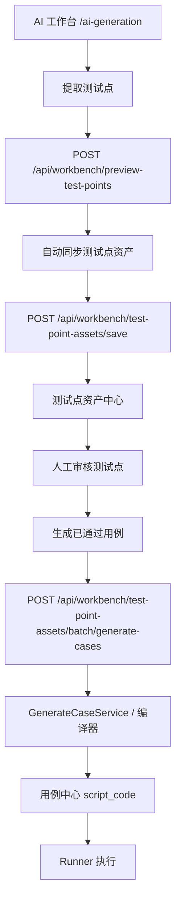
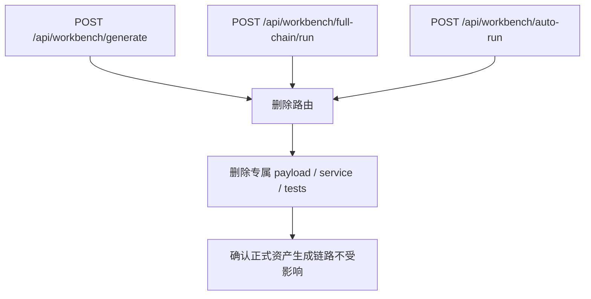

# 2026-05-24 已下线生成入口物理清理方案

## 1. 日期与目标

- 日期：2026-05-24
- 目标：未来物理删除已下线的普通生成、全链路运行、自动运行入口及其专属代码。
- 本轮性质：方案留档，不修改业务代码。
- 铁律：被测系统地址 `http://localhost:5174/#/login` 不允许被任何清理动作改写。

## 2. 当前结论

已下线入口不再纳入 DSL V1.1 / V1.2 的兼容范围。

当前正式链路只保留：

```text
测试点资产 -> 已审核测试点 -> 生成用例 -> 用例中心 script_code -> Runner 执行
```

当前正式来源身份只保留：

```text
source_asset_id + intent_id
```

不再设计：

- `source_requirement_id`
- `source_input_hash`
- `source_exploration_id`
- `source_chain_run_id`

这些字段只有未来重新建设新入口时才重新评估。

## 3. 当前正式入口流程图



## 4. 要物理清理的旧入口



## 5. 候选删除文件与代码

### 5.1 可以作为第一批删除候选

这些代码只服务已下线入口，确认无引用后可以物理删除。

| 路径 | 清理动作 | 原因 |
|---|---|---|
| `apps/web-ui-service/app/services/workbench_generation_api/full_chain_service.py` | 删除文件 | 专属 `/api/workbench/full-chain/run` |
| `apps/web-ui-service/app/services/workbench_generation_api/auto_run_service.py` | 删除文件 | 专属 `/api/workbench/auto-run` |
| `apps/web-ui-service/app/services/workbench_generation_api/usecase_factory.py` | 删除 `build_full_chain_usecase` / `build_auto_run_usecase` 及对应 import | 已无公开入口 |
| `apps/web-ui-service/app/services/workbench_generation_api/payloads.py` | 删除 `FullChainRunPayload` / `AutoRunPayload` | 已无公开入口 |
| `apps/web-ui-service/app/routers/workbench_generation.py` | 删除 `/api/workbench/full-chain/run` 和 `/api/workbench/auto-run` 路由 | 当前已 410，下阶段物理清除 |
| `apps/web-ui-service/tests/integration/test_workbench_generation_api.py` | 删除或改写 full-chain 相关测试 | 当前测试仍覆盖已下线能力 |

### 5.2 谨慎清理候选

这些代码与旧入口有关，但可能被其他链路间接使用，必须先确认。

| 路径 | 清理动作 | 必须确认 |
|---|---|---|
| `apps/web-ui-service/app/routers/workbench_generation.py` | 删除 `/api/workbench/generate` 410 路由 | 前端和外部脚本不再调用 |
| `apps/web-ui-service/tests/integration/test_workbench_generation_api.py` | 删除 `/api/workbench/generate` 相关测试 | 已有新的资产生成测试覆盖正式链路 |
| `apps/web-ui-service/app/services/workbench_generation_api/generate_case_service.py` | 暂不删除 | 测试点资产生成仍复用 |
| `apps/web-ui-service/app/services/workbench_generation_api/payloads.py` | 暂不删除 `GenerateCasePayload` | 预览、保存资产、资产生成仍复用 |
| `apps/web-ui-service/app/api/workbench/facade.py` | 保留 `build_generate_case_usecase` 调用 | 正式资产生成入口依赖它 |
| `apps/web-ui-service/frontend/src/api/workbench.ts` | 保留 `GenerateCasePayload` 类型 | `saveTestPointAssets()` 仍复用该 payload 类型 |

### 5.3 暂不清理

这些不是旧入口本身，不能顺手删。

| 路径 | 原因 |
|---|---|
| `apps/web-ui-service/app/services/workbench_generation_api/generate_case_service.py` | 当前正式资产生成链路内部编译能力 |
| `apps/web-ui-service/app/services/workbench_generation_compiler/runtime/generate_pipeline.py` | 当前 DSL V1.1 生成核心 |
| `apps/web-ui-service/app/api/workbench/facade.py` | `/test-point-assets/batch/generate-cases` 正式入口实现 |
| `apps/web-ui-service/app/routers/workbench_assets.py` | 正式资产生成路由 |
| `apps/web-ui-service/frontend/src/api/assets.ts` | 正式资产生成前端 API |
| `apps/web-ui-service/frontend/src/pages/TestPointAssetsPage.tsx` | 正式资产列表生成入口 |
| `apps/web-ui-service/frontend/src/pages/TestPointAssetDetailPage.tsx` | 正式资产详情生成入口 |
| `apps/web-ui-service/frontend/src/pages/CasesReviewPage.tsx` | 单测试点审核后生成入口 |
| `apps/web-ui-service/frontend/src/pages/CaseDetailPage.tsx` | 基于来源资产再次生成入口 |

## 6. 必须确认的引用

执行物理清理前必须确认以下引用全部处理。

```bash
rg -n "FullChainRunPayload|AutoRunPayload|FullChainService|AutoRunService|build_full_chain_usecase|build_auto_run_usecase|full-chain|auto-run" apps/web-ui-service/app apps/web-ui-service/tests -S
```

预期：只剩历史文档或无结果。

```bash
rg -n "/api/workbench/generate|generateCase\\(|runFullChain\\(" apps/web-ui-service/frontend/src apps/web-ui-service/app apps/web-ui-service/tests -S
```

预期：正式源码无调用；测试要么删除，要么改为确认路由不存在。

```bash
rg -n "build_generate_case_usecase|GenerateCasePayload|GenerateCaseService" apps/web-ui-service/app apps/web-ui-service/tests -S
```

预期：仍允许存在，因为资产生成链路需要。

## 7. 推荐清理步骤

### 第一步：删除 full-chain / auto-run 专属代码

目标：

- 删除 `full_chain_service.py`
- 删除 `auto_run_service.py`
- 删除 `build_full_chain_usecase`
- 删除 `build_auto_run_usecase`
- 删除 `FullChainRunPayload`
- 删除 `AutoRunPayload`
- 删除 router 中 `/full-chain/run` 和 `/auto-run`

理由：

- 这两个入口已经下线。
- 它们不属于测试点资产正式链路。
- 删除风险比 `/generate` 小。

### 第二步：删除普通 `/generate` 公开路由

目标：

- 删除 router 中 `/api/workbench/generate`
- 删除 `_raise_retired_generation_endpoint` 如果不再有旧路由使用
- 删除 `/api/workbench/generate` 相关旧测试

理由：

- 普通生成入口不再是正式入口。
- `GenerateCaseService` 不能删，只删公开路由。

### 第三步：收紧 `GenerateCaseService`

目标：

- 单独评估 `selected_candidates` 为空的普通生成分支。
- 如果资产生成永远一 intent 一 candidate，则删除或显式拒绝无 candidate 的生成。
- 错误码建议：`asset_candidate_required`。

理由：

- 这是内部能力收敛，不应该和路由删除混在一起。
- 需要测试覆盖确认不会误伤资产生成。

### 第四步：清理历史文档和测试命名

目标：

- 历史文档保留“已废弃”说明，不强求删除。
- 当前验收文档、测试名、注释不再把 full-chain / auto-run 描述为可用功能。

理由：

- 避免后续工程师误以为旧入口仍是产品能力。

## 8. 风险点

### 风险 1：误删 `GenerateCaseService`

影响：测试点资产生成用例直接失败。

规避：第一轮只删路由和 full-chain/auto-run 专属服务，不删 `GenerateCaseService`。

### 风险 2：误删 `GenerateCasePayload`

影响：`preview-test-points`、`test-point-assets/save`、资产生成 facade 可能编译失败。

规避：只删 `FullChainRunPayload` 和 `AutoRunPayload`，保留 `GenerateCasePayload`。

### 风险 3：旧测试未同步清理

影响：CI 继续调用已删除接口。

规避：同步删除或改写 `test_workbench_generation_api.py` 中旧入口用例。

### 风险 4：静态构建产物误导搜索

影响：`app/static/react/assets/main.js.map` 可能包含历史字符串，导致误判引用。

规避：引用扫描以 `frontend/src` 和 `app` 源码为准；构建产物不作为源代码依据。

### 风险 5：顺手改历史数据

影响：用户手工维护过的测试资产、YAML、数据库记录可能被覆盖。

规避：物理清理代码不碰历史数据。

### 风险 6：误改被测地址

影响：破坏 `http://localhost:5174/#/login` 铁律。

规避：本次只删旧入口代码，不改 runner、页面对象 URL、用例脚本 URL。

## 9. 验证计划

### 静态验证

```bash
python3 -m py_compile \
  apps/web-ui-service/app/routers/workbench_generation.py \
  apps/web-ui-service/app/services/workbench_generation_api/usecase_factory.py \
  apps/web-ui-service/app/services/workbench_generation_api/payloads.py
```

```bash
rg -n "FullChainRunPayload|AutoRunPayload|FullChainService|AutoRunService|build_full_chain_usecase|build_auto_run_usecase" apps/web-ui-service/app apps/web-ui-service/tests -S
```

```bash
rg -n "/api/workbench/full-chain/run|/api/workbench/auto-run|/api/workbench/generate" apps/web-ui-service/frontend/src apps/web-ui-service/app apps/web-ui-service/tests -S
```

### 正式链路回归

```bash
pytest apps/web-ui-service/tests/integration/test_workbench_assets_api.py
```

至少覆盖：

- 测试点资产批量生成仍可调用。
- 生成时仍写入 `source_asset_id + intent_id`。
- 重复生成仍按来源身份复用或更新。
- 失败测试点仍能记录 skipped / failure。

### 前端验证

```bash
cd apps/web-ui-service/frontend
npm run build
```

手工检查：

- AI 工作台不再出现直接生成用例按钮。
- 测试点资产中心仍有“生成用例”。
- 测试点资产详情仍有“生成已通过用例”。
- 用例详情“再次生成”仍基于来源资产。

## 10. 本轮不做的事

- 不删除 `GenerateCaseService`。
- 不删除 `GenerateCasePayload`。
- 不修改 DSL V1.1 生成规则。
- 不修改历史 YAML。
- 不修改数据库数据。
- 不修改被测系统地址。
- 不恢复普通生成、全链路、自动运行入口。

## 11. 最终判断

物理清理可以做，但必须分两刀：

1. 先删除 `full-chain / auto-run` 专属入口和专属服务。
2. 再删除 `/generate` 公开路由，但保留资产生成内部编译能力。

这样最稳，能清掉历史入口，又不会把当前唯一正式链路一起拆掉。

## 12. 2026-05-24 执行记录

本轮已执行物理清理：

- 删除 `/api/workbench/generate` 公开路由。
- 删除 `/api/workbench/full-chain/run` 公开路由。
- 删除 `/api/workbench/auto-run` 公开路由。
- 删除 `full_chain_service.py`。
- 删除 `auto_run_service.py`。
- 删除 `build_full_chain_usecase` 和 `build_auto_run_usecase`。
- 删除 `FullChainRunPayload` 和 `AutoRunPayload`。
- 删除 `app/api/workbench/schemas.py` 中未使用的 `AutoRunPayload`。
- 删除 `test_workbench_generation_api.py` 中调用旧入口的集成测试。
- 删除 repository 中 full-chain 专属的页面对象引用绑定方法。

本轮刻意保留：

- `GenerateCaseService`，因为测试点资产生成仍依赖。
- `GenerateCasePayload`，因为预览、保存测试点资产、资产生成仍复用。
- `generate_pipeline.py`，因为它是当前 DSL V1.1 生成核心。
- 测试资产、历史 YAML、数据库数据和被测系统地址。

自检结果：

- `python3 -m py_compile` 通过。
- 前端 `npm run build` 通过。
- 旧公开入口、旧 payload、旧 service 类、旧 factory 构造函数在源码/测试中已无引用。
- `pytest` 未执行成功，原因是当前本地 Python 环境未安装 `pytest`：`No module named pytest`。

遗留说明：

- `workbench_generation_service.py` 中仍有未被引用的 auto-run helper 函数名残留。本轮不做大块工具函数重写，避免扩大清理范围；后续可以单独做“死 helper 清理”。
- `test_point_service.py` 中仍有历史默认 `source="full-chain"`，当前未发现调用点，本轮不改业务默认值。
