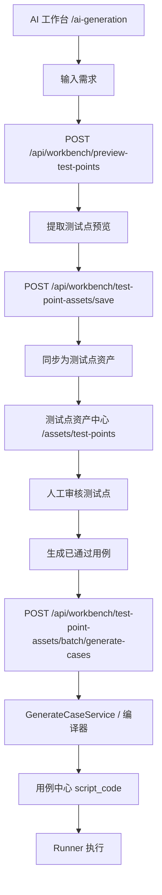
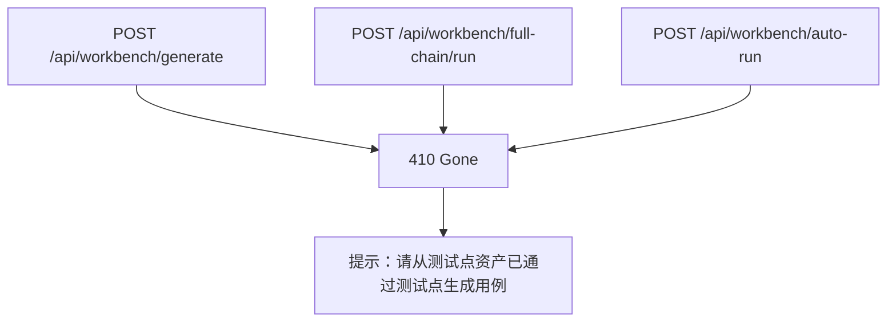
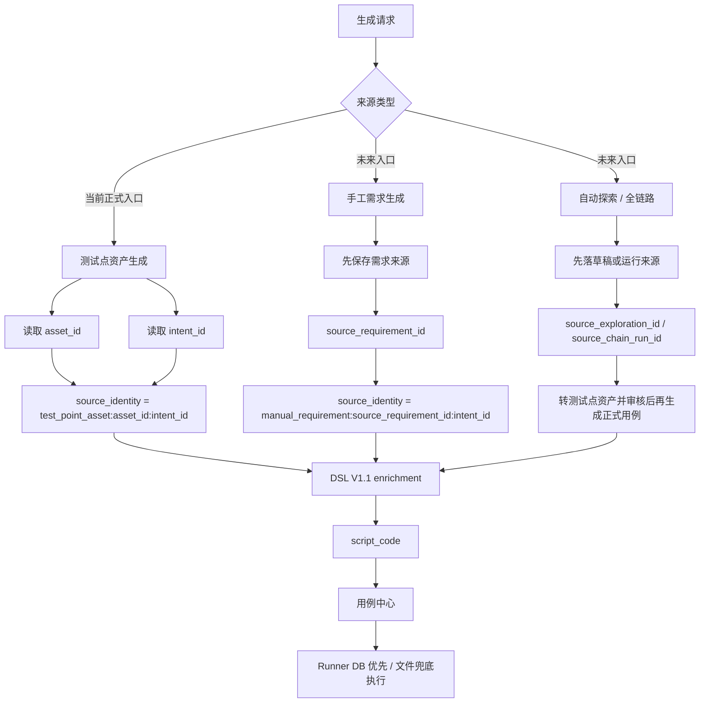

# 2026-05-24 来源身份与生成入口技术架构方案

## 1. 日期与范围

- 日期：2026-05-24
- 主题：在第 1 点“生成入口收口”之后，讨论第 2 点 `source_asset_id` 与替代来源身份的技术架构。
- 范围：只做方案留档，不修改业务代码、不新增接口、不迁移历史数据。
- 铁律：被测系统地址 `http://localhost:5174/#/login` 不允许被 DSL、runner、Docker、页面对象或生成链路改写。

## 2. 当前系统实际支持的入口

当前系统的正式业务入口已经收口为“测试点资产生成用例”。AI 工作台只负责提取测试点和同步测试点资产，不再直接生成正式用例。



当前仍存在但已经下线的旧入口：



## 3. 第 2 点结论

`source_asset_id` 不应该被定义为所有生成场景的唯一必填字段。

更准确的规则是：

```text
正式用例必须有稳定来源身份 source_identity。
测试点资产生成场景下，source_identity = source_asset_id + intent_id。
其他未来场景如果恢复，必须提供等价的稳定替代身份。
```

| 生成场景 | 来源身份字段 | 是否必填 | 当前状态 | 说明 |
|---|---|---:|---|---|
| 测试点资产生成 | `source_asset_id + intent_id` | 是 | 当前正式主链路 | 已有资产、审核、去重和追溯链路 |
| 手工需求生成 | `source_requirement_id + intent_id` 或 `source_input_hash + intent_id` | 是 | 当前不作为正式入口 | 如果未来恢复，必须先形成稳定需求来源身份 |
| 自动探索生成 | `source_exploration_id + discovered_intent_id` | 是 | 当前下线 | 不建议直接进入正式用例中心 |
| 全链路生成 | `source_chain_run_id + intent_id` | 是 | 当前下线 | 不建议绕过资产审核直接落正式用例 |

## 4. 推荐 DSL V1.1 来源身份结构

为了避免 YAML 中散落多个平级字段，建议后续统一为 `requirement.source` 结构。第一阶段可以兼容旧字段，不急于迁移。

测试点资产生成：

```yaml
requirement:
  intent_id: intent-01
  title: 首次登录成功
  type: functional
  source:
    type: test_point_asset
    id: mall-web-login-auth-fn-ai-0021
    intent_id: intent-01
  source_asset_id: mall-web-login-auth-fn-ai-0021
```

未来手工需求生成：

```yaml
requirement:
  intent_id: intent-01
  title: 首次登录成功
  type: functional
  source:
    type: manual_requirement
    id: req-20260524-0001
    input_hash: sha256:example
    intent_id: intent-01
```

说明：

- `requirement.source.type` 用来区分来源类型。
- `requirement.source.id` 是该来源类型下的稳定 ID。
- `requirement.source.input_hash` 只适合辅助去重，不应单独替代稳定 ID。
- `requirement.source_asset_id` 短期保留，兼容现有详情页、去重和历史用例。

## 5. 技术架构图

目标是把“来源身份解析”从具体字段判断升级为统一能力，但第一阶段用最土最稳的兼容方式实现。



## 6. 最土最稳的实现方式

本阶段不急着设计复杂多态模型，先做兼容层：

1. 保留当前正式入口：`/api/workbench/test-point-assets/batch/generate-cases`。
2. 当前只对 `source_type=test_point_asset` 强制 `source_asset_id + intent_id`。
3. 新增一个内部解析函数，例如 `resolve_source_identity(requirement, candidate, payload)`。
4. 解析函数返回统一结构：

```python
{
    "source_type": "test_point_asset",
    "source_id": "mall-web-login-auth-fn-ai-0021",
    "source_intent_id": "intent-01",
    "source_identity_key": "mall::test_point_asset::mall-web-login-auth-fn-ai-0021::intent-01",
}
```

5. DSL YAML 短期同时写入：

```yaml
requirement:
  source_asset_id: mall-web-login-auth-fn-ai-0021
  intent_id: intent-01
  source:
    type: test_point_asset
    id: mall-web-login-auth-fn-ai-0021
    intent_id: intent-01
```

6. 去重仍先沿用现有 `project + source_asset_id + intent_id`，避免一次性改 DB 模型。
7. 后续如果恢复手工需求生成，必须先引入“需求来源资产”或“生成草稿资产”，再接入统一 `source` 结构。

## 7. 我准备在哪里坑你，以及规避方式

### 坑 1：把 `source_asset_id` 继续当成所有场景的硬字段

后果：未来手工需求生成、探索生成无法进入 V1.1，或者被迫造假资产 ID。

规避：抽象 `source_identity`，但当前只实现 `test_point_asset` 类型。

### 坑 2：为了兼容未来场景，马上放松当前主链路校验

后果：测试点资产生成又可能缺少 `source_asset_id + intent_id`，重复生成和追溯问题复发。

规避：当前正式入口继续强校验；未来入口必须先有替代稳定身份。

### 坑 3：生成临时 `source_input_hash` 当事实源

后果：用户改一个字 hash 就变，无法稳定追溯，也无法表达人工审核状态。

规避：`source_input_hash` 只能作为辅助去重字段，不能单独作为正式来源 ID。

### 坑 4：一次性改 DB 唯一索引

后果：历史数据、用例中心、执行记录、详情页可能一起炸。

规避：第一阶段不改 DB schema，先在 YAML 和服务层兼容统一结构。

### 坑 5：恢复普通生成入口

后果：绕过资产审核，和刚完成的入口收口冲突。

规避：手工需求生成如果恢复，先落需求来源资产或草稿资产，再进入审核链路。

### 坑 6：动到历史 YAML 或历史数据库

后果：用户手工维护过的数据可能被覆盖。

规避：本阶段只影响新生成脚本，历史数据单独治理。

### 坑 7：误改被测地址

后果：再次破坏 `http://localhost:5174/#/login` 铁律。

规避：来源身份改造只处理 `requirement.source`，不碰 `execution.page_url`。

### 坑 8：把架构改造和大重构混在一起

后果：问题不好定位，回滚困难。

规避：第一阶段只加解析函数和 YAML 字段补齐，不拆服务、不改入口、不清死代码。

## 8. 后续代码落地建议

建议拆成三个小步：

### 第一步：只加统一解析函数

目标文件建议：

- `apps/web-ui-service/app/services/workbench_generation_compiler/runtime/generate_pipeline.py`

新增内部函数：

```python
def _resolve_source_identity(*, project: str, requirement: dict, candidate: dict, selected_ids: list[str]) -> dict:
    ...
```

只支持 `test_point_asset`，缺少 `source_asset_id` 或 `intent_id` 时继续失败。

### 第二步：YAML 兼容写入 `requirement.source`

在现有 `source_asset_id + intent_id` 不变的前提下，额外写入：

```yaml
requirement:
  source:
    type: test_point_asset
    id: ...
    intent_id: ...
```

### 第三步：测试覆盖

增加或更新测试：

- 测试点资产生成必须写入 `source_asset_id`。
- 测试点资产生成必须写入 `requirement.source.type=test_point_asset`。
- 缺少 `source_asset_id` 时仍失败。
- 不修改 `execution.page_url`。
- 旧字段仍能被详情页和去重逻辑读取。

## 9. 验收标准

- 当前正式入口仍只有测试点资产生成。
- 新生成 YAML 中同时具备旧字段和新结构：
  - `requirement.source_asset_id`
  - `requirement.intent_id`
  - `requirement.source.type`
  - `requirement.source.id`
  - `requirement.source.intent_id`
- 缺少测试点资产来源的正式生成请求失败，不生成半成品用例。
- `source_input_hash` 不单独进入正式用例中心。
- 被测地址 `http://localhost:5174/#/login` 不被改写。
- 不改历史 YAML、不改历史数据库、不删除旧服务代码。

## 10. 当前结论

第 2 点的最终结论是：

```text
source_asset_id 不是所有未来生成场景的唯一字段；
但正式用例必须具备稳定 source_identity。
当前阶段只实现 test_point_asset 类型，继续强制 source_asset_id + intent_id。
未来手工需求生成必须先形成 source_requirement_id 或等价稳定来源，再进入正式生成。
```
